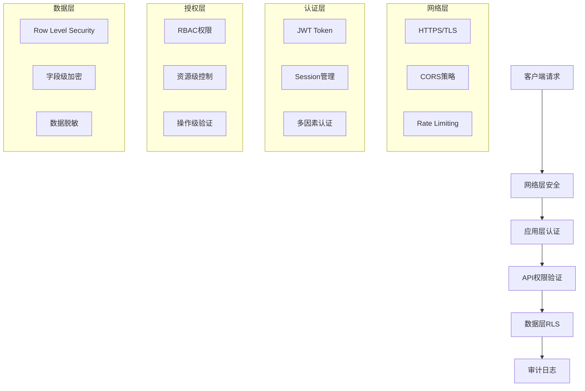

# API安全与权限管理

## 概述

本文档详细说明了SMS营销数据分析系统的API安全策略、权限管理机制、数据保护措施和安全最佳实践。

## 安全架构

### 1. 多层安全防护



### 2. 安全组件架构

```typescript
// 安全服务架构
interface SecurityService {
  authentication: AuthenticationService;
  authorization: AuthorizationService;
  encryption: EncryptionService;
  audit: AuditService;
  rateLimit: RateLimitService;
}

// 认证服务
interface AuthenticationService {
  login(credentials: LoginCredentials): Promise<AuthResult>;
  logout(token: string): Promise<void>;
  refreshToken(refreshToken: string): Promise<AuthResult>;
  validateToken(token: string): Promise<TokenValidation>;
  enableMFA(userId: string): Promise<MFASetup>;
}

// 授权服务
interface AuthorizationService {
  checkPermission(userId: string, resource: string, action: string): Promise<boolean>;
  getUserRoles(userId: string): Promise<Role[]>;
  assignRole(userId: string, roleId: string): Promise<void>;
  revokeRole(userId: string, roleId: string): Promise<void>;
}
```

## 认证机制

### 1. JWT Token认证

```typescript
// JWT配置
const jwtConfig = {
  secret: process.env.JWT_SECRET,
  expiresIn: '1h',
  refreshExpiresIn: '7d',
  algorithm: 'HS256',
  issuer: 'sms-analytics-system',
  audience: 'sms-analytics-users'
};

// Token生成
export const generateTokens = (user: User): TokenPair => {
  const payload = {
    sub: user.id,
    email: user.email,
    role: user.role,
    permissions: user.permissions,
    iat: Math.floor(Date.now() / 1000)
  };

  const accessToken = jwt.sign(payload, jwtConfig.secret, {
    expiresIn: jwtConfig.expiresIn,
    issuer: jwtConfig.issuer,
    audience: jwtConfig.audience
  });

  const refreshToken = jwt.sign(
    { sub: user.id, type: 'refresh' },
    jwtConfig.secret,
    { expiresIn: jwtConfig.refreshExpiresIn }
  );

  return { accessToken, refreshToken };
};

// Token验证中间件
export const authenticateToken = async (token: string): Promise<AuthUser> => {
  try {
    const decoded = jwt.verify(token, jwtConfig.secret, {
      issuer: jwtConfig.issuer,
      audience: jwtConfig.audience
    }) as JWTPayload;

    // 检查token是否在黑名单中
    const isBlacklisted = await checkTokenBlacklist(token);
    if (isBlacklisted) {
      throw new Error('Token已失效');
    }

    // 验证用户状态
    const user = await getUserById(decoded.sub);
    if (!user || user.status !== 'active') {
      throw new Error('用户状态异常');
    }

    return {
      id: decoded.sub,
      email: decoded.email,
      role: decoded.role,
      permissions: decoded.permissions
    };
  } catch (error) {
    throw new Error('Token验证失败');
  }
};
```

### 2. Supabase认证集成

```typescript
// Supabase认证配置
export class SupabaseAuthService {
  private supabase: SupabaseClient;

  constructor() {
    this.supabase = createClient(
      process.env.SUPABASE_URL!,
      process.env.SUPABASE_ANON_KEY!,
      {
        auth: {
          autoRefreshToken: true,
          persistSession: true,
          detectSessionInUrl: true
        }
      }
    );
  }

  // 用户登录
  async signIn(email: string, password: string): Promise<AuthResult> {
    const { data, error } = await this.supabase.auth.signInWithPassword({
      email,
      password
    });

    if (error) {
      throw new AuthError(error.message);
    }

    // 获取用户配置
    const userProfile = await this.getUserProfile(data.user.id);
    
    // 记录登录日志
    await this.logAuthEvent('login', data.user.id, {
      email: data.user.email,
      ip: this.getClientIP(),
      userAgent: this.getUserAgent()
    });

    return {
      user: data.user,
      session: data.session,
      profile: userProfile
    };
  }

  // 用户登出
  async signOut(): Promise<void> {
    const { data: { user } } = await this.supabase.auth.getUser();
    
    if (user) {
      await this.logAuthEvent('logout', user.id);
    }

    const { error } = await this.supabase.auth.signOut();
    if (error) {
      throw new AuthError(error.message);
    }
  }

  // 刷新Token
  async refreshSession(): Promise<AuthResult> {
    const { data, error } = await this.supabase.auth.refreshSession();
    
    if (error) {
      throw new AuthError('Session刷新失败');
    }

    return {
      user: data.user,
      session: data.session
    };
  }

  // 获取用户配置
  private async getUserProfile(userId: string): Promise<UserProfile> {
    const { data, error } = await this.supabase
      .from('user_profiles')
      .select('*')
      .eq('user_id', userId)
      .single();

    if (error) {
      throw new Error('获取用户配置失败');
    }

    return data;
  }
}
```

### 3. 多因素认证 (MFA)

```typescript
// MFA服务
export class MFAService {
  // 启用TOTP
  async enableTOTP(userId: string): Promise<MFASetup> {
    const secret = speakeasy.generateSecret({
      name: `SMS Analytics (${userId})`,
      issuer: 'SMS Analytics System'
    });

    // 保存密钥到数据库
    await this.saveMFASecret(userId, secret.base32);

    return {
      secret: secret.base32,
      qrCode: await this.generateQRCode(secret.otpauth_url!),
      backupCodes: await this.generateBackupCodes(userId)
    };
  }

  // 验证TOTP
  async verifyTOTP(userId: string, token: string): Promise<boolean> {
    const secret = await this.getMFASecret(userId);
    
    const verified = speakeasy.totp.verify({
      secret,
      encoding: 'base32',
      token,
      window: 2 // 允许时间偏差
    });

    // 记录验证日志
    await this.logMFAEvent(userId, 'totp_verify', verified);

    return verified;
  }

  // 生成备用码
  private async generateBackupCodes(userId: string): Promise<string[]> {
    const codes = Array.from({ length: 10 }, () => 
      crypto.randomBytes(4).toString('hex').toUpperCase()
    );

    // 加密保存备用码
    const encryptedCodes = codes.map(code => this.encrypt(code));
    await this.saveBackupCodes(userId, encryptedCodes);

    return codes;
  }
}
```

## 权限管理

### 1. RBAC权限模型

```typescript
// 角色定义
export enum Role {
  ADMIN = 'admin',
  OPERATOR = 'operator',
  VIEWER = 'viewer'
}

// 权限定义
export enum Permission {
  // 号码包权限
  PACKAGE_VIEW = 'package:view',
  PACKAGE_CREATE = 'package:create',
  PACKAGE_UPDATE = 'package:update',
  PACKAGE_DELETE = 'package:delete',
  PACKAGE_UPLOAD = 'package:upload',

  // 号码评级权限
  RATING_VIEW = 'rating:view',
  RATING_CREATE = 'rating:create',
  RATING_UPDATE = 'rating:update',
  RATING_DELETE = 'rating:delete',

  // 报告权限
  REPORT_VIEW = 'report:view',
  REPORT_GENERATE = 'report:generate',
  REPORT_DELETE = 'report:delete',
  REPORT_DOWNLOAD = 'report:download',

  // 系统设置权限
  SETTINGS_VIEW = 'settings:view',
  SETTINGS_UPDATE = 'settings:update',

  // 用户管理权限
  USER_VIEW = 'user:view',
  USER_CREATE = 'user:create',
  USER_UPDATE = 'user:update',
  USER_DELETE = 'user:delete',

  // 审计日志权限
  AUDIT_VIEW = 'audit:view'
}

// 角色权限映射
export const RolePermissions: Record<Role, Permission[]> = {
  [Role.ADMIN]: [
    // 管理员拥有所有权限
    ...Object.values(Permission)
  ],
  [Role.OPERATOR]: [
    // 操作员权限
    Permission.PACKAGE_VIEW,
    Permission.PACKAGE_CREATE,
    Permission.PACKAGE_UPDATE,
    Permission.PACKAGE_UPLOAD,
    Permission.RATING_VIEW,
    Permission.RATING_CREATE,
    Permission.RATING_UPDATE,
    Permission.REPORT_VIEW,
    Permission.REPORT_GENERATE,
    Permission.REPORT_DOWNLOAD,
    Permission.SETTINGS_VIEW
  ],
  [Role.VIEWER]: [
    // 查看者权限
    Permission.PACKAGE_VIEW,
    Permission.RATING_VIEW,
    Permission.REPORT_VIEW,
    Permission.REPORT_DOWNLOAD,
    Permission.SETTINGS_VIEW
  ]
};
```

### 2. 权限验证中间件

```typescript
// 权限验证装饰器
export const RequirePermission = (permission: Permission) => {
  return (target: any, propertyKey: string, descriptor: PropertyDescriptor) => {
    const originalMethod = descriptor.value;

    descriptor.value = async function (...args: any[]) {
      const user = this.getCurrentUser();
      
      if (!user) {
        throw new UnauthorizedError('用户未认证');
      }

      const hasPermission = await checkUserPermission(user.id, permission);
      if (!hasPermission) {
        throw new ForbiddenError(`缺少权限: ${permission}`);
      }

      return originalMethod.apply(this, args);
    };

    return descriptor;
  };
};

// 权限检查函数
export const checkUserPermission = async (
  userId: string, 
  permission: Permission
): Promise<boolean> => {
  try {
    // 获取用户角色
    const userRoles = await getUserRoles(userId);
    
    // 检查角色权限
    for (const role of userRoles) {
      const rolePermissions = RolePermissions[role];
      if (rolePermissions.includes(permission)) {
        return true;
      }
    }

    // 检查用户特定权限
    const userPermissions = await getUserSpecificPermissions(userId);
    return userPermissions.includes(permission);
  } catch (error) {
    console.error('权限检查失败:', error);
    return false;
  }
};

// 使用示例
export class PackageService {
  @RequirePermission(Permission.PACKAGE_CREATE)
  async createPackage(packageData: CreatePackageRequest): Promise<Package> {
    // 创建号码包逻辑
  }

  @RequirePermission(Permission.PACKAGE_DELETE)
  async deletePackage(packageId: string): Promise<void> {
    // 删除号码包逻辑
  }
}
```

### 3. 资源级权限控制

```typescript
// 资源所有权检查
export const checkResourceOwnership = async (
  userId: string,
  resourceType: string,
  resourceId: string
): Promise<boolean> => {
  switch (resourceType) {
    case 'package':
      const packageOwner = await getPackageOwner(resourceId);
      return packageOwner === userId;
    
    case 'report':
      const reportOwner = await getReportOwner(resourceId);
      return reportOwner === userId;
    
    default:
      return false;
  }
};

// 资源权限装饰器
export const RequireResourceAccess = (
  resourceType: string,
  resourceIdParam: string = 'id'
) => {
  return (target: any, propertyKey: string, descriptor: PropertyDescriptor) => {
    const originalMethod = descriptor.value;

    descriptor.value = async function (...args: any[]) {
      const user = this.getCurrentUser();
      const resourceId = this.getParam(resourceIdParam);

      // 管理员跳过资源检查
      if (user.role === Role.ADMIN) {
        return originalMethod.apply(this, args);
      }

      // 检查资源所有权
      const hasAccess = await checkResourceOwnership(
        user.id,
        resourceType,
        resourceId
      );

      if (!hasAccess) {
        throw new ForbiddenError('无权访问该资源');
      }

      return originalMethod.apply(this, args);
    };

    return descriptor;
  };
};
```

## 数据保护

### 1. Row Level Security (RLS)

```sql
-- 用户配置表RLS策略
CREATE POLICY "用户只能查看自己的配置" ON user_profiles
  FOR SELECT USING (auth.uid() = user_id);

CREATE POLICY "管理员可以查看所有配置" ON user_profiles
  FOR SELECT USING (
    EXISTS (
      SELECT 1 FROM user_profiles 
      WHERE user_id = auth.uid() AND role = 'admin'
    )
  );

-- 号码包表RLS策略
CREATE POLICY "认证用户可以查看号码包" ON phone_packages
  FOR SELECT USING (auth.role() = 'authenticated');

CREATE POLICY "用户只能修改自己创建的号码包" ON phone_packages
  FOR UPDATE USING (
    created_by = auth.uid() OR 
    EXISTS (
      SELECT 1 FROM user_profiles 
      WHERE user_id = auth.uid() AND role = 'admin'
    )
  );

-- 动态RLS策略
CREATE OR REPLACE FUNCTION check_user_permission(
  required_permission TEXT
) RETURNS BOOLEAN AS $$
DECLARE
  user_role TEXT;
  user_permissions TEXT[];
BEGIN
  -- 获取当前用户角色
  SELECT role INTO user_role
  FROM user_profiles
  WHERE user_id = auth.uid();

  -- 获取角色权限
  SELECT permissions INTO user_permissions
  FROM role_permissions
  WHERE role = user_role;

  -- 检查权限
  RETURN required_permission = ANY(user_permissions);
END;
$$ LANGUAGE plpgsql SECURITY DEFINER;

-- 使用动态权限策略
CREATE POLICY "基于权限的访问控制" ON reports
  FOR ALL USING (check_user_permission('report:view'));
```

### 2. 数据加密

```typescript
// 数据加密服务
export class EncryptionService {
  private readonly algorithm = 'aes-256-gcm';
  private readonly keyLength = 32;
  private readonly ivLength = 16;
  private readonly tagLength = 16;

  // 加密敏感数据
  encrypt(plaintext: string, key?: string): EncryptedData {
    const encryptionKey = key ? Buffer.from(key, 'hex') : this.getDefaultKey();
    const iv = crypto.randomBytes(this.ivLength);
    
    const cipher = crypto.createCipher(this.algorithm, encryptionKey, iv);
    
    let encrypted = cipher.update(plaintext, 'utf8', 'hex');
    encrypted += cipher.final('hex');
    
    const tag = cipher.getAuthTag();

    return {
      encrypted,
      iv: iv.toString('hex'),
      tag: tag.toString('hex')
    };
  }

  // 解密敏感数据
  decrypt(encryptedData: EncryptedData, key?: string): string {
    const encryptionKey = key ? Buffer.from(key, 'hex') : this.getDefaultKey();
    const iv = Buffer.from(encryptedData.iv, 'hex');
    const tag = Buffer.from(encryptedData.tag, 'hex');

    const decipher = crypto.createDecipher(this.algorithm, encryptionKey, iv);
    decipher.setAuthTag(tag);

    let decrypted = decipher.update(encryptedData.encrypted, 'hex', 'utf8');
    decrypted += decipher.final('utf8');

    return decrypted;
  }

  // 哈希密码
  async hashPassword(password: string): Promise<string> {
    const saltRounds = 12;
    return bcrypt.hash(password, saltRounds);
  }

  // 验证密码
  async verifyPassword(password: string, hash: string): Promise<boolean> {
    return bcrypt.compare(password, hash);
  }

  private getDefaultKey(): Buffer {
    const key = process.env.ENCRYPTION_KEY;
    if (!key) {
      throw new Error('加密密钥未配置');
    }
    return Buffer.from(key, 'hex');
  }
}
```

### 3. 数据脱敏

```typescript
// 数据脱敏服务
export class DataMaskingService {
  // 手机号脱敏
  maskPhoneNumber(phone: string): string {
    if (!phone || phone.length < 8) return phone;
    
    const start = phone.slice(0, 3);
    const end = phone.slice(-2);
    const middle = '*'.repeat(phone.length - 5);
    
    return `${start}${middle}${end}`;
  }

  // 邮箱脱敏
  maskEmail(email: string): string {
    if (!email || !email.includes('@')) return email;
    
    const [username, domain] = email.split('@');
    const maskedUsername = username.length > 2 
      ? `${username[0]}***${username.slice(-1)}`
      : username;
    
    return `${maskedUsername}@${domain}`;
  }

  // 身份证脱敏
  maskIdCard(idCard: string): string {
    if (!idCard || idCard.length < 8) return idCard;
    
    const start = idCard.slice(0, 4);
    const end = idCard.slice(-4);
    const middle = '*'.repeat(idCard.length - 8);
    
    return `${start}${middle}${end}`;
  }

  // 根据用户权限脱敏数据
  maskDataByPermission(data: any, userRole: Role): any {
    if (userRole === Role.ADMIN) {
      return data; // 管理员看到完整数据
    }

    const maskedData = { ...data };

    // 根据角色脱敏不同字段
    if (userRole === Role.VIEWER) {
      if (maskedData.phone_number) {
        maskedData.phone_number = this.maskPhoneNumber(maskedData.phone_number);
      }
      if (maskedData.email) {
        maskedData.email = this.maskEmail(maskedData.email);
      }
    }

    return maskedData;
  }
}
```

## 审计日志

### 1. 审计日志记录

```typescript
// 审计日志服务
export class AuditService {
  // 记录用户操作
  async logUserAction(
    userId: string,
    action: string,
    resourceType?: string,
    resourceId?: string,
    details?: any,
    request?: Request
  ): Promise<void> {
    const auditLog: AuditLog = {
      id: crypto.randomUUID(),
      user_id: userId,
      action,
      resource_type: resourceType,
      resource_id: resourceId,
      details: details ? JSON.stringify(details) : null,
      ip_address: this.getClientIP(request),
      user_agent: request?.headers['user-agent'],
      created_at: new Date()
    };

    await this.saveAuditLog(auditLog);
  }

  // 记录认证事件
  async logAuthEvent(
    event: 'login' | 'logout' | 'login_failed' | 'password_change',
    userId?: string,
    details?: any,
    request?: Request
  ): Promise<void> {
    await this.logUserAction(
      userId || 'anonymous',
      `auth_${event}`,
      'auth',
      undefined,
      details,
      request
    );
  }

  // 记录数据访问
  async logDataAccess(
    userId: string,
    table: string,
    operation: 'select' | 'insert' | 'update' | 'delete',
    recordId?: string,
    request?: Request
  ): Promise<void> {
    await this.logUserAction(
      userId,
      `data_${operation}`,
      table,
      recordId,
      { operation, table },
      request
    );
  }

  // 记录安全事件
  async logSecurityEvent(
    event: 'permission_denied' | 'suspicious_activity' | 'rate_limit_exceeded',
    userId?: string,
    details?: any,
    request?: Request
  ): Promise<void> {
    await this.logUserAction(
      userId || 'anonymous',
      `security_${event}`,
      'security',
      undefined,
      details,
      request
    );

    // 严重安全事件发送告警
    if (event === 'suspicious_activity') {
      await this.sendSecurityAlert(event, details);
    }
  }

  private async saveAuditLog(auditLog: AuditLog): Promise<void> {
    try {
      await supabase
        .from('audit_logs')
        .insert(auditLog);
    } catch (error) {
      console.error('审计日志保存失败:', error);
      // 审计日志失败不应影响业务操作
    }
  }

  private getClientIP(request?: Request): string {
    if (!request) return 'unknown';
    
    return (
      request.headers['x-forwarded-for'] ||
      request.headers['x-real-ip'] ||
      request.connection?.remoteAddress ||
      'unknown'
    ) as string;
  }
}
```

### 2. 审计日志装饰器

```typescript
// 审计装饰器
export const Audit = (
  action: string,
  resourceType?: string,
  options?: AuditOptions
) => {
  return (target: any, propertyKey: string, descriptor: PropertyDescriptor) => {
    const originalMethod = descriptor.value;

    descriptor.value = async function (...args: any[]) {
      const user = this.getCurrentUser();
      const request = this.getRequest();
      const auditService = this.getAuditService();

      let result;
      let error;

      try {
        result = await originalMethod.apply(this, args);
        
        // 记录成功操作
        await auditService.logUserAction(
          user?.id || 'anonymous',
          action,
          resourceType,
          options?.getResourceId?.(args, result),
          {
            success: true,
            args: options?.logArgs ? args : undefined,
            result: options?.logResult ? result : undefined
          },
          request
        );

        return result;
      } catch (err) {
        error = err;
        
        // 记录失败操作
        await auditService.logUserAction(
          user?.id || 'anonymous',
          `${action}_failed`,
          resourceType,
          options?.getResourceId?.(args),
          {
            success: false,
            error: err.message,
            args: options?.logArgs ? args : undefined
          },
          request
        );

        throw err;
      }
    };

    return descriptor;
  };
};

// 使用示例
export class PackageService {
  @Audit('package_create', 'package', {
    logArgs: true,
    getResourceId: (args, result) => result?.id
  })
  async createPackage(packageData: CreatePackageRequest): Promise<Package> {
    // 创建逻辑
  }

  @Audit('package_delete', 'package', {
    getResourceId: (args) => args[0]
  })
  async deletePackage(packageId: string): Promise<void> {
    // 删除逻辑
  }
}
```

## 安全监控

### 1. 异常检测

```typescript
// 安全监控服务
export class SecurityMonitoringService {
  private readonly suspiciousPatterns = [
    {
      name: 'rapid_login_attempts',
      condition: (events: AuditLog[]) => 
        events.filter(e => e.action === 'auth_login_failed').length > 5,
      timeWindow: 5 * 60 * 1000 // 5分钟
    },
    {
      name: 'unusual_access_pattern',
      condition: (events: AuditLog[]) =>
        new Set(events.map(e => e.ip_address)).size > 3,
      timeWindow: 10 * 60 * 1000 // 10分钟
    },
    {
      name: 'privilege_escalation_attempt',
      condition: (events: AuditLog[]) =>
        events.some(e => e.action === 'security_permission_denied'),
      timeWindow: 1 * 60 * 1000 // 1分钟
    }
  ];

  // 检测可疑活动
  async detectSuspiciousActivity(userId: string): Promise<SecurityAlert[]> {
    const alerts: SecurityAlert[] = [];
    
    for (const pattern of this.suspiciousPatterns) {
      const recentEvents = await this.getRecentUserEvents(
        userId,
        pattern.timeWindow
      );

      if (pattern.condition(recentEvents)) {
        const alert: SecurityAlert = {
          id: crypto.randomUUID(),
          type: pattern.name,
          severity: this.getSeverity(pattern.name),
          userId,
          description: this.getAlertDescription(pattern.name),
          events: recentEvents,
          createdAt: new Date()
        };

        alerts.push(alert);
        await this.handleSecurityAlert(alert);
      }
    }

    return alerts;
  }

  // 处理安全告警
  private async handleSecurityAlert(alert: SecurityAlert): Promise<void> {
    // 记录告警
    await this.saveSecurityAlert(alert);

    // 根据严重程度采取行动
    switch (alert.severity) {
      case 'high':
        await this.lockUserAccount(alert.userId);
        await this.notifyAdministrators(alert);
        break;
      
      case 'medium':
        await this.requireMFAVerification(alert.userId);
        await this.notifyAdministrators(alert);
        break;
      
      case 'low':
        await this.logSecurityEvent(alert);
        break;
    }
  }

  // 实时监控
  async startRealTimeMonitoring(): Promise<void> {
    // 监听审计日志
    const subscription = supabase
      .channel('audit_logs')
      .on('postgres_changes', 
        { event: 'INSERT', schema: 'public', table: 'audit_logs' },
        async (payload) => {
          const auditLog = payload.new as AuditLog;
          await this.analyzeEvent(auditLog);
        }
      )
      .subscribe();

    console.log('安全监控已启动');
  }

  private async analyzeEvent(event: AuditLog): Promise<void> {
    // 实时分析单个事件
    if (this.isHighRiskEvent(event)) {
      await this.detectSuspiciousActivity(event.user_id);
    }
  }

  private isHighRiskEvent(event: AuditLog): boolean {
    const highRiskActions = [
      'auth_login_failed',
      'security_permission_denied',
      'data_delete',
      'settings_update'
    ];

    return highRiskActions.includes(event.action);
  }
}
```

### 2. 速率限制

```typescript
// 速率限制服务
export class RateLimitService {
  private readonly limits = new Map<string, RateLimit>();

  // 检查速率限制
  async checkRateLimit(
    key: string,
    limit: number,
    windowMs: number
  ): Promise<RateLimitResult> {
    const now = Date.now();
    const windowStart = now - windowMs;

    // 获取或创建限制记录
    let rateLimit = this.limits.get(key);
    if (!rateLimit) {
      rateLimit = {
        requests: [],
        blocked: false,
        resetTime: now + windowMs
      };
      this.limits.set(key, rateLimit);
    }

    // 清理过期请求
    rateLimit.requests = rateLimit.requests.filter(
      time => time > windowStart
    );

    // 检查是否超限
    if (rateLimit.requests.length >= limit) {
      rateLimit.blocked = true;
      rateLimit.resetTime = now + windowMs;

      return {
        allowed: false,
        remaining: 0,
        resetTime: rateLimit.resetTime,
        retryAfter: Math.ceil(windowMs / 1000)
      };
    }

    // 记录请求
    rateLimit.requests.push(now);
    rateLimit.blocked = false;

    return {
      allowed: true,
      remaining: limit - rateLimit.requests.length,
      resetTime: rateLimit.resetTime,
      retryAfter: 0
    };
  }

  // 速率限制中间件
  createRateLimitMiddleware(
    limit: number,
    windowMs: number,
    keyGenerator?: (req: Request) => string
  ) {
    return async (req: Request, res: Response, next: NextFunction) => {
      const key = keyGenerator ? keyGenerator(req) : req.ip;
      const result = await this.checkRateLimit(key, limit, windowMs);

      // 设置响应头
      res.set({
        'X-RateLimit-Limit': limit.toString(),
        'X-RateLimit-Remaining': result.remaining.toString(),
        'X-RateLimit-Reset': new Date(result.resetTime).toISOString()
      });

      if (!result.allowed) {
        res.set('Retry-After', result.retryAfter.toString());
        return res.status(429).json({
          error: 'Too Many Requests',
          message: '请求过于频繁，请稍后再试',
          retryAfter: result.retryAfter
        });
      }

      next();
    };
  }
}

// 使用示例
const rateLimitService = new RateLimitService();

// API速率限制
app.use('/api', rateLimitService.createRateLimitMiddleware(
  100, // 100次请求
  15 * 60 * 1000, // 15分钟窗口
  (req) => `api:${req.ip}` // 按IP限制
));

// 登录速率限制
app.use('/api/auth/login', rateLimitService.createRateLimitMiddleware(
  5, // 5次尝试
  15 * 60 * 1000, // 15分钟窗口
  (req) => `login:${req.ip}:${req.body.email}` // 按IP和邮箱限制
));
```

## 安全配置

### 1. 环境变量安全

```typescript
// 安全配置管理
export class SecurityConfig {
  private static instance: SecurityConfig;
  private config: SecuritySettings;

  private constructor() {
    this.loadConfig();
    this.validateConfig();
  }

  static getInstance(): SecurityConfig {
    if (!SecurityConfig.instance) {
      SecurityConfig.instance = new SecurityConfig();
    }
    return SecurityConfig.instance;
  }

  private loadConfig(): void {
    this.config = {
      // JWT配置
      jwt: {
        secret: this.getRequiredEnv('JWT_SECRET'),
        expiresIn: process.env.JWT_EXPIRES_IN || '1h',
        refreshExpiresIn: process.env.JWT_REFRESH_EXPIRES_IN || '7d'
      },

      // 加密配置
      encryption: {
        key: this.getRequiredEnv('ENCRYPTION_KEY'),
        algorithm: process.env.ENCRYPTION_ALGORITHM || 'aes-256-gcm'
      },

      // Supabase配置
      supabase: {
        url: this.getRequiredEnv('SUPABASE_URL'),
        anonKey: this.getRequiredEnv('SUPABASE_ANON_KEY'),
        serviceKey: this.getRequiredEnv('SUPABASE_SERVICE_ROLE_KEY')
      },

      // 安全策略
      security: {
        passwordMinLength: parseInt(process.env.PASSWORD_MIN_LENGTH || '8'),
        sessionTimeout: parseInt(process.env.SESSION_TIMEOUT || '3600'),
        maxLoginAttempts: parseInt(process.env.MAX_LOGIN_ATTEMPTS || '5'),
        lockoutDuration: parseInt(process.env.LOCKOUT_DURATION || '900')
      },

      // CORS配置
      cors: {
        origin: process.env.CORS_ORIGIN?.split(',') || ['http://localhost:3000'],
        credentials: true,
        optionsSuccessStatus: 200
      }
    };
  }

  private getRequiredEnv(key: string): string {
    const value = process.env[key];
    if (!value) {
      throw new Error(`必需的环境变量 ${key} 未设置`);
    }
    return value;
  }

  private validateConfig(): void {
    // 验证JWT密钥强度
    if (this.config.jwt.secret.length < 32) {
      throw new Error('JWT密钥长度不足，至少需要32个字符');
    }

    // 验证加密密钥
    if (this.config.encryption.key.length < 64) {
      throw new Error('加密密钥长度不足，至少需要64个字符');
    }

    // 验证Supabase URL
    if (!this.config.supabase.url.startsWith('https://')) {
      throw new Error('Supabase URL必须使用HTTPS');
    }
  }

  getConfig(): SecuritySettings {
    return { ...this.config };
  }
}
```

### 2. HTTPS和TLS配置

```typescript
// HTTPS配置
export const httpsConfig = {
  // 强制HTTPS
  forceHTTPS: process.env.NODE_ENV === 'production',
  
  // HSTS配置
  hsts: {
    maxAge: 31536000, // 1年
    includeSubDomains: true,
    preload: true
  },

  // TLS配置
  tls: {
    minVersion: 'TLSv1.2',
    ciphers: [
      'ECDHE-RSA-AES128-GCM-SHA256',
      'ECDHE-RSA-AES256-GCM-SHA384',
      'ECDHE-RSA-AES128-SHA256',
      'ECDHE-RSA-AES256-SHA384'
    ].join(':'),
    honorCipherOrder: true
  }
};

// 安全中间件
export const securityMiddleware = [
  // 强制HTTPS
  (req: Request, res: Response, next: NextFunction) => {
    if (httpsConfig.forceHTTPS && req.header('x-forwarded-proto') !== 'https') {
      return res.redirect(`https://${req.header('host')}${req.url}`);
    }
    next();
  },

  // 设置安全头
  helmet({
    hsts: httpsConfig.hsts,
    contentSecurityPolicy: {
      directives: {
        defaultSrc: ["'self'"],
        styleSrc: ["'self'", "'unsafe-inline'"],
        scriptSrc: ["'self'"],
        imgSrc: ["'self'", "data:", "https:"],
        connectSrc: ["'self'", process.env.SUPABASE_URL!]
      }
    },
    crossOriginEmbedderPolicy: false
  }),

  // CORS配置
  cors(SecurityConfig.getInstance().getConfig().cors)
];
```

## 部署安全

### 1. 生产环境安全检查

```typescript
// 生产环境安全检查
export class ProductionSecurityCheck {
  async runSecurityChecks(): Promise<SecurityCheckResult[]> {
    const results: SecurityCheckResult[] = [];

    // 检查环境变量
    results.push(await this.checkEnvironmentVariables());
    
    // 检查数据库安全
    results.push(await this.checkDatabaseSecurity());
    
    // 检查API安全
    results.push(await this.checkApiSecurity());
    
    // 检查文件权限
    results.push(await this.checkFilePermissions());

    return results;
  }

  private async checkEnvironmentVariables(): Promise<SecurityCheckResult> {
    const requiredVars = [
      'JWT_SECRET',
      'ENCRYPTION_KEY',
      'SUPABASE_URL',
      'SUPABASE_ANON_KEY',
      'SUPABASE_SERVICE_ROLE_KEY'
    ];

    const missing = requiredVars.filter(varName => !process.env[varName]);
    
    return {
      check: 'environment_variables',
      passed: missing.length === 0,
      message: missing.length > 0 
        ? `缺少环境变量: ${missing.join(', ')}`
        : '所有必需的环境变量已设置',
      severity: missing.length > 0 ? 'high' : 'info'
    };
  }

  private async checkDatabaseSecurity(): Promise<SecurityCheckResult> {
    try {
      // 检查RLS是否启用
      const { data: tables } = await supabase
        .from('information_schema.tables')
        .select('table_name')
        .eq('table_schema', 'public');

      const rlsChecks = await Promise.all(
        tables.map(async (table) => {
          const { data } = await supabase
            .rpc('check_rls_enabled', { table_name: table.table_name });
          return { table: table.table_name, rls_enabled: data };
        })
      );

      const tablesWithoutRLS = rlsChecks.filter(check => !check.rls_enabled);

      return {
        check: 'database_security',
        passed: tablesWithoutRLS.length === 0,
        message: tablesWithoutRLS.length > 0
          ? `以下表未启用RLS: ${tablesWithoutRLS.map(t => t.table).join(', ')}`
          : '所有表都已启用RLS',
        severity: tablesWithoutRLS.length > 0 ? 'high' : 'info'
      };
    } catch (error) {
      return {
        check: 'database_security',
        passed: false,
        message: `数据库安全检查失败: ${error.message}`,
        severity: 'high'
      };
    }
  }
}
```

### 2. 安全监控告警

```typescript
// 安全告警服务
export class SecurityAlertService {
  // 发送安全告警
  async sendSecurityAlert(alert: SecurityAlert): Promise<void> {
    // 邮件告警
    await this.sendEmailAlert(alert);
    
    // Slack告警
    await this.sendSlackAlert(alert);
    
    // 短信告警（高危事件）
    if (alert.severity === 'high') {
      await this.sendSMSAlert(alert);
    }
  }

  private async sendEmailAlert(alert: SecurityAlert): Promise<void> {
    const emailContent = this.generateEmailContent(alert);
    
    // 发送邮件逻辑
    await this.emailService.send({
      to: process.env.SECURITY_ALERT_EMAIL!,
      subject: `安全告警: ${alert.type}`,
      html: emailContent
    });
  }

  private generateEmailContent(alert: SecurityAlert): string {
    return `
      <h2>安全告警</h2>
      <p><strong>告警类型:</strong> ${alert.type}</p>
      <p><strong>严重程度:</strong> ${alert.severity}</p>
      <p><strong>用户ID:</strong> ${alert.userId}</p>
      <p><strong>描述:</strong> ${alert.description}</p>
      <p><strong>时间:</strong> ${alert.createdAt.toISOString()}</p>
      
      <h3>相关事件</h3>
      <ul>
        ${alert.events.map(event => `
          <li>${event.action} - ${event.created_at} - ${event.ip_address}</li>
        `).join('')}
      </ul>
    `;
  }
}
```

这个安全与权限管理文档提供了完整的安全架构设计，确保系统在各个层面都有适当的安全保护措施。