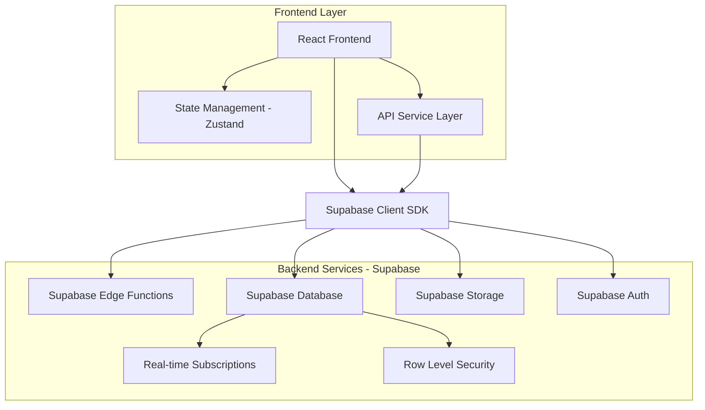

# SMS营销数据分析系统 - API集成技术文档

## 1. API集成架构设计

### 1.1 整体架构


### 1.2 数据流设计
- **单向数据流**：UI → Actions → API → Database → State → UI
- **实时更新**：Database Changes → Realtime → State → UI
- **缓存策略**：Memory Cache → Local Storage → Database

### 1.3 错误处理机制
```typescript
interface APIResponse<T> {
  data?: T
  error?: {
    code: string
    message: string
    details?: any
  }
  success: boolean
}
```

## 2. 核心API模块

### 2.1 用户认证与权限管理API

#### 认证服务
```typescript
interface AuthAPI {
  // 登录
  login(email: string, password: string): Promise<LoginResponse>
  
  // 登出
  logout(): Promise<void>
  
  // 刷新令牌
  refreshToken(): Promise<TokenResponse>
  
  // 获取当前用户
  getCurrentUser(): Promise<User>
  
  // 密码管理
  changePassword(oldPassword: string, newPassword: string): Promise<void>
  resetPassword(email: string): Promise<void>
}
```

#### 用户管理服务
```typescript
interface UserManagementAPI {
  // 用户CRUD
  createUser(userData: CreateUserForm): Promise<User>
  updateUser(userId: string, userData: EditUserForm): Promise<User>
  deleteUser(userId: string): Promise<void>
  getUserList(filters?: UserFilters): Promise<User[]>
  
  // 用户状态管理
  lockUser(userId: string): Promise<void>
  unlockUser(userId: string): Promise<void>
  
  // 权限管理
  updateUserPermissions(userId: string, permissions: string[]): Promise<void>
}
```

### 2.2 号码包管理API

```typescript
interface PackageAPI {
  // 号码包CRUD
  getPackages(filters?: PackageFilters, pagination?: Pagination): Promise<PackageListResponse>
  getPackageById(id: string): Promise<PhonePackage>
  createPackage(packageData: CreatePackageForm): Promise<PhonePackage>
  updatePackage(id: string, updates: Partial<PhonePackage>): Promise<PhonePackage>
  deletePackage(id: string): Promise<void>
  
  // 文件上传
  uploadPackageFile(file: File, packageId: string): Promise<UploadResponse>
  
  // 统计数据
  getPackageStats(id: string): Promise<PackageStats>
  
  // 批量操作
  batchUpdatePackages(updates: BatchUpdateRequest[]): Promise<BatchUpdateResponse>
}
```

### 2.3 号码评级与评分API

```typescript
interface PhoneRatingAPI {
  // 号码评级
  ratePhone(phoneId: string, rating: PhoneRating): Promise<PhoneRating>
  getPhoneRatings(phoneId: string): Promise<PhoneRating[]>
  
  // 批量评级
  batchRatePhones(ratings: BatchRatingRequest[]): Promise<BatchRatingResponse>
  
  // 评分管理
  updatePhoneScore(phoneId: string, score: PhoneScore): Promise<PhoneScore>
  getPhoneScores(filters?: ScoreFilters): Promise<PhoneScore[]>
  
  // 评级历史
  getPhoneRatingHistory(phoneNumber: string): Promise<PhoneRating[]>
}
```

### 2.4 数据分析与报告API

```typescript
interface AnalyticsAPI {
  // 仪表盘数据
  getDashboardStats(dateRange?: DateRange): Promise<DashboardStats>
  
  // 数据分析
  getConversionAnalysis(filters?: AnalysisFilters): Promise<ConversionAnalysis>
  getQualityAnalysis(filters?: AnalysisFilters): Promise<QualityAnalysis>
  getTrendAnalysis(dateRange: DateRange): Promise<TrendAnalysis>
  
  // 报告生成
  generateReport(reportConfig: ReportConfig): Promise<Report>
  getReports(filters?: ReportFilters): Promise<Report[]>
  downloadReport(reportId: string, format: 'pdf' | 'excel'): Promise<Blob>
}
```

### 2.5 系统设置与配置API

```typescript
interface SystemAPI {
  // 系统设置
  getSystemSettings(): Promise<SystemSettings>
  updateSystemSettings(settings: Partial<SystemSettings>): Promise<SystemSettings>
  
  // 安全配置
  getSecuritySettings(): Promise<SecuritySettings>
  updateSecuritySettings(settings: Partial<SecuritySettings>): Promise<SecuritySettings>
  
  // 审计日志
  getAuditLogs(filters?: AuditFilters): Promise<AuditLog[]>
  
  // 系统监控
  getSystemHealth(): Promise<SystemHealth>
  getSystemStats(): Promise<SystemStats>
}
```

### 2.6 文件上传与存储API

```typescript
interface StorageAPI {
  // 文件上传
  uploadFile(file: File, bucket: string, path: string): Promise<UploadResponse>
  
  // 文件管理
  getFileUrl(bucket: string, path: string): Promise<string>
  deleteFile(bucket: string, path: string): Promise<void>
  
  // 批量上传
  uploadMultipleFiles(files: File[], bucket: string): Promise<BatchUploadResponse>
  
  // 文件处理
  processUploadedFile(fileId: string): Promise<ProcessingResult>
}
```

## 3. 数据同步策略

### 3.1 实时数据更新
```typescript
// Supabase Realtime 订阅
const subscribeToTableChanges = (table: string, callback: (payload: any) => void) => {
  return supabase
    .channel(`public:${table}`)
    .on('postgres_changes', 
      { event: '*', schema: 'public', table }, 
      callback
    )
    .subscribe()
}
```

### 3.2 离线数据处理
- **本地存储**：使用 IndexedDB 存储关键数据
- **同步队列**：离线操作队列，网络恢复后自动同步
- **冲突解决**：基于时间戳的最后写入获胜策略

### 3.3 数据一致性保证
- **乐观锁**：使用版本号防止并发更新冲突
- **事务处理**：关键操作使用数据库事务
- **数据校验**：前端和后端双重数据验证

## 4. 性能优化

### 4.1 分页加载
```typescript
interface PaginationConfig {
  page: number
  pageSize: number
  total?: number
}

interface PaginatedResponse<T> {
  data: T[]
  pagination: PaginationConfig
  hasMore: boolean
}
```

### 4.2 懒加载策略
- **组件懒加载**：React.lazy() + Suspense
- **数据懒加载**：按需加载详细数据
- **图片懒加载**：Intersection Observer API

### 4.3 数据预取
- **路由预取**：预加载下一页面数据
- **关联数据预取**：同时加载相关数据
- **智能预取**：基于用户行为模式预取

### 4.4 缓存管理
```typescript
interface CacheStrategy {
  // 内存缓存
  memoryCache: Map<string, CacheItem>
  
  // 本地存储缓存
  localStorage: {
    set(key: string, data: any, ttl?: number): void
    get(key: string): any
    clear(): void
  }
  
  // 查询缓存
  queryCache: {
    invalidate(pattern: string): void
    refresh(key: string): Promise<any>
  }
}
```

## 5. 安全与权限

### 5.1 RLS策略实施
```sql
-- 用户数据访问策略
CREATE POLICY "users_select_policy" ON users
  FOR SELECT TO authenticated
  USING (
    get_current_user_role() = 'admin' OR 
    id = auth.uid()
  );

-- 号码包访问策略
CREATE POLICY "packages_select_policy" ON phone_packages
  FOR SELECT TO authenticated
  USING (
    get_current_user_role() IN ('admin', 'operator')
  );
```

### 5.2 API权限控制
```typescript
interface PermissionMiddleware {
  checkPermission(permission: string): boolean
  requireRole(role: UserRole): void
  requirePermissions(permissions: string[]): void
}
```

### 5.3 数据脱敏
```typescript
interface DataMasking {
  maskPhoneNumber(phone: string): string
  maskEmail(email: string): string
  maskSensitiveData(data: any, fields: string[]): any
}
```

## 6. 实施计划

### 6.1 第一阶段：核心认证与用户管理
- [ ] 用户认证API集成
- [ ] 用户管理功能
- [ ] 权限控制系统
- [ ] 安全设置

### 6.2 第二阶段：数据管理核心功能
- [ ] 号码包管理API
- [ ] 文件上传功能
- [ ] 基础数据分析
- [ ] 系统设置

### 6.3 第三阶段：高级功能与优化
- [ ] 实时数据更新
- [ ] 高级分析功能
- [ ] 报告生成
- [ ] 性能优化

### 6.4 第四阶段：监控与维护
- [ ] 系统监控
- [ ] 错误追踪
- [ ] 性能监控
- [ ] 自动化测试

## 7. 测试验证方案

### 7.1 单元测试
```typescript
// API服务测试
describe('AuthAPI', () => {
  test('should login successfully', async () => {
    const result = await authAPI.login('test@example.com', 'password')
    expect(result.success).toBe(true)
  })
})
```

### 7.2 集成测试
- **API集成测试**：测试前后端数据流
- **权限测试**：验证RLS策略
- **性能测试**：负载和压力测试

### 7.3 端到端测试
```typescript
// E2E测试示例
test('用户登录并管理号码包', async () => {
  await page.goto('/login')
  await page.fill('[data-testid=email]', 'admin@example.com')
  await page.fill('[data-testid=password]', 'password')
  await page.click('[data-testid=login-button]')
  
  await expect(page).toHaveURL('/dashboard')
  await page.click('[data-testid=packages-menu]')
  await expect(page.locator('[data-testid=packages-table]')).toBeVisible()
})
```

## 8. 监控告警

### 8.1 性能监控
- **响应时间监控**：API响应时间追踪
- **错误率监控**：API错误率统计
- **资源使用监控**：内存、CPU使用情况

### 8.2 业务监控
- **用户活跃度**：登录、操作频率
- **数据质量**：数据完整性检查
- **系统健康度**：关键功能可用性

### 8.3 告警机制
```typescript
interface AlertConfig {
  // 性能告警
  responseTimeThreshold: number
  errorRateThreshold: number
  
  // 业务告警
  dataQualityThreshold: number
  systemHealthThreshold: number
  
  // 通知方式
  notificationChannels: ('email' | 'sms' | 'webhook')[]
}
```

## 9. 回滚机制

### 9.1 数据库迁移回滚
```sql
-- 迁移版本控制
CREATE TABLE schema_migrations (
  version VARCHAR(255) PRIMARY KEY,
  applied_at TIMESTAMP DEFAULT NOW()
);
```

### 9.2 应用版本回滚
- **蓝绿部署**：零停机时间部署
- **金丝雀发布**：渐进式功能发布
- **特性开关**：动态功能控制

### 9.3 数据回滚策略
- **数据备份**：定期自动备份
- **增量备份**：变更数据追踪
- **时间点恢复**：精确时间点数据恢复

---

## 总结

本文档提供了SMS营销数据分析系统的完整API集成方案，涵盖了从架构设计到实施部署的全过程。通过分阶段实施、完善的测试验证和监控告警机制，确保系统的稳定性和可靠性。

**下一步行动**：
1. 开始第一阶段的用户认证API集成
2. 建立基础的错误处理和日志系统
3. 实施核心的数据管理功能
4. 逐步完善高级功能和性能优化