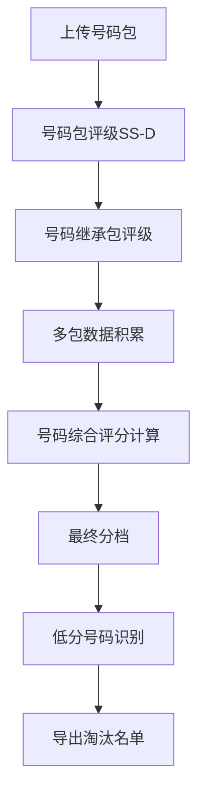
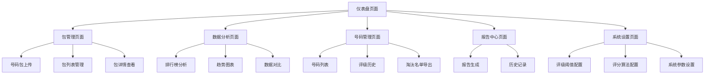
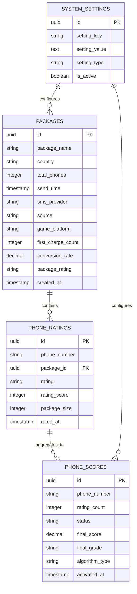
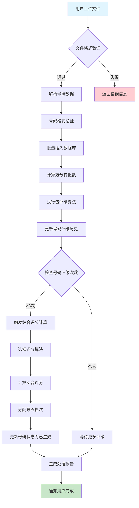
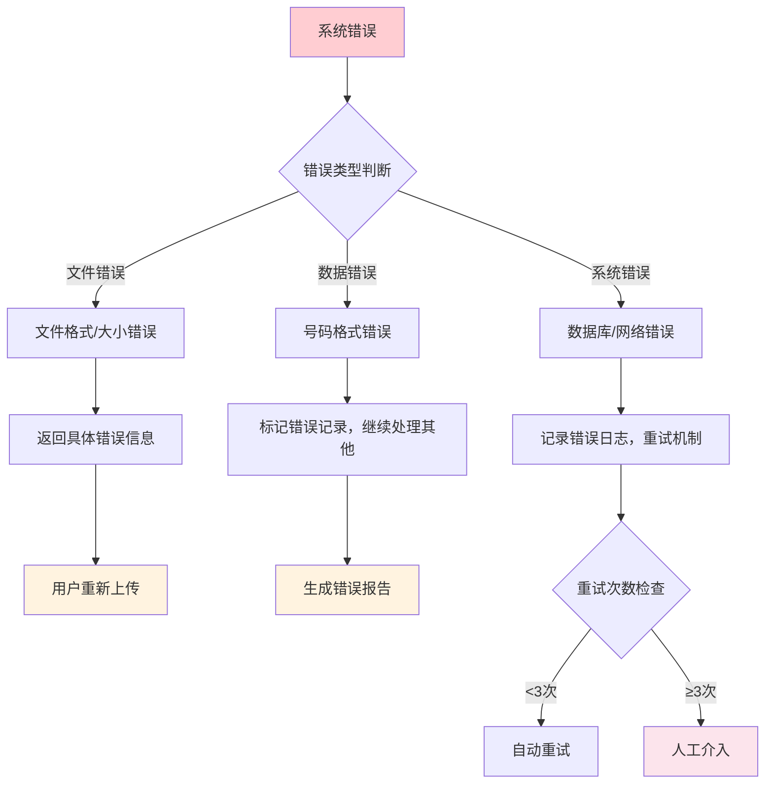

# SMS营销数据分析系统 - 产品需求文档

## 📋 开发指导总览

### 🎯 开发优先级与里程碑

**MVP阶段（第1-4周）- 核心功能**

* **P0 - 必须完成**：

  * 用户认证系统（登录/注册）

  * 号码包上传功能（基础版）

  * 万分转化数计算

  * 号码包评级（SS-D）

  * 基础数据展示

**增强阶段（第5-8周）- 分析功能**

* **P1 - 重要功能**：

  * 号码综合评分系统

  * 数据分析页面（排行榜）

  * 报告生成功能

  * 系统设置页面

**优化阶段（第9-12周）- 高级功能**

* **P2 - 优化功能**：

  * 大数据量处理优化

  * 高级筛选和搜索

  * 实时监控仪表盘

  * API接口开放

### 📖 核心用户故事

**用户故事1：号码包上传与评级**

```
作为一名营销操作员
我希望能够上传包含手机号码的TXT文件
以便系统能够自动计算万分转化数并为号码包评级
从而快速了解号码包的质量

验收标准：
✅ 支持TXT/CSV格式文件上传
✅ 文件大小限制在100MB以内
✅ 自动验证巴西号码格式（13-14位，55开头）
✅ 30秒内完成1万条号码处理
✅ 自动计算万分转化数并显示
✅ 根据阈值自动评级（SS/S/A/B/C/D）
✅ 显示上传进度和处理状态
```

**用户故事2：数据分析与排行榜**

```
作为一名数据分析师
我希望能够查看各维度的排行榜数据
以便分析不同短信商、来源、平台的表现
从而优化营销策略

验收标准：
✅ 提供4个排行榜：号码包、短信商、游戏平台、来源
✅ 支持5个时间维度筛选（昨天、3天、7天、15天、30天）
✅ 数据查询响应时间<3秒
✅ 支持排序和分页显示
✅ 显示万分转化数、总号码数、首充人数等关键指标
```

**用户故事3：号码质量管理**

```
作为一名营销管理员
我希望能够识别和管理低质量号码
以便排除这些号码，提高后续营销效果
从而降低营销成本

验收标准：
✅ 号码需被评级3次以上才计算综合评分
✅ 支持3种评分算法（简单平均、加权平均、时间衰减）
✅ 提供A/B/C/D/E五档分级
✅ 支持按状态、档次、评分范围筛选
✅ 可导出低分号码名单（CSV/Excel格式）
✅ 管理员可强制生效号码评分
```

### 🔄 开发检查清单

**前端开发检查清单**：

* [ ] React 18 + TypeScript 项目初始化

* [ ] TailwindCSS 样式系统配置

* [ ] 路由系统设置（React Router）

* [ ] 状态管理配置（Zustand/Redux）

* [ ] API 客户端配置（Axios + Supabase SDK）

* [ ] 表单验证库集成（React Hook Form + Zod）

* [ ] 图表库集成（Chart.js/Recharts）

* [ ] 文件上传组件开发

* [ ] 数据表格组件开发（支持虚拟滚动）

* [ ] 响应式设计实现

**后端开发检查清单**：

* [ ] Supabase 项目创建和配置

* [ ] 数据库表结构创建

* [ ] 行级安全策略配置

* [ ] 认证系统配置

* [ ] 文件存储配置

* [ ] 实时订阅功能配置

* [ ] 数据库函数编写（评级计算）

* [ ] 批量处理逻辑实现

* [ ] 性能优化（索引、查询优化）

* [ ] 数据备份策略实施

**测试检查清单**：

* [ ] 单元测试覆盖率 >80%

* [ ] 集成测试（API 接口）

* [ ] 端到端测试（关键用户流程）

* [ ] 性能测试（大数据量处理）

* [ ] 安全测试（权限控制）

* [ ] 兼容性测试（浏览器兼容）

### 0.1 重要概念区分

为确保开发人员准确理解业务需求，特此明确定义系统中的核心术语：

**万分转化数（万分之几）**：

* **定义**：每万条号码中产生首充的数量，表示为"万分之几"

* **计算公式**：(首充人数 / 号码总数) × 10000

* **表述方式**：结果直接表示为万分之几，如50表示"万分之五十"

* **优势**：比"万充转化率"更直观易懂，便于业务沟通

**评级（Rating）**：

* **对象**：号码包（整个包）

* **时机**：上传号码包时

* **依据**：基于万分转化数

* **结果**：SS/S/A/B/C/D（6个等级）

* **作用**：为号码包质量分级，为包内号码提供初始评级基础

**评分（Score）**：

* **对象**：单个号码

* **时机**：号码被评级N次后才计算

* **依据**：基于多次评级历史数据

* **结果**：综合分数 + 最终分档（超高价值/高价值/中价值/低价值/超低价值）

* **作用**：识别低质量号码用于淘汰

**号码包评级**：专指对整个号码包基于万分转化数的评估过程
**号码综合评分**：专指对单个号码基于多次评级历史的综合计算过程

### 0.2 业务流程区分

**流程1：号码包评级流程**

```
上传号码包 → 计算万分转化数 → 包评级(SS-D) → 包内号码继承评级
```

**流程2：号码综合评分流程**

```
号码评级历史积累 → 达到N次阈值 → 综合评分计算 → 最终分档 → 可下载分档
```

### 0.3 数据表对应关系

* **packages表**：存储号码包信息和评级结果

* **phone\_ratings表**：记录号码的评级历史（来自不同包的评级）

* **phone\_scores表**：存储号码的综合评分和最终分档

## 1. 产品概述

SMS营销数据分析系统是一个专为游戏行业设计的号码价值评估和数据分析平台。通过上传包含手机号码的TXT文档（号码包），系统收集并分析短信营销的转化效果，帮助企业识别和排除低转化率号码。

**业务规模**：系统需支持每日处理20-50万条号码数据，即每天上传20-50个号码包（每包约1万条号码），确保高并发场景下的稳定运行和快速响应。

核心价值：通过"万分转化数"指标（每万条号码产生的首充客户数量）实现基于万分转化数的精准排除法策略，去除低质量号码，优化营销成本。

目标市场：内部使用，基于巴西市场，未来扩向多国家。

**性能要求**：

* 日处理能力：20-50万条号码数据

* 并发上传：支持20-50个号码包同时处理

* 单包上传时间：30秒内完成1万条号码处理

* 系统响应时间：数据查询3秒内响应，报告生成30秒内完成

* 数据存储：支持千万级号码数据存储和快速检索

## 2. 核心功能

### 2.1 用户角色（适合5人高效小团队）

| 角色  | 人数建议 | 注册方式  | 核心权限                                |
| --- | ---- | ----- | ----------------------------------- |
| 管理员 | 2-3人 | 系统分配  | 全部功能：调整参数、上传数据、查看报告、系统配置、沙盒测试、API管理 |
| 操作员 | 2-3人 | 管理员分配 | 基础功能：上传号码包、查看仪表盘、生成报告、数据导出          |

### 2.2 双重评估系统架构

本系统采用创新的双重评估机制，确保号码质量评估的准确性：

**第一层：号码包评级（Package Rating）**

* 触发时机：用户上传号码包时

* 评级依据：基于首充人数计算的万分转化数

* 评级标准：SS/S/A/B/C/D（6个等级）

* 作用范围：为包内所有号码提供初始评级基础

**第二层：号码综合评分（Phone Scoring）**

* 数据来源：号码在多个包中的历史评级记录

* 计算方式：支持加权平均、简单平均、时间衰减等算法

* 输出结果：可自定义分档（如A/B/C/D/E或高/中/低）

* 业务价值：精准识别低质量号码，支持营销优化

**完整业务流程**：

1. **号码包上传阶段**：用户上传号码包 → 系统验证格式 → 录入包信息（发送时间、短信商、来源、游戏平台、反馈数据）
2. **号码包评级阶段**：系统计算万分转化数 → 基于阈值自动评级（SS/S/A/B/C/D） → 包内号码继承评级
3. **号码积累阶段**：号码在多个包中被评级 → 累积评级历史数据 → 达到最小评级次数要求
4. **号码综合评分阶段**：系统计算号码综合评分 → 根据分档设置分配最终档次 → 识别低质量号码
5. **质量管理阶段**：筛选低分号码 → 导出淘汰名单 → 优化后续营销策略



### 2.3 功能模块

系统包含以下核心页面：

1. **包管理页面**：号码包上传（30秒完成1万条）、号码包评级、列表管理、实时进度显示
2. **数据分析页面**：万分转化数分析、趋势图表、数据对比、3秒内响应
3. **号码管理页面**：号码综合评分、历史评级记录、分档筛选、淘汰名单导出
4. **报告中心页面**：自动报告生成（日/周/月报）、PDF导出（30秒生成）、历史记录
5. **系统设置页面**：保本线阈值配置、号码包评级阈值配置、号码综合评分算法配置、沙盒测试模式、API接口管理、数据备份
6. **仪表盘页面**：实时监控、关键指标展示、号码包评级分布统计、号码质量趋势

### 2.4 页面详情

| 页面名称   | 模块名称       | 功能描述                                                                         |
| ------ | ---------- | ---------------------------------------------------------------------------- |
| 包管理页面  | 号码包上传      | 支持TXT格式上传，包名称自动填充，国家选择、发送时间、短信商下拉、来源下拉、游戏平台下拉、反馈数据录入                         |
| 包管理页面  | 包列表管理      | 显示包名称、上传时间、号码数量、万分转化数、号码包评级状态、发送时间、短信商等信息                                    |
| 包管理页面  | 包详情查看      | 展示详细统计信息、号码列表、操作历史、号码继承机制数据                                                  |
| 数据分析页面 | 号码包排行榜     | 基于万分转化数排序，显示排名、包名称、万分转化数、总号码数、总首充人数、上传时间、发送短信商等信息。支持时间筛选功能（昨天、3天、7天、15天、30天） |
| 数据分析页面 | 发送短信商排行榜   | 基于万分转化数排序，显示排名、短信商名称、万分转化数、总号码数、总首充人数、使用的号码包数量。支持时间筛选功能（昨天、3天、7天、15天、30天）    |
| 数据分析页面 | 游戏平台排行榜    | 基于万分转化数排序，显示排名、平台名称、万分转化数、总号码数、总首充人数、使用的号码包数量。支持时间筛选功能（昨天、3天、7天、15天、30天）     |
| 数据分析页面 | 号码包来源排行榜   | 基于万分转化数排序，显示排名、来源名称、万分转化数、总号码数、总首充人数、使用的号码包数量。支持时间筛选功能（昨天、3天、7天、15天、30天）     |
| 数据分析页面 | 时间筛选功能     | 提供5个时间维度选项（昨天、3天、7天、15天、30天），实时筛选各排行榜数据，基于选定时间段内累计发送量的万分转化数进行排序              |
| 数据分析页面 | 趋势分析图表     | 时间序列图表、对比分析、数据筛选、号码包评级分布                                                     |
| 数据分析页面 | 数据维度分析     | 按时间、短信商、来源、游戏平台等维度进行数据分析                                                     |
| 号码管理页面 | 号码列表       | 显示所有号码及其综合评分、被评级次数、历史评级记录、最终分档、评级次数、状态                                       |
| 号码管理页面 | 状态标识显示     | 用颜色和图标区分号码状态：灰色圆点(待评级)、黄色圆点(评级中)、绿色圆点(已生效)                                   |
| 号码管理页面 | 号码评级历史     | 查看单个号码的完整评级历史和综合评分计算过程                                                       |
| 号码管理页面 | 状态筛选功能     | 按状态筛选号码（待评级/评级中/已生效），按档次、评级次数、综合评分范围筛选                                       |
| 号码管理页面 | 淘汰名单导出     | 导出低分号码名单，只包含"已生效"状态的低分号码，支持CSV/Excel格式                                       |
| 号码管理页面 | 强制生效功能     | 管理员可手动将号码状态改为已生效，绕过评级次数限制                                                    |
| 号码管理页面 | 综合评分计算     | 支持手动触发重新计算，查看计算进度和结果                                                         |
| 报告中心页面 | 报告生成       | 自动生成PDF/Excel格式的分析报告（日/周/月报）                                                 |
| 报告中心页面 | 数据导出       | 支持多种格式导出，自定义导出字段                                                             |
| 报告中心页面 | 历史记录管理     | 查看历史报告、重新生成、分享功能                                                             |
| 系统设置页面 | 号码包评级阈值配置  | 自定义SS/S/A/B/C/D级号码包评级标准，支持实时预览影响                                             |
| 系统设置页面 | 保本线阈值配置    | 自定义保本线阈值（默认16个首充/万条号码），支持警告线和危险线设置                                           |
| 系统设置页面 | 号码综合评分算法配置 | 选择计算算法（加权平均/简单平均/时间衰减），设置权重参数                                                |
| 系统设置页面 | 自定义分档设置    | 配置最终分档数量、档次名称、分数区间（如A/B/C/D/E或高/中/低）                                         |
| 系统设置页面 | 最小评级次数     | 设置号码需要被评级的最少次数才计算综合评分（防误杀机制）                                                 |
| 系统设置页面 | 沙盒测试模式     | 开启/关闭沙盒模式，测试新的保本线阈值而不影响正式业务                                                  |
| 系统设置页面 | 下拉选项管理     | 发送短信商、号码包来源、游戏平台选项的添加、编辑、删除管理                                                |
| 系统设置页面 | API接口管理    | API密钥管理、接口权限控制、调用频率限制（预留设计）                                                  |
| 系统设置页面 | 数据管理       | 数据备份、清理历史数据、导入导出功能                                                           |

## 3. 核心流程

### 3.1 主要业务流程

**双重评估系统完整流程**：

**第一阶段：号码包评级流程**

1. 用户上传号码包文件（CSV/TXT格式）
2. 系统验证号码格式（巴西号码：13-14位，以55开头）
3. 用户录入包信息（发送时间、短信服务商、号码包来源、游戏平台、反馈数据）
4. 系统基于首充人数自动计算万分转化数
5. 根据号码包评级标准自动为号码包评级（SS/S/A/B/C/D）
6. 包内所有号码继承包的评级，更新号码评级历史

**第二阶段：号码综合评分流程**
7\. 系统检测号码是否达到最小评级次数要求
8\. 对符合条件的号码执行综合评分计算（加权平均/简单平均/时间衰减）
9\. 根据自定义分档设置，为号码分配最终档次
10\. 更新号码综合评分数据库
11\. 生成分析报告和统计数据

**号码质量管理流程**：

1. 用户进入号码管理页面
2. 按分档、评级次数等条件筛选号码
3. 查看低质量号码列表
4. 导出淘汰名单（CSV/Excel格式）
5. 在后续营销中避免使用低质量号码

**报告生成流程**：

1. 系统自动收集数据（日/周/月）
2. 生成分析报告（PDF/Excel格式）
3. 用户查看和下载报告
4. 支持历史报告管理和分享

### 3.2 页面导航流程



## 4. 核心算法与配置

### 4.1 号码包评级算法

**万分转化数计算**：

```javascript
// 万分转化数计算公式
const conversionRate = (firstChargeCount / totalPhoneCount) * 10000;

// 代码实现示例
function calculateConversionRate(packageData) {
    const { firstChargeCount, totalPhoneCount } = packageData;
    
    if (totalPhoneCount === 0) {
        throw new Error('号码总数不能为0');
    }
    
    const rate = (firstChargeCount / totalPhoneCount) * 10000;
    return Math.round(rate * 100) / 100; // 保留2位小数
}
```

**号码包评级标准**（可自定义）：

| 评级  | 默认阈值  | 可调整范围  | 说明              |
| --- | ----- | ------ | --------------- |
| SS级 | ≥50   | 30-100 | 超级优质号码，万分之五十及以上 |
| S级  | 30-49 | 20-49  | 优质号码，万分之三十至四十九  |
| A级  | 20-29 | 15-29  | 良好号码，万分之二十至二十九  |
| B级  | 16-19 | 10-19  | 保本线附近，万分之十六至十九  |
| C级  | 10-15 | 5-15   | 接近保本线，万分之十至十五   |
| D级  | <10   | <10    | 低效号码，建议排除       |

**评级算法实现**：

```javascript
// 号码包评级算法
function getPackageRating(conversionRate, thresholds) {
    if (conversionRate >= thresholds.SS) return 'SS';
    if (conversionRate >= thresholds.S) return 'S';
    if (conversionRate >= thresholds.A) return 'A';
    if (conversionRate >= thresholds.B) return 'B';
    if (conversionRate >= thresholds.C) return 'C';
    return 'D';
}

// 默认阈值配置
const defaultThresholds = {
    SS: 50,
    S: 30,
    A: 20,
    B: 16,
    C: 10
};
```

### 4.2 号码综合评分算法

**防误杀机制**：

* 号码需要在N个不同的号码包中出现（被评级N次），才会触发该号码的综合评分计算

* 默认值：3次（可在系统设置中配置，范围1-10次）

**号码状态管理**：

* **待评级**：评级次数 < N次，显示灰色标识

* **评级中**：评级次数 = N次，但综合评分未生效，显示黄色标识

* **已生效**：评级次数 ≥ N次，综合评分已生效，显示绿色标识

**1. 简单平均算法**：

```javascript
// 简单平均算法
function calculateSimpleAverage(ratings) {
    const totalScore = ratings.reduce((sum, rating) => sum + rating.score, 0);
    return totalScore / ratings.length;
}

// 使用示例
const phoneRatings = [
    { score: 85, date: '2024-01-01' },
    { score: 70, date: '2024-01-15' },
    { score: 90, date: '2024-02-01' }
];
const averageScore = calculateSimpleAverage(phoneRatings);
```

**2. 加权平均算法**：

```javascript
// 加权平均算法（基于包规模）
function calculateWeightedAverage(ratings) {
    let totalWeightedScore = 0;
    let totalWeight = 0;
    
    ratings.forEach(rating => {
        const weight = rating.packageSize / 10000; // 包规模越大权重越高
        totalWeightedScore += rating.score * weight;
        totalWeight += weight;
    });
    
    return totalWeight > 0 ? totalWeightedScore / totalWeight : 0;
}

// 使用示例
const phoneRatingsWithWeight = [
    { score: 85, packageSize: 5000, date: '2024-01-01' },
    { score: 70, packageSize: 15000, date: '2024-01-15' },
    { score: 90, packageSize: 8000, date: '2024-02-01' }
];
```

**3. 时间衰减算法**：

```javascript
// 时间衰减算法
function calculateTimeDecayAverage(ratings, decayFactor = 0.01) {
    const currentDate = new Date();
    let totalWeightedScore = 0;
    let totalWeight = 0;
    
    ratings.forEach(rating => {
        const daysDiff = Math.floor((currentDate - new Date(rating.date)) / (1000 * 60 * 60 * 24));
        const timeWeight = Math.exp(-decayFactor * daysDiff);
        
        totalWeightedScore += rating.score * timeWeight;
        totalWeight += timeWeight;
    });
    
    return totalWeight > 0 ? totalWeightedScore / totalWeight : 0;
}

// 使用示例
const phoneRatingsWithTime = [
    { score: 85, date: '2024-01-01' },
    { score: 70, date: '2024-01-15' },
    { score: 90, date: '2024-02-01' }
];
const timeDecayScore = calculateTimeDecayAverage(phoneRatingsWithTime);
```

### 4.3 评级分数映射配置

**评级分数映射**（可自定义）：

| 评级  | 默认分数 | 可调整范围  | 说明              |
| --- | ---- | ------ | --------------- |
| SS级 | 100分 | 80-100 | 超级优质评级对应分数，必须最高 |
| S级  | 85分  | 70-95  | 优质评级对应分数        |
| A级  | 70分  | 60-85  | 良好评级对应分数        |
| B级  | 55分  | 45-70  | 保本线评级对应分数       |
| C级  | 40分  | 30-55  | 接近保本线评级对应分数     |
| D级  | 25分  | 10-40  | 低效评级对应分数，必须最低   |

**配置约束**：

* 分数必须严格递减：SS > S > A > B > C > D

* 相邻评级分数差距不能小于5分

* SS级分数不能低于80分，D级分数不能高于40分

```javascript
// 评级分数映射实现
const defaultRatingScoreMap = {
    'SS': 100,
    'S': 85,
    'A': 70,
    'B': 55,
    'C': 40,
    'D': 25
};

function getRatingScore(rating, customMap = null) {
    const scoreMap = customMap || defaultRatingScoreMap;
    return scoreMap[rating] || 0;
}
```

### 4.4 最终分档标准配置

**默认5档制分数区间**：

| 档次 | 分数区间   | 说明    | 颜色编码  |
| -- | ------ | ----- | ----- |
| A档 | ≥ 80分  | 优秀号码  | 🟢 绿色 |
| B档 | 60-79分 | 良好号码  | 🔵 蓝色 |
| C档 | 40-59分 | 一般号码  | 🟡 黄色 |
| D档 | 20-39分 | 较差号码  | 🟠 橙色 |
| E档 | < 20分  | 低质量号码 | 🔴 红色 |

**分档算法实现**：

```javascript
// 最终分档算法
function getFinalGrade(score, gradeConfig) {
    for (const grade of gradeConfig) {
        if (score >= grade.minScore) {
            return grade.name;
        }
    }
    return gradeConfig[gradeConfig.length - 1].name; // 返回最低档
}

// 默认分档配置
const defaultGradeConfig = [
    { name: 'A', minScore: 80, color: 'green' },
    { name: 'B', minScore: 60, color: 'blue' },
    { name: 'C', minScore: 40, color: 'yellow' },
    { name: 'D', minScore: 20, color: 'orange' },
    { name: 'E', minScore: 0, color: 'red' }
];
```

### 4.5 保本线配置

**保本线标准**：

| 配置项   | 默认值           | 可调整范围       | 说明           |
| ----- | ------------- | ----------- | ------------ |
| 保本线阈值 | 16个首充/万条号码    | 10-30       | 盈亏平衡点，低于此值亏损 |
| 警告线阈值 | 12.8（保本线的80%） | 保本线的60%-90% | 接近保本线预警      |
| 危险线阈值 | 9.6（保本线的60%）  | 保本线的40%-80% | 严重低于保本线警告    |

```javascript
// 保本线判断算法
function getBreakevenStatus(conversionRate, thresholds) {
    if (conversionRate >= thresholds.breakeven) {
        return { status: 'safe', level: 'green', message: '盈利状态' };
    } else if (conversionRate >= thresholds.warning) {
        return { status: 'warning', level: 'yellow', message: '接近保本线' };
    } else if (conversionRate >= thresholds.danger) {
        return { status: 'danger', level: 'orange', message: '低于保本线' };
    } else {
        return { status: 'critical', level: 'red', message: '严重亏损' };
    }
}
```

## 5. 数据模型设计

### 5.1 核心数据表

**号码包表（packages）**：

```sql
CREATE TABLE packages (
    id UUID PRIMARY KEY DEFAULT gen_random_uuid(),
    package_name VARCHAR(255) NOT NULL,
    country VARCHAR(50) DEFAULT 'Brazil',
    file_path VARCHAR(500),
    total_phones INTEGER NOT NULL,
    send_time TIMESTAMP NOT NULL,
    sms_provider VARCHAR(100) NOT NULL,
    source VARCHAR(100) NOT NULL,
    game_platform VARCHAR(100) NOT NULL,
    visit_count INTEGER DEFAULT 0,
    register_count INTEGER DEFAULT 0,
    first_charge_count INTEGER DEFAULT 0,
    total_amount DECIMAL(15,2) DEFAULT 0,
    conversion_rate DECIMAL(8,2) DEFAULT 0, -- 万分转化数
    package_rating VARCHAR(10), -- SS/S/A/B/C/D
    status VARCHAR(20) DEFAULT 'processing',
    created_at TIMESTAMP DEFAULT NOW(),
    updated_at TIMESTAMP DEFAULT NOW()
);

-- 索引
CREATE INDEX idx_packages_rating ON packages(package_rating);
CREATE INDEX idx_packages_conversion_rate ON packages(conversion_rate DESC);
CREATE INDEX idx_packages_created_at ON packages(created_at DESC);
```

**号码评级历史表（phone\_ratings）**：

```sql
CREATE TABLE phone_ratings (
    id UUID PRIMARY KEY DEFAULT gen_random_uuid(),
    phone_number VARCHAR(20) NOT NULL,
    package_id UUID NOT NULL REFERENCES packages(id),
    rating VARCHAR(10) NOT NULL, -- SS/S/A/B/C/D
    rating_score INTEGER NOT NULL, -- 评级对应的分数
    package_size INTEGER NOT NULL, -- 包的大小，用于加权计算
    rated_at TIMESTAMP DEFAULT NOW(),
    created_at TIMESTAMP DEFAULT NOW()
);

-- 索引
CREATE INDEX idx_phone_ratings_phone ON phone_ratings(phone_number);
CREATE INDEX idx_phone_ratings_package ON phone_ratings(package_id);
CREATE INDEX idx_phone_ratings_rated_at ON phone_ratings(rated_at DESC);
```

**号码综合评分表（phone\_scores）**：

```sql
CREATE TABLE phone_scores (
    id UUID PRIMARY KEY DEFAULT gen_random_uuid(),
    phone_number VARCHAR(20) UNIQUE NOT NULL,
    rating_count INTEGER DEFAULT 0, -- 被评级次数
    status VARCHAR(20) DEFAULT 'pending' CHECK (status IN ('pending', 'processing', 'active')),
    simple_average_score DECIMAL(8,2), -- 简单平均分数
    weighted_average_score DECIMAL(8,2), -- 加权平均分数
    time_decay_score DECIMAL(8,2), -- 时间衰减分数
    final_score DECIMAL(8,2), -- 最终使用的分数
    final_grade VARCHAR(10), -- 最终分档 (A/B/C/D/E)
    algorithm_type VARCHAR(20) DEFAULT 'weighted', -- 使用的算法类型
    min_rating_threshold INTEGER DEFAULT 3, -- 最小评级次数要求
    activated_at TIMESTAMP, -- 生效时间
    last_calculated TIMESTAMP, -- 最后计算时间
    created_at TIMESTAMP DEFAULT NOW(),
    updated_at TIMESTAMP DEFAULT NOW()
);

-- 索引
CREATE INDEX idx_phone_scores_phone ON phone_scores(phone_number);
CREATE INDEX idx_phone_scores_status ON phone_scores(status);
CREATE INDEX idx_phone_scores_final_grade ON phone_scores(final_grade);
CREATE INDEX idx_phone_scores_final_score ON phone_scores(final_score DESC);
```

**系统配置表（system\_settings）**：

```sql
CREATE TABLE system_settings (
    id UUID PRIMARY KEY DEFAULT gen_random_uuid(),
    setting_key VARCHAR(100) UNIQUE NOT NULL,
    setting_value TEXT NOT NULL,
    setting_type VARCHAR(20) NOT NULL, -- 'threshold', 'algorithm', 'mapping', 'general'
    description TEXT,
    is_active BOOLEAN DEFAULT true,
    created_at TIMESTAMP DEFAULT NOW(),
    updated_at TIMESTAMP DEFAULT NOW()
);

-- 初始化配置数据
INSERT INTO system_settings (setting_key, setting_value, setting_type, description) VALUES
('package_rating_thresholds', '{"SS":50,"S":30,"A":20,"B":16,"C":10}', 'threshold', '号码包评级阈值配置'),
('rating_score_mapping', '{"SS":100,"S":85,"A":70,"B":55,"C":40,"D":25}', 'mapping', '评级分数映射配置'),
('final_grade_config', '[{"name":"A","minScore":80,"color":"green"},{"name":"B","minScore":60,"color":"blue"},{"name":"C","minScore":40,"color":"yellow"},{"name":"D","minScore":20,"color":"orange"},{"name":"E","minScore":0,"color":"red"}]', 'mapping', '最终分档标准配置'),
('breakeven_thresholds', '{"breakeven":16,"warning":12.8,"danger":9.6}', 'threshold', '保本线配置'),
('min_rating_count', '3', 'general', '最小评级次数要求'),
('scoring_algorithm', 'weighted', 'algorithm', '默认评分算法');
```

### 5.2 数据关系图



## 6. API接口设计

### 6.1 时间筛选功能API接口

**获取排行榜数据（支持时间筛选）**：

```javascript
GET /api/analytics/rankings?type=packages&timeRange=7days&page=1&limit=20

// 请求参数说明
{
    type: string, // 排行榜类型：packages(号码包), sms_providers(短信商), platforms(游戏平台), sources(来源)
    timeRange: string, // 时间范围：yesterday, 3days, 7days, 15days, 30days
    page: number, // 页码
    limit: number, // 每页数量
    sortBy: string, // 排序字段，默认为conversion_rate
    order: string // 排序方向：desc(降序), asc(升序)
}

// 响应示例
{
    "success": true,
    "data": {
        "rankings": [
            {
                "rank": 1,
                "name": "优质号码包001",
                "conversionRate": 45.8,
                "totalPhones": 15000,
                "firstChargeCount": 687,
                "smsProvider": "短信商A",
                "uploadTime": "2024-01-15T10:30:00Z"
            }
        ],
        "timeRange": {
            "type": "7days",
            "startDate": "2024-01-08T00:00:00Z",
            "endDate": "2024-01-14T23:59:59Z",
            "description": "过去7天（不包含今天）"
        },
        "pagination": {
            "page": 1,
            "limit": 20,
            "total": 150,
            "totalPages": 8
        }
    }
}
```

**时间范围计算逻辑**：

```javascript
// 时间范围计算函数
function calculateTimeRange(timeRangeType) {
    const now = new Date();
    const today = new Date(now.getFullYear(), now.getMonth(), now.getDate());
    
    switch (timeRangeType) {
        case 'yesterday':
            const yesterday = new Date(today);
            yesterday.setDate(today.getDate() - 1);
            return {
                startDate: new Date(yesterday.getFullYear(), yesterday.getMonth(), yesterday.getDate(), 0, 0, 0),
                endDate: new Date(yesterday.getFullYear(), yesterday.getMonth(), yesterday.getDate(), 23, 59, 59)
            };
            
        case '3days':
            const threeDaysAgo = new Date(today);
            threeDaysAgo.setDate(today.getDate() - 3);
            return {
                startDate: new Date(threeDaysAgo.getFullYear(), threeDaysAgo.getMonth(), threeDaysAgo.getDate(), 0, 0, 0),
                endDate: new Date(today.getTime() - 1) // 今天00:00:00前一毫秒
            };
            
        case '7days':
            const sevenDaysAgo = new Date(today);
            sevenDaysAgo.setDate(today.getDate() - 7);
            return {
                startDate: new Date(sevenDaysAgo.getFullYear(), sevenDaysAgo.getMonth(), sevenDaysAgo.getDate(), 0, 0, 0),
                endDate: new Date(today.getTime() - 1)
            };
            
        case '15days':
            const fifteenDaysAgo = new Date(today);
            fifteenDaysAgo.setDate(today.getDate() - 15);
            return {
                startDate: new Date(fifteenDaysAgo.getFullYear(), fifteenDaysAgo.getMonth(), fifteenDaysAgo.getDate(), 0, 0, 0),
                endDate: new Date(today.getTime() - 1)
            };
            
        case '30days':
            const thirtyDaysAgo = new Date(today);
            thirtyDaysAgo.setDate(today.getDate() - 30);
            return {
                startDate: new Date(thirtyDaysAgo.getFullYear(), thirtyDaysAgo.getMonth(), thirtyDaysAgo.getDate(), 0, 0, 0),
                endDate: new Date(today.getTime() - 1)
            };
            
        default:
            throw new Error('不支持的时间范围类型');
    }
}
```

**前端交互设计要点**：

1. **时间选项按钮组**：

   * 5个按钮水平排列：昨天、3天、7天、15天、30天

   * 默认选中"7天"选项

   * 选中状态：蓝色背景 + 白色文字

   * 未选中状态：白色背景 + 灰色边框 + 深色文字

   * 悬停效果：浅蓝色背景

2. **实时筛选交互**：

   * 点击时间选项后立即发起API请求

   * 显示加载状态（按钮禁用 + 加载图标）

   * 数据更新后移除加载状态

   * 排行榜数据平滑过渡更新

3. **数据聚合说明**：

   * 显示选定时间段内的累计发送量

   * 基于万分转化数进行排序

   * 实时计算和更新排行榜位置

### 6.2 号码包评级相关接口

**上传号码包**：

```javascript
POST /api/packages/upload
Content-Type: multipart/form-data

// 请求参数
{
    file: File, // TXT文件
    packageName: string,
    country: string,
    sendTime: datetime,
    smsProvider: string,
    source: string,
    gamePlatform: string,
    visitCount: number,
    registerCount: number,
    firstChargeCount: number,
    totalAmount: number
}

// 响应示例
{
    "success": true,
    "data": {
        "packageId": "uuid",
        "packageName": "test_package_001",
        "totalPhones": 10000,
        "conversionRate": 25.5,
        "packageRating": "C",
        "status": "processing"
    }
}
```

**获取号码包列表**：

```javascript
GET /api/packages?page=1&limit=20&rating=SS&sortBy=conversionRate&order=desc

// 响应示例
{
    "success": true,
    "data": {
        "packages": [
            {
                "id": "uuid",
                "packageName": "test_package_001",
                "totalPhones": 10000,
                "conversionRate": 25.5,
                "packageRating": "C",
                "smsProvider": "Provider A",
                "source": "Source A",
                "gamePlatform": "Platform A",
                "createdAt": "2024-01-01T00:00:00Z"
            }
        ],
        "pagination": {
            "page": 1,
            "limit": 20,
            "total": 100,
            "totalPages": 5
        }
    }
}
```

### 6.2 号码综合评分相关接口

**获取号码列表**：

```javascript
GET /api/phones/scores?page=1&limit=20&status=active&grade=A&minScore=80

// 响应示例
{
    "success": true,
    "data": {
        "phones": [
            {
                "phoneNumber": "5565992273833",
                "ratingCount": 5,
                "status": "active",
                "finalScore": 85.5,
                "finalGrade": "A",
                "algorithmType": "weighted",
                "activatedAt": "2024-01-15T00:00:00Z"
            }
        ],
        "pagination": {
            "page": 1,
            "limit": 20,
            "total": 500,
            "totalPages": 25
        }
    }
}
```

**触发号码评分计算**：

```javascript
POST /api/phones/calculate-scores
{
    "phoneNumbers": ["5565992273833", "5541988007698"], // 可选，不传则计算所有符合条件的号码
    "algorithmType": "weighted", // simple, weighted, timeDecay
    "forceRecalculate": false
}

// 响应示例
{
    "success": true,
    "data": {
        "taskId": "uuid",
        "processedCount": 150,
        "totalCount": 150,
        "status": "completed"
    }
}
```

### 6.3 系统配置相关接口

**获取系统配置**：

```javascript
GET /api/settings?type=threshold

// 响应示例
{
    "success": true,
    "data": {
        "packageRatingThresholds": {
            "SS": 50,
            "S": 30,
            "A": 20,
            "B": 16,
            "C": 10
        },
        "ratingScoreMapping": {
            "SS": 100,
            "S": 85,
            "A": 70,
            "B": 55,
            "C": 40,
            "D": 25
        }
    }
}
```

**更新系统配置**：

```javascript
PUT /api/settings
{
    "packageRatingThresholds": {
        "SS": 55,
        "S": 35,
        "A": 25,
        "B": 18,
        "C": 12
    }
}

// 响应示例
{
    "success": true,
    "message": "配置更新成功",
    "data": {
        "updatedSettings": ["packageRatingThresholds"],
        "affectedPackages": 25,
        "affectedPhones": 1500
    }
}
```

## 7. 号码包上传详细设计

### 7.1 上传表单字段

```
📦 号码包上传表单：
├── 包名称：[跟随文件名字] - 自动填充，可手动修改
├── 国家选择：[下拉选择] *必填，影响号码验证规则
├── TXT文件：[文件上传] *必填，每行一个号码
├── 📅 发送时间：[日期时间选择器] *必填
├── 📱 发送短信商：[下拉选择] *必填
├── 🏷️ 号码包来源：[下拉选择] *必填
├── 🎮 游戏平台：[下拉选择] *必填
└── 📈 反馈数据：*必填
    ├── 访问人数：[数字输入] - 点击了链接的人数
    ├── 注册人数：[数字输入] - 真正注册游戏的人数
    ├── 首充人数：[数字输入] - 第一次充值的人数
    └── 充值金额：[数字输入，货币格式] - 总充值金额
```

### 7.2 号码验证规则

**巴西号码验证**：

```javascript
// 巴西号码验证函数
function validateBrazilPhone(phoneNumber) {
    // 移除所有非数字字符
    const cleanNumber = phoneNumber.replace(/\D/g, '');
    
    // 检查长度（13-14位）
    if (cleanNumber.length < 13 || cleanNumber.length > 14) {
        return { valid: false, error: '号码长度必须为13-14位' };
    }
    
    // 检查是否以55开头
    if (!cleanNumber.startsWith('55')) {
        return { valid: false, error: '巴西号码必须以55开头' };
    }
    
    return { valid: true, formattedNumber: cleanNumber };
}

// 批量验证号码
function validatePhoneNumbers(phoneList, country = 'Brazil') {
    const results = {
        valid: [],
        invalid: [],
        duplicates: [],
        summary: {
            total: phoneList.length,
            validCount: 0,
            invalidCount: 0,
            duplicateCount: 0
        }
    };
    
    const seenNumbers = new Set();
    
    phoneList.forEach((phone, index) => {
        const validation = validateBrazilPhone(phone);
        
        if (!validation.valid) {
            results.invalid.push({
                line: index + 1,
                phone: phone,
                error: validation.error
            });
            results.summary.invalidCount++;
        } else if (seenNumbers.has(validation.formattedNumber)) {
            results.duplicates.push({
                line: index + 1,
                phone: validation.formattedNumber
            });
            results.summary.duplicateCount++;
        } else {
            seenNumbers.add(validation.formattedNumber);
            results.valid.push(validation.formattedNumber);
            results.summary.validCount++;
        }
    });
    
    return results;
}
```

### 7.3 号码继承机制

**核心逻辑**：

* 同一个手机号可能出现在多个不同的号码包里

* 每个号码会继承所有包含它的号码包的信息

* 通过多次收集，逐渐了解每个号码的"性格"

**实现方式**：

```javascript
// 号码继承处理函数
async function processPhoneInheritance(packageId, phoneNumbers) {
    const inheritanceResults = [];
    
    for (const phoneNumber of phoneNumbers) {
        // 检查号码是否已存在
        const existingRatings = await PhoneRating.findAll({
            where: { phoneNumber },
            include: [{ model: Package, attributes: ['packageRating', 'conversionRate'] }]
        });
        
        // 获取当前包的评级
        const currentPackage = await Package.findByPk(packageId);
        const currentRating = currentPackage.packageRating;
        const currentScore = getRatingScore(currentRating);
        
        // 创建新的评级记录
        await PhoneRating.create({
            phoneNumber,
            packageId,
            rating: currentRating,
            ratingScore: currentScore,
            packageSize: currentPackage.totalPhones
        });
        
        // 更新号码的评级次数
        const [phoneScore, created] = await PhoneScore.findOrCreate({
            where: { phoneNumber },
            defaults: {
                ratingCount: 1,
                status: 'pending',
                algorithmType: 'weighted'
            }
        });
        
        if (!created) {
            phoneScore.ratingCount += 1;
            
            // 检查是否达到最小评级次数要求
            const minRatingThreshold = await getSystemSetting('min_rating_count', 3);
            if (phoneScore.ratingCount >= minRatingThreshold && phoneScore.status === 'pending') {
                phoneScore.status = 'processing';
                // 触发综合评分计算
                await calculatePhoneScore(phoneNumber);
            }
            
            await phoneScore.save();
        }
        
        inheritanceResults.push({
            phoneNumber,
            ratingCount: phoneScore.ratingCount,
            status: phoneScore.status,
            newRating: currentRating
        });
    }
    
    return inheritanceResults;
}
```

## 8. 系统设置页面设计

### 8.1 页面总览

系统设置页面采用简洁的分组卡片布局，聚焦核心业务配置需求，将配置分为可自定义配置和系统内置参数两大类别。

**可自定义配置类别**：

1. **号码包评级阈值配置**：自定义SS/S/A/B/C/D级评级标准
2. **评级分数映射配置**：自定义各评级对应的分数值
3. **最终分档标准配置**：自定义分档数量、档次名称和分数区间
4. **保本线配置**：自定义保本线、警告线、危险线阈值
5. **下拉选项管理**：管理短信商、来源、平台等选项

### 8.2 号码包评级阈值配置

**功能描述**：自定义SS/S/A/B/C/D级号码包评级标准，支持实时预览影响

| 配置项   | 默认值   | 可调整范围  | 说明              |
| ----- | ----- | ------ | --------------- |
| SS级阈值 | 50    | 30-100 | 超级优质号码，万分之五十及以上 |
| S级阈值  | 30-49 | 20-49  | 优质号码，万分之三十至四十九  |
| A级阈值  | 20-29 | 15-29  | 良好号码，万分之二十至二十九  |
| B级阈值  | 16-19 | 10-19  | 保本线附近，万分之十六至十九  |
| C级阈值  | 10-15 | 5-15   | 接近保本线，万分之十至十五   |
| D级阈值  | <10   | <10    | 低效号码，建议排除       |

**UI元素**：

* 分组卡片布局，每个评级一个配置行

* 数值输入框 + 滑块组件

* 实时预览影响（显示当前数据下各评级包数量变化）

* 颜色编码显示（SS级金色，S级银色，A级绿色，B级黄色，C级橙色，D级红色）

* 保存/重置按钮

### 8.3 综合评分配置

**功能描述**：配置号码综合评分的核心参数，包括评级分数映射和最终分档标准

**8.3.1 评级分数映射配置**

自定义SS/S/A/B/C/D级评级对应的分数值，用于号码综合评分计算：

| 配置项   | 默认值（推荐） | 可调整范围  | 说明              |
| ----- | ------- | ------ | --------------- |
| SS级分数 | 100     | 80-100 | 超级优质评级对应分数，必须最高 |
| S级分数  | 85      | 70-95  | 优质评级对应分数        |
| A级分数  | 70      | 60-85  | 良好评级对应分数        |
| B级分数  | 55      | 45-70  | 保本线评级对应分数       |
| C级分数  | 40      | 30-55  | 接近保本线评级对应分数     |
| D级分数  | 25      | 10-40  | 低效评级对应分数，必须最低   |

**配置约束**：

* 分数必须严格递减：SS > S > A > B > C > D

* 相邻评级分数差距不能小于5分

* SS级分数不能低于80分，D级分数不能高于40分

**8.3.2 最终分档标准配置**

自定义号码综合评分的最终分档标准：

| 配置项  | 默认值       | 可选范围   | 说明            |
| ---- | --------- | ------ | ------------- |
| 分档数量 | 5档        | 3-7档   | 系统支持的分档数量范围   |
| 档次名称 | A/B/C/D/E | 自定义    | 支持字母、中文、数字组合  |
| 分数区间 | 见下表       | 0-100分 | 每个档次对应的综合评分范围 |

**预设模板**：

* **5档制（A/B/C/D/E）- 默认**：A档≥80分，B档60-79分，C档40-59分，D档20-39分，E档<20分

* **3档制（高/中/低）**：高档≥70分，中档30-69分，低档<30分

* **4档制（优秀/良好/一般/较差）**：优秀≥75分，良好50-74分，一般25-49分，较差<25分

**配置约束**：

* 分数区间不能重叠，必须覆盖0-100分完整范围

* 档次名称不能重复，分数区间必须按降序排列

### 8.4 保本线配置

**功能描述**：保本线、警告线、危险线阈值设置

| 配置项   | 默认值           | 可调整范围       | 说明           |
| ----- | ------------- | ----------- | ------------ |
| 保本线阈值 | 16个首充/万条号码    | 10-30       | 盈亏平衡点，低于此值亏损 |
| 警告线阈值 | 12.8（保本线的80%） | 保本线的60%-90% | 接近保本线预警      |
| 危险线阈值 | 9.6（保本线的60%）  | 保本线的40%-80% | 严重低于保本线警告    |

### 8.5 下拉选项管理

**功能描述**：管理号码包上传时的下拉选项

**发送短信商管理**：

* 添加/编辑/删除短信服务商选项

* 设置默认选项

* 批量导入/导出

**号码包来源管理**：

* 管理号码包来源选项

* 支持分类管理

* 使用频率统计

**游戏平台管理**：

* 管理游戏平台选项

* 平台状态管理（启用/禁用）

* 平台性能统计

### 8.6 配置界面交互设计

**简洁布局设计**：

```
🎛️ 系统配置
├── 📊 号码包评级阈值配置（可自定义）
│   ├── SS级阈值 [50] ━━━━━━━━━━ (30-100)
│   ├── S级阈值  [30-49] ━━━━━━━━━━ (20-49)
│   └── ... (其他评级)
├── 🎯 评级分数映射配置（可自定义）
│   ├── SS级分数 [100] ━━━━━━━━━━ (80-100)
│   ├── S级分数  [85] ━━━━━━━━━━ (70-95)
│   └── ... (其他分数)
├── 🏆 最终分档标准配置（可自定义）
│   ├── 分档数量 [5档] ━━━━━━━━━━ (3-7档)
│   ├── A档设置 [≥80分] 名称:[A档] 🟢
│   └── ... (其他档次)
├── ⚖️ 保本线配置（可自定义）
│   ├── 保本线阈值 [16] ━━━━━━━━━━ (10-30)
│   ├── 警告线阈值 [12.8] ━━━━━━━━━━ (自动计算)
│   └── 危险线阈值 [9.6] ━━━━━━━━━━ (自动计算)
└── 📝 下拉选项管理（可自定义）
    ├── 发送短信商 [管理选项]
    ├── 号码包来源 [管理选项]
    └── 游戏平台   [管理选项]
```

## 9. 用户界面设计

### 9.1 设计风格

**主色调**：

* 主色：#2563EB（专业蓝）

* 辅色：#10B981（成功绿）、#F59E0B（警告黄）、#EF4444（危险红）

* 背景：#F8FAFC（浅灰）、#FFFFFF（纯白）

**按钮样式**：

* 主要按钮：圆角8px，渐变背景，悬停效果

* 次要按钮：边框样式，透明背景

* 危险按钮：红色背景，确认对话框

**字体设计**：

* 主字体：Inter, -apple-system, BlinkMacSystemFont, sans-serif

* 标题：24px/28px，字重600

* 正文：14px/20px，字重400

* 小字：12px/16px，字重400

**布局风格**：

* 卡片式布局，阴影效果

* 顶部导航栏固定

* 左侧边栏可收缩

* 响应式设计，支持移动端

**图标样式**：

* 使用Heroicons图标库

* 线性风格，1.5px线宽

* 状态图标：🟢🟡🔴表示不同状态

### 9.2 页面设计概览

| 页面名称   | 模块名称   | UI元素                                            |
| ------ | ------ | ----------------------------------------------- |
| 仪表盘页面  | 关键指标卡片 | 大数字显示、趋势图标、颜色编码（绿色上升、红色下降）                      |
| 仪表盘页面  | 实时监控面板 | 环形进度条、状态指示灯、实时数据更新                              |
| 包管理页面  | 上传表单   | 拖拽上传区域、**大文件上传进度条**、表单验证提示、文件预览、**批量上传队列显示**    |
| 包管理页面  | 包列表表格  | 排序表头、筛选器、分页器、评级徽章、操作按钮、**大数据量加载状态**             |
| 数据分析页面 | 排行榜表格  | 排名徽章、进度条、颜色编码、排序功能、**虚拟滚动（支持大数据量）**             |
| 数据分析页面 | 时间筛选功能 | 5个时间选项按钮（昨天、3天、7天、15天、30天），选中状态高亮，实时筛选效果，加载状态指示 |
| 数据分析页面 | 趋势图表   | 折线图、柱状图、饼图、时间选择器、图例、**大数据量分页加载**                |
| 号码管理页面 | 号码列表   | 状态圆点、评分进度条、档次徽章、筛选面板、**分页器（支持50万条数据）**          |
| 号码管理页面 | 评级历史   | 时间轴、评级变化图、详情弹窗                                  |
| 报告中心页面 | 报告列表   | 文件图标、下载按钮、生成状态、预览功能、**大文件下载进度**                 |
| 系统设置页面 | 配置表单   | 滑块组件、数值输入框、实时预览、保存确认                            |

### 9.3 大数据量处理界面设计

**批量上传界面**：

* **多文件队列显示**：支持同时上传20-50个号码包，显示每个文件的上传进度

* **总体进度指示**：显示整体上传进度（已完成/总数量）

* **实时速度显示**：显示当前上传速度（MB/s）和预计剩余时间

* **错误处理提示**：单个文件失败时不影响其他文件，提供重试选项

* **暂停/恢复功能**：支持暂停和恢复上传操作

**大数据量列表界面**：

* **虚拟滚动技术**：支持50万条数据的流畅滚动，只渲染可见区域

* **智能分页**：每页显示100-500条数据，支持快速跳转

* **加载状态指示**：数据加载时显示骨架屏或加载动画

* **搜索优化**：支持模糊搜索和精确搜索，搜索结果高亮显示

* **筛选面板**：多条件筛选，实时显示筛选结果数量

**数据处理反馈界面**：

* **处理进度条**：显示数据处理进度（解析、验证、入库）

* **处理状态提示**：成功、失败、警告状态的清晰区分

* **错误详情展示**：失败数据的详细错误信息和修复建议

* **处理结果统计**：成功数量、失败数量、重复数量的统计显示

**性能监控界面**：

* **系统负载指示**：CPU、内存、磁盘使用率的实时显示

* **处理队列状态**：当前处理队列长度和等待时间

* **并发处理显示**：当前并发处理的任务数量和状态

### 9.4 响应式设计

**桌面优先设计**：

* 主要针对1920x1080分辨率优化

* 支持1366x768及以上分辨率

* 侧边栏可收缩以适应小屏幕

**移动端适配**：

* 768px以下使用移动端布局

* 侧边栏改为抽屉式导航

* 表格改为卡片式布局

* 触摸友好的按钮尺寸（最小44px）

**交互优化**：

* 支持键盘导航

* 加载状态指示

* 错误提示友好

* 操作确认对话框

## 10. 性能要求

### 10.1 响应时间要求

* **页面加载**：首页 < 2秒，数据页面 < 3秒

* **数据上传**：1万号码 < 30秒

* **图表渲染**：数据图表 < 1秒，复杂图表 < 3秒

* **报告生成**：PDF报告 < 30秒，Excel报告 < 30秒

### 10.2 数据处理能力

* **单包容量**：支持最大10万个号码

* **并发用户**：支持50个并发用户

* **数据存储**：支持TB级数据存储

* **查询性能**：复杂查询 < 5秒

### 10.3 系统可用性

* **系统可用率**：99.5%以上

* **数据备份**：每日自动备份

* **故障恢复**：RTO < 4小时，RPO < 1小时

## 11. 安全要求

### 11.1 数据安全

* **数据加密**：敏感数据AES-256加密存储

* **传输安全**：HTTPS/TLS 1.3加密传输

* **访问控制**：基于角色的权限控制

* **数据脱敏**：号码显示部分脱敏处理

### 11.2 用户安全

* **身份认证**：支持邮箱/手机号注册登录

* **会话管理**：JWT token，24小时过期

* **操作审计**：记录关键操作日志

* **防护机制**：防SQL注入、XSS攻击

***

## 12. 开发实施指南

### 12.1 详细数据流程图

**完整业务数据流**：



**错误处理流程**：



### 12.2 API设计规范

**统一响应格式**：

```typescript
interface ApiResponse<T> {
  success: boolean;
  data?: T;
  error?: {
    code: string;
    message: string;
    details?: any;
  };
  meta?: {
    pagination?: {
      page: number;
      limit: number;
      total: number;
      totalPages: number;
    };
    timestamp: string;
    requestId: string;
  };
}
```

**错误代码规范**：

```typescript
enum ErrorCodes {
  // 认证错误 (1000-1099)
  UNAUTHORIZED = 'AUTH_1001',
  TOKEN_EXPIRED = 'AUTH_1002',
  INSUFFICIENT_PERMISSIONS = 'AUTH_1003',
  
  // 文件错误 (2000-2099)
  FILE_TOO_LARGE = 'FILE_2001',
  INVALID_FILE_FORMAT = 'FILE_2002',
  FILE_CORRUPTED = 'FILE_2003',
  
  // 数据错误 (3000-3099)
  INVALID_PHONE_FORMAT = 'DATA_3001',
  DUPLICATE_PACKAGE_NAME = 'DATA_3002',
  INVALID_DATE_RANGE = 'DATA_3003',
  
  // 系统错误 (5000-5099)
  DATABASE_ERROR = 'SYS_5001',
  EXTERNAL_SERVICE_ERROR = 'SYS_5002',
  RATE_LIMIT_EXCEEDED = 'SYS_5003'
}
```

**分页查询标准**：

```typescript
interface PaginationParams {
  page?: number;        // 页码，从1开始
  limit?: number;       // 每页数量，默认20，最大100
  sortBy?: string;      // 排序字段
  order?: 'asc' | 'desc'; // 排序方向
}

interface FilterParams {
  search?: string;      // 搜索关键词
  dateFrom?: string;    // 开始日期 (ISO 8601)
  dateTo?: string;      // 结束日期 (ISO 8601)
  status?: string[];    // 状态筛选
  rating?: string[];    // 评级筛选
}
```

### 12.3 性能监控指标

**关键性能指标 (KPI)**：

```typescript
interface PerformanceMetrics {
  // 响应时间指标
  apiResponseTime: {
    average: number;      // 平均响应时间 (ms)
    p95: number;         // 95%分位响应时间
    p99: number;         // 99%分位响应时间
  };
  
  // 处理能力指标
  throughput: {
    uploadsPerHour: number;     // 每小时上传包数
    recordsPerSecond: number;   // 每秒处理记录数
    concurrentUsers: number;    // 并发用户数
  };
  
  // 错误率指标
  errorRates: {
    uploadFailureRate: number;  // 上传失败率 (%)
    apiErrorRate: number;       // API错误率 (%)
    dataCorruptionRate: number; // 数据损坏率 (%)
  };
  
  // 资源使用指标
  resourceUsage: {
    cpuUtilization: number;     // CPU使用率 (%)
    memoryUsage: number;        // 内存使用量 (MB)
    diskUsage: number;          // 磁盘使用量 (GB)
    networkBandwidth: number;   // 网络带宽使用 (Mbps)
  };
}
```

**性能阈值设置**：

```typescript
const PERFORMANCE_THRESHOLDS = {
  // 响应时间阈值
  API_RESPONSE_TIME: {
    WARNING: 1000,    // 1秒警告
    CRITICAL: 3000    // 3秒严重
  },
  
  // 处理能力阈值
  UPLOAD_PROCESSING: {
    TARGET: 30,       // 目标：30秒处理1万条
    WARNING: 45,      // 警告：45秒
    CRITICAL: 60      // 严重：60秒
  },
  
  // 错误率阈值
  ERROR_RATE: {
    WARNING: 5,       // 5%警告
    CRITICAL: 10      // 10%严重
  },
  
  // 资源使用阈值
  RESOURCE_USAGE: {
    CPU_WARNING: 70,     // CPU 70%警告
    CPU_CRITICAL: 90,    // CPU 90%严重
    MEMORY_WARNING: 80,  // 内存 80%警告
    MEMORY_CRITICAL: 95  // 内存 95%严重
  }
};
```

### 12.4 数据验证规范

**号码验证规则**：

```typescript
interface PhoneValidationRules {
  brazil: {
    pattern: /^55\d{11,12}$/;
    minLength: 13;
    maxLength: 14;
    countryCode: '55';
    description: '巴西号码：55开头，总长度13-14位';
  };
  // 预留其他国家扩展
}

// 验证函数示例
function validateBrazilPhone(phone: string): ValidationResult {
  const cleaned = phone.replace(/\D/g, '');
  
  if (cleaned.length < 13 || cleaned.length > 14) {
    return { valid: false, error: '号码长度必须为13-14位' };
  }
  
  if (!cleaned.startsWith('55')) {
    return { valid: false, error: '巴西号码必须以55开头' };
  }
  
  return { valid: true };
}
```

**文件验证规则**：

```typescript
interface FileValidationRules {
  allowedFormats: ['.txt', '.csv'];
  maxSize: 104857600; // 100MB
  maxRecords: 100000; // 10万条记录
  encoding: ['utf-8', 'gbk', 'gb2312'];
  
  validation: {
    checkFileExtension: boolean;
    checkFileSize: boolean;
    checkEncoding: boolean;
    checkRecordCount: boolean;
    validatePhoneFormat: boolean;
  };
}
```

### 12.5 安全实施规范

**认证与授权**：

```typescript
interface SecurityConfig {
  authentication: {
    tokenExpiry: 86400;        // 24小时
    refreshTokenExpiry: 604800; // 7天
    maxLoginAttempts: 5;       // 最大登录尝试次数
    lockoutDuration: 900;      // 锁定时间15分钟
  };
  
  authorization: {
    roles: ['admin', 'operator'];
    permissions: {
      admin: ['*'];
      operator: [
        'packages:read',
        'packages:create',
        'analytics:read',
        'reports:read',
        'reports:create'
      ];
    };
  };
  
  dataProtection: {
    phoneNumberMasking: true;   // 号码脱敏显示
    auditLogging: true;         // 操作审计日志
    dataEncryption: true;       // 敏感数据加密
    backupEncryption: true;     // 备份数据加密
  };
}
```

**数据脱敏规则**：

```typescript
function maskPhoneNumber(phone: string): string {
  // 显示前3位和后4位，中间用*替代
  // 例：5565992273833 -> 556****3833
  if (phone.length < 8) return phone;
  
  const start = phone.substring(0, 3);
  const end = phone.substring(phone.length - 4);
  const middle = '*'.repeat(phone.length - 7);
  
  return start + middle + end;
}
```

### 12.6 部署与运维指南

**环境配置清单**：

```typescript
interface EnvironmentConfig {
  development: {
    database: 'supabase_dev';
    redis: 'localhost:6379';
    fileStorage: 'local';
    logLevel: 'debug';
    mockData: true;
  };
  
  staging: {
    database: 'supabase_staging';
    redis: 'redis_cluster_staging';
    fileStorage: 'supabase_storage';
    logLevel: 'info';
    mockData: false;
  };
  
  production: {
    database: 'supabase_prod';
    redis: 'redis_cluster_prod';
    fileStorage: 'supabase_storage';
    logLevel: 'warn';
    mockData: false;
    monitoring: true;
    backup: true;
  };
}
```

**监控告警配置**：

```typescript
interface AlertConfig {
  metrics: {
    responseTime: {
      threshold: 3000;
      severity: 'critical';
      notification: ['email', 'slack'];
    };
    errorRate: {
      threshold: 5;
      severity: 'warning';
      notification: ['slack'];
    };
    diskUsage: {
      threshold: 85;
      severity: 'warning';
      notification: ['email'];
    };
  };
  
  businessMetrics: {
    uploadFailures: {
      threshold: 10;
      timeWindow: '1h';
      severity: 'warning';
    };
    dataCorruption: {
      threshold: 1;
      timeWindow: '1h';
      severity: 'critical';
    };
  };
}
```

### 12.7 测试策略

**测试覆盖范围**：

```typescript
interface TestStrategy {
  unitTests: {
    coverage: 80;
    focus: [
      '业务逻辑函数',
      '数据验证函数',
      '计算算法函数',
      '工具函数'
    ];
  };
  
  integrationTests: {
    coverage: 60;
    focus: [
      'API接口测试',
      '数据库操作测试',
      '文件处理测试',
      '第三方服务集成测试'
    ];
  };
  
  e2eTests: {
    coverage: 40;
    focus: [
      '用户登录流程',
      '文件上传流程',
      '数据分析流程',
      '报告生成流程'
    ];
  };
  
  performanceTests: {
    scenarios: [
      '大文件上传测试',
      '并发用户测试',
      '数据库压力测试',
      '长时间运行测试'
    ];
  };
}
```

**测试数据准备**：

```typescript
interface TestDataConfig {
  mockPhoneNumbers: {
    valid: string[];      // 有效号码样本
    invalid: string[];    // 无效号码样本
    edge: string[];       // 边界情况号码
  };
  
  mockPackages: {
    small: number;        // 小包数量 (<1000条)
    medium: number;       // 中包数量 (1000-10000条)
    large: number;        // 大包数量 (>10000条)
  };
  
  performanceData: {
    recordCount: number;  // 性能测试记录数
    concurrentUsers: number; // 并发用户数
    testDuration: number; // 测试持续时间(分钟)
  };
}
```

***

## 📚 附录

### A. 术语表

| 术语     | 英文                            | 定义            | 示例           |
| ------ | ----------------------------- | ------------- | ------------ |
| 万分转化数  | Conversion Rate (per 10K)     | 每万条号码中产生首充的数量 | 25表示万分之二十五   |
| 号码包评级  | Package Rating                | 基于万分转化数的包级别评估 | SS/S/A/B/C/D |
| 号码综合评分 | Phone Comprehensive Score     | 基于历史评级的号码质量评分 | 0-100分       |
| 最终分档   | Final Grade                   | 基于综合评分的号码质量档次 | A/B/C/D/E    |
| 保本线    | Break-even Line               | 营销活动盈亏平衡点     | 16个首充/万条号码   |
| 防误杀机制  | Anti-false-positive Mechanism | 避免偶然性误判的保护机制  | 需要3次以上评级     |

### B. 常见问题解答

**Q1: 为什么使用"万分转化数"而不是"转化率"？**
A1: "万分转化数"更直观，便于业务沟通。例如说"万分之二十五"比说"0.25%的转化率"更容易理解。

**Q2: 号码需要被评级多少次才能计算综合评分？**
A2: 默认需要3次，可在系统设置中调整（1-10次）。这是防误杀机制，避免因偶然性因素误判号码质量。

**Q3: 系统支持哪些国家的号码格式？**
A3: 目前主要支持巴西号码（55开头，13-14位），系统架构支持扩展其他国家。

**Q4: 大文件上传失败怎么办？**
A4: 系统支持断点续传和分片上传，单个文件最大100MB。如果失败，可以重新上传，系统会自动处理重复数据。

**Q5: 如何保证数据安全？**
A5: 系统采用多层安全措施：数据加密存储、传输加密、权限控制、操作审计、号码脱敏显示等。

### C. 版本更新记录

| 版本   | 日期         | 更新内容          | 负责人  |
| ---- | ---------- | ------------- | ---- |
| v1.0 | 2024-01-01 | 初始版本，包含核心功能设计 | 产品团队 |
| v1.1 | 2024-01-15 | 增加开发指导和实施规范   | 技术团队 |
| v1.2 | 2024-01-20 | 完善用户故事和验收标准   | 产品团队 |

***

**文档维护说明**：

* 本文档应与技术架构文档保持同步更新

* 重大变更需要产品、技术、测试团队共同评审

* 建议每月回顾一次，确保文档的准确性和完整性

