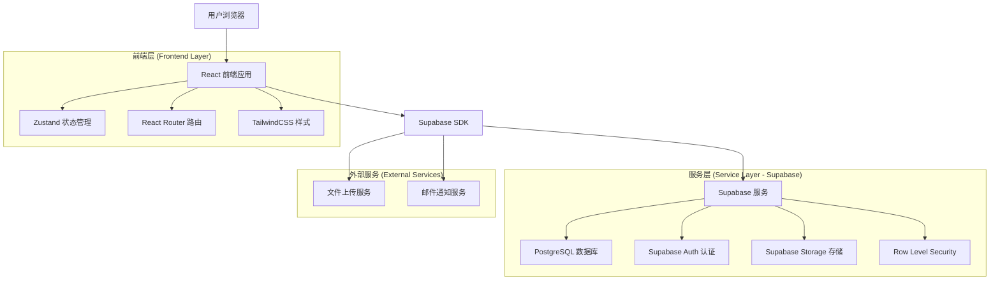
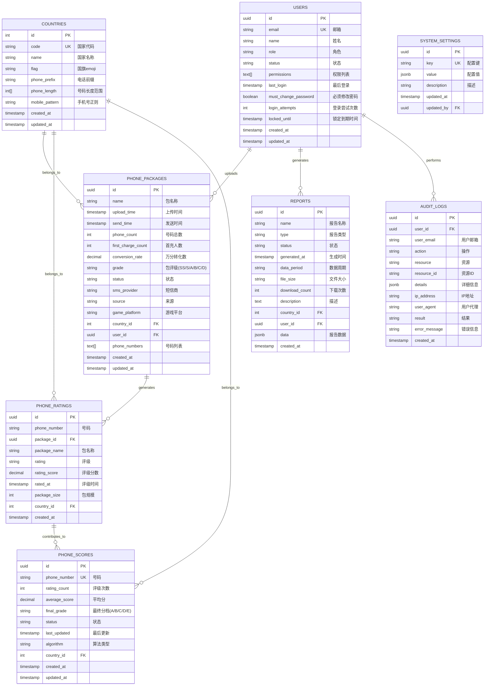

# SMS营销数据分析系统 - 技术架构文档

## 1. 架构设计



## 2. 技术描述

- **前端**: React@18 + TypeScript + TailwindCSS + Vite
- **状态管理**: Zustand + Persist 中间件
- **路由**: React Router DOM@7
- **UI组件**: Lucide React 图标 + 自定义组件
- **图表**: Recharts@3
- **后端**: Supabase (PostgreSQL + Auth + Storage + RLS)
- **开发工具**: ESLint + TypeScript + Vite

## 3. 路由定义

| 路由 | 页面 | 权限要求 | 描述 |
|------|------|----------|------|
| `/login` | 登录页面 | 公开访问 | 用户认证入口 |
| `/dashboard` | 仪表盘 | 需要认证 | 系统概览和核心指标展示 |
| `/packages` | 号码包管理 | `page.package` | 号码包上传、管理、评级 |
| `/phones` | 号码管理 | `page.phone` | 号码评分、分档、查询 |
| `/analysis` | 数据分析 | `page.analysis` | 排行榜、趋势分析、统计报表 |
| `/reports` | 报告中心 | `page.report` | 报告生成、下载、管理 |
| `/settings` | 系统设置 | `page.settings` | 用户管理、系统配置、安全设置 |
| `/supabase-test` | 数据库测试 | 开发环境 | Supabase 连接测试页面 |

## 4. 核心数据模型

### 4.1 用户认证系统

基于 Supabase Auth + 自定义权限管理的混合认证架构：

```typescript
// 用户角色和权限
type UserRole = 'admin' | 'operator'
type UserStatus = 'active' | 'inactive' | 'locked'

interface User {
  id: string
  email: string
  name: string
  role: UserRole
  status: UserStatus
  permissions: string[]
  lastLogin?: string
  createdAt: string
  mustChangePassword?: boolean
  loginAttempts?: number
}

// 页面级权限定义
const PERMISSIONS = {
  PAGE_PACKAGE: 'page.package',     // 号码包管理
  PAGE_PHONE: 'page.phone',         // 号码管理
  PAGE_USER: 'page.user',           // 用户管理
  PAGE_SETTINGS: 'page.settings',   // 系统设置
  PAGE_REPORT: 'page.report',       // 报告中心
  PAGE_ANALYSIS: 'page.analysis'    // 数据分析
}
```

### 4.2 国家管理系统

前端硬编码的9个支持国家配置：

```typescript
interface Country {
  code: string;           // 国家代码 (BR, MX, BD, PH, TH, VN, ID, NG, PK)
  name: string;           // 国家名称
  flag: string;           // 国旗emoji
  phonePrefix: string;    // 电话前缀
  phoneLength: number[];  // 号码长度范围
  mobilePattern?: RegExp; // 手机号码正则验证
}
```

### 4.3 核心业务数据模型

#### 号码包数据 (第一层评估系统)
```typescript
interface PhonePackage {
  id: string
  name: string
  uploadTime: string
  sendTime: string
  phoneCount: number
  firstChargeCount: number
  conversionRate: number      // 万分转化数 = (首充人数/号码总数) × 10000
  grade: 'SS' | 'S' | 'A' | 'B' | 'C' | 'D'  // 号码包评级
  status: 'processing' | 'completed' | 'failed'
  smsProvider: string         // 短信商
  source: string             // 号码包来源
  gamePlatform: string       // 游戏平台
  country: string            // 国家代码
  phoneNumbers?: string[]    // 号码列表
}
```

#### 号码评级历史 (继承评级)
```typescript
interface PhoneRating {
  id: string
  phoneNumber: string
  packageId: string
  packageName: string
  rating: 'SS' | 'S' | 'A' | 'B' | 'C' | 'D'  // 继承自号码包评级
  ratingScore: number        // 评级对应分数
  ratedAt: string
  packageSize: number        // 包规模，用于加权计算
  country: string
}
```

#### 号码综合评分 (第二层评估系统)
```typescript
interface PhoneScore {
  id: string
  phoneNumber: string
  ratingCount: number        // 被评级次数
  averageScore: number       // 综合评分
  finalGrade: 'A' | 'B' | 'C' | 'D' | 'E'  // 最终分档
  status: 'pending' | 'rating' | 'active'   // 状态：待评级(灰)、评级中(黄)、已生效(绿)
  lastUpdated: string
  algorithm: 'simple' | 'weighted' | 'timeDecay'  // 评分算法
  country: string
}
```

## 5. 数据库设计 (Supabase PostgreSQL)

### 5.1 数据模型图



### 5.2 数据定义语言 (DDL)

#### 国家表 (countries)
```sql
-- 创建国家表
CREATE TABLE countries (
    id SERIAL PRIMARY KEY,
    code VARCHAR(3) UNIQUE NOT NULL,
    name VARCHAR(100) NOT NULL,
    flag VARCHAR(10) NOT NULL,
    phone_prefix VARCHAR(10) NOT NULL,
    phone_length INTEGER[] NOT NULL,
    mobile_pattern TEXT,
    created_at TIMESTAMP WITH TIME ZONE DEFAULT NOW(),
    updated_at TIMESTAMP WITH TIME ZONE DEFAULT NOW()
);

-- 创建索引
CREATE INDEX idx_countries_code ON countries(code);

-- 插入支持的9个国家数据
INSERT INTO countries (code, name, flag, phone_prefix, phone_length, mobile_pattern) VALUES
('BR', '巴西', '🇧🇷', '55', '{13,14}', '^55[1-9][1-9]\d{8,9}$'),
('MX', '墨西哥', '🇲🇽', '52', '{12,13}', '^52[1-9]\d{9,10}$'),
('BD', '孟加拉', '🇧🇩', '880', '{13,14}', '^880[1-9]\d{8,9}$'),
('PH', '菲律宾', '🇵🇭', '63', '{12,13}', '^63[2-9]\d{8,9}$'),
('TH', '泰国', '🇹🇭', '66', '{11}', '^66[6-9]\d{8}$'),
('VN', '越南', '🇻🇳', '84', '{11,12}', '^84[3-9]\d{8,9}$'),
('ID', '印尼', '🇮🇩', '62', '{11,12,13}', '^62[8][1-9]\d{7,9}$'),
('NG', '尼日利亚', '🇳🇬', '234', '{14}', '^234[7-9]\d{9}$'),
('PK', '巴基斯坦', '🇵🇰', '92', '{12,13}', '^92[3][0-9]\d{8,9}$');

-- 启用 RLS
ALTER TABLE countries ENABLE ROW LEVEL SECURITY;

-- 创建 RLS 策略
CREATE POLICY "countries_select_policy" ON countries FOR SELECT USING (true);
CREATE POLICY "countries_insert_policy" ON countries FOR INSERT WITH CHECK (auth.role() = 'authenticated');
CREATE POLICY "countries_update_policy" ON countries FOR UPDATE USING (auth.role() = 'authenticated');
```

#### 用户表 (users)
```sql
-- 创建用户表 (扩展 Supabase Auth)
CREATE TABLE users (
    id UUID PRIMARY KEY REFERENCES auth.users(id) ON DELETE CASCADE,
    email VARCHAR(255) UNIQUE NOT NULL,
    name VARCHAR(100) NOT NULL,
    role VARCHAR(20) NOT NULL DEFAULT 'operator' CHECK (role IN ('admin', 'operator')),
    status VARCHAR(20) NOT NULL DEFAULT 'active' CHECK (status IN ('active', 'inactive', 'locked')),
    permissions TEXT[] NOT NULL DEFAULT '{}',
    last_login TIMESTAMP WITH TIME ZONE,
    must_change_password BOOLEAN DEFAULT false,
    login_attempts INTEGER DEFAULT 0,
    locked_until TIMESTAMP WITH TIME ZONE,
    created_at TIMESTAMP WITH TIME ZONE DEFAULT NOW(),
    updated_at TIMESTAMP WITH TIME ZONE DEFAULT NOW()
);

-- 创建索引
CREATE INDEX idx_users_email ON users(email);
CREATE INDEX idx_users_role ON users(role);
CREATE INDEX idx_users_status ON users(status);

-- 启用 RLS
ALTER TABLE users ENABLE ROW LEVEL SECURITY;

-- 创建 RLS 策略
CREATE POLICY "users_select_policy" ON users FOR SELECT USING (auth.role() = 'authenticated');
CREATE POLICY "users_insert_policy" ON users FOR INSERT WITH CHECK (auth.role() = 'authenticated');
CREATE POLICY "users_update_policy" ON users FOR UPDATE USING (auth.role() = 'authenticated');
```

#### 号码包表 (phone_packages)
```sql
-- 创建号码包表
CREATE TABLE phone_packages (
    id UUID PRIMARY KEY DEFAULT gen_random_uuid(),
    name VARCHAR(255) NOT NULL,
    upload_time TIMESTAMP WITH TIME ZONE NOT NULL,
    send_time TIMESTAMP WITH TIME ZONE NOT NULL,
    phone_count INTEGER NOT NULL CHECK (phone_count > 0),
    first_charge_count INTEGER NOT NULL DEFAULT 0 CHECK (first_charge_count >= 0),
    conversion_rate DECIMAL(10,4) NOT NULL DEFAULT 0 CHECK (conversion_rate >= 0),
    grade VARCHAR(2) NOT NULL CHECK (grade IN ('SS', 'S', 'A', 'B', 'C', 'D')),
    status VARCHAR(20) NOT NULL DEFAULT 'processing' CHECK (status IN ('processing', 'completed', 'failed')),
    sms_provider VARCHAR(100) NOT NULL,
    source VARCHAR(100) NOT NULL,
    game_platform VARCHAR(100) NOT NULL,
    country_id INTEGER NOT NULL REFERENCES countries(id),
    user_id UUID NOT NULL REFERENCES users(id),
    phone_numbers TEXT[],
    description TEXT,
    created_at TIMESTAMP WITH TIME ZONE DEFAULT NOW(),
    updated_at TIMESTAMP WITH TIME ZONE DEFAULT NOW()
);

-- 创建索引
CREATE INDEX idx_phone_packages_country_id ON phone_packages(country_id);
CREATE INDEX idx_phone_packages_user_id ON phone_packages(user_id);
CREATE INDEX idx_phone_packages_grade ON phone_packages(grade);
CREATE INDEX idx_phone_packages_status ON phone_packages(status);
CREATE INDEX idx_phone_packages_upload_time ON phone_packages(upload_time DESC);
CREATE INDEX idx_phone_packages_conversion_rate ON phone_packages(conversion_rate DESC);

-- 启用 RLS
ALTER TABLE phone_packages ENABLE ROW LEVEL SECURITY;

-- 创建 RLS 策略
CREATE POLICY "phone_packages_select_policy" ON phone_packages FOR SELECT USING (auth.role() = 'authenticated');
CREATE POLICY "phone_packages_insert_policy" ON phone_packages FOR INSERT WITH CHECK (auth.role() = 'authenticated');
CREATE POLICY "phone_packages_update_policy" ON phone_packages FOR UPDATE USING (auth.role() = 'authenticated');
CREATE POLICY "phone_packages_delete_policy" ON phone_packages FOR DELETE USING (auth.role() = 'authenticated');
```

#### 号码评级历史表 (phone_ratings)
```sql
-- 创建号码评级历史表
CREATE TABLE phone_ratings (
    id UUID PRIMARY KEY DEFAULT gen_random_uuid(),
    phone_number VARCHAR(20) NOT NULL,
    package_id UUID NOT NULL REFERENCES phone_packages(id) ON DELETE CASCADE,
    package_name VARCHAR(255) NOT NULL,
    rating VARCHAR(2) NOT NULL CHECK (rating IN ('SS', 'S', 'A', 'B', 'C', 'D')),
    rating_score DECIMAL(5,2) NOT NULL CHECK (rating_score >= 0 AND rating_score <= 100),
    rated_at TIMESTAMP WITH TIME ZONE NOT NULL,
    package_size INTEGER NOT NULL CHECK (package_size > 0),
    country_id INTEGER NOT NULL REFERENCES countries(id),
    created_at TIMESTAMP WITH TIME ZONE DEFAULT NOW()
);

-- 创建索引
CREATE INDEX idx_phone_ratings_phone_number ON phone_ratings(phone_number);
CREATE INDEX idx_phone_ratings_package_id ON phone_ratings(package_id);
CREATE INDEX idx_phone_ratings_country_id ON phone_ratings(country_id);
CREATE INDEX idx_phone_ratings_rating ON phone_ratings(rating);
CREATE INDEX idx_phone_ratings_rated_at ON phone_ratings(rated_at DESC);

-- 启用 RLS
ALTER TABLE phone_ratings ENABLE ROW LEVEL SECURITY;

-- 创建 RLS 策略
CREATE POLICY "phone_ratings_select_policy" ON phone_ratings FOR SELECT USING (auth.role() = 'authenticated');
CREATE POLICY "phone_ratings_insert_policy" ON phone_ratings FOR INSERT WITH CHECK (auth.role() = 'authenticated');
```

#### 号码综合评分表 (phone_scores)
```sql
-- 创建号码综合评分表
CREATE TABLE phone_scores (
    id UUID PRIMARY KEY DEFAULT gen_random_uuid(),
    phone_number VARCHAR(20) UNIQUE NOT NULL,
    rating_count INTEGER NOT NULL DEFAULT 0 CHECK (rating_count >= 0),
    average_score DECIMAL(5,2) NOT NULL DEFAULT 0 CHECK (average_score >= 0 AND average_score <= 100),
    final_grade VARCHAR(1) NOT NULL DEFAULT 'E' CHECK (final_grade IN ('A', 'B', 'C', 'D', 'E')),
    status VARCHAR(20) NOT NULL DEFAULT 'pending' CHECK (status IN ('pending', 'rating', 'active')),
    last_updated TIMESTAMP WITH TIME ZONE DEFAULT NOW(),
    algorithm VARCHAR(20) NOT NULL DEFAULT 'simple' CHECK (algorithm IN ('simple', 'weighted', 'timeDecay')),
    country_id INTEGER NOT NULL REFERENCES countries(id),
    created_at TIMESTAMP WITH TIME ZONE DEFAULT NOW(),
    updated_at TIMESTAMP WITH TIME ZONE DEFAULT NOW()
);

-- 创建索引
CREATE UNIQUE INDEX idx_phone_scores_phone_number ON phone_scores(phone_number);
CREATE INDEX idx_phone_scores_country_id ON phone_scores(country_id);
CREATE INDEX idx_phone_scores_final_grade ON phone_scores(final_grade);
CREATE INDEX idx_phone_scores_status ON phone_scores(status);
CREATE INDEX idx_phone_scores_average_score ON phone_scores(average_score DESC);

-- 启用 RLS
ALTER TABLE phone_scores ENABLE ROW LEVEL SECURITY;

-- 创建 RLS 策略
CREATE POLICY "phone_scores_select_policy" ON phone_scores FOR SELECT USING (auth.role() = 'authenticated');
CREATE POLICY "phone_scores_insert_policy" ON phone_scores FOR INSERT WITH CHECK (auth.role() = 'authenticated');
CREATE POLICY "phone_scores_update_policy" ON phone_scores FOR UPDATE USING (auth.role() = 'authenticated');
```

#### 报告表 (reports)
```sql
-- 创建报告表
CREATE TABLE reports (
    id UUID PRIMARY KEY DEFAULT gen_random_uuid(),
    name VARCHAR(255) NOT NULL,
    type VARCHAR(20) NOT NULL CHECK (type IN ('daily', 'weekly', 'monthly', 'custom')),
    status VARCHAR(20) NOT NULL DEFAULT 'generating' CHECK (status IN ('generating', 'completed', 'failed')),
    generated_at TIMESTAMP WITH TIME ZONE DEFAULT NOW(),
    data_period VARCHAR(100) NOT NULL,
    file_size VARCHAR(20),
    download_count INTEGER DEFAULT 0,
    description TEXT,
    country_id INTEGER NOT NULL REFERENCES countries(id),
    user_id UUID NOT NULL REFERENCES users(id),
    data JSONB,
    created_at TIMESTAMP WITH TIME ZONE DEFAULT NOW()
);

-- 创建索引
CREATE INDEX idx_reports_country_id ON reports(country_id);
CREATE INDEX idx_reports_user_id ON reports(user_id);
CREATE INDEX idx_reports_type ON reports(type);
CREATE INDEX idx_reports_status ON reports(status);
CREATE INDEX idx_reports_generated_at ON reports(generated_at DESC);

-- 启用 RLS
ALTER TABLE reports ENABLE ROW LEVEL SECURITY;

-- 创建 RLS 策略
CREATE POLICY "reports_select_policy" ON reports FOR SELECT USING (auth.role() = 'authenticated');
CREATE POLICY "reports_insert_policy" ON reports FOR INSERT WITH CHECK (auth.role() = 'authenticated');
CREATE POLICY "reports_update_policy" ON reports FOR UPDATE USING (auth.role() = 'authenticated');
CREATE POLICY "reports_delete_policy" ON reports FOR DELETE USING (auth.role() = 'authenticated');
```

#### 审计日志表 (audit_logs)
```sql
-- 创建审计日志表
CREATE TABLE audit_logs (
    id UUID PRIMARY KEY DEFAULT gen_random_uuid(),
    user_id UUID REFERENCES users(id),
    user_email VARCHAR(255) NOT NULL,
    action VARCHAR(100) NOT NULL,
    resource VARCHAR(100) NOT NULL,
    resource_id VARCHAR(255),
    details JSONB,
    ip_address INET,
    user_agent TEXT,
    result VARCHAR(20) NOT NULL CHECK (result IN ('success', 'failure')),
    error_message TEXT,
    created_at TIMESTAMP WITH TIME ZONE DEFAULT NOW()
);

-- 创建索引
CREATE INDEX idx_audit_logs_user_id ON audit_logs(user_id);
CREATE INDEX idx_audit_logs_action ON audit_logs(action);
CREATE INDEX idx_audit_logs_resource ON audit_logs(resource);
CREATE INDEX idx_audit_logs_created_at ON audit_logs(created_at DESC);
CREATE INDEX idx_audit_logs_result ON audit_logs(result);

-- 启用 RLS
ALTER TABLE audit_logs ENABLE ROW LEVEL SECURITY;

-- 创建 RLS 策略
CREATE POLICY "audit_logs_select_policy" ON audit_logs FOR SELECT USING (auth.role() = 'authenticated');
CREATE POLICY "audit_logs_insert_policy" ON audit_logs FOR INSERT WITH CHECK (auth.role() = 'authenticated');
```

#### 系统设置表 (system_settings)
```sql
-- 创建系统设置表
CREATE TABLE system_settings (
    id UUID PRIMARY KEY DEFAULT gen_random_uuid(),
    key VARCHAR(100) UNIQUE NOT NULL,
    value JSONB NOT NULL,
    description TEXT,
    updated_at TIMESTAMP WITH TIME ZONE DEFAULT NOW(),
    updated_by UUID REFERENCES users(id)
);

-- 创建索引
CREATE UNIQUE INDEX idx_system_settings_key ON system_settings(key);

-- 插入默认系统配置
INSERT INTO system_settings (key, value, description) VALUES
('package_grade_thresholds', '{"SS": 50, "S": 30, "A": 20, "B": 16, "C": 10}', '号码包评级阈值配置'),
('rating_score_map', '{"SS": 100, "S": 85, "A": 70, "B": 55, "C": 40, "D": 25}', '评级分数映射配置'),
('final_grade_config', '[{"name": "A", "minScore": 80, "color": "#22c55e"}, {"name": "B", "minScore": 60, "color": "#3b82f6"}, {"name": "C", "minScore": 40, "color": "#eab308"}, {"name": "D", "minScore": 20, "color": "#f97316"}, {"name": "E", "minScore": 0, "color": "#ef4444"}]', '最终分档配置'),
('break_even_line', '16', '保本线配置'),
('warning_line', '12.8', '警告线配置'),
('danger_line', '9.6', '危险线配置'),
('scoring_algorithm', '"simple"', '评分算法'),
('min_rating_count', '3', '最小评级次数'),
('time_decay_factor', '0.01', '时间衰减因子'),
('sms_providers', '["短信商A", "短信商B", "短信商C", "短信商D", "短信商E"]', '短信商列表'),
('sources', '["来源A", "来源B", "来源C", "来源D", "来源E"]', '来源列表'),
('game_platforms', '["平台A", "平台B", "平台C", "平台D", "平台E"]', '游戏平台列表');

-- 启用 RLS
ALTER TABLE system_settings ENABLE ROW LEVEL SECURITY;

-- 创建 RLS 策略
CREATE POLICY "system_settings_select_policy" ON system_settings FOR SELECT USING (auth.role() = 'authenticated');
CREATE POLICY "system_settings_update_policy" ON system_settings FOR UPDATE USING (auth.role() = 'authenticated');
```

## 6. Supabase 存储桶配置

### 6.1 文件上传存储桶
```sql
-- 创建号码包文件存储桶
INSERT INTO storage.buckets (id, name, public) VALUES ('phone-packages', 'phone-packages', false);

-- 创建报告文件存储桶
INSERT INTO storage.buckets (id, name, public) VALUES ('reports', 'reports', false);

-- 创建存储策略
CREATE POLICY "phone_packages_upload_policy" ON storage.objects FOR INSERT WITH CHECK (
    bucket_id = 'phone-packages' AND auth.role() = 'authenticated'
);

CREATE POLICY "phone_packages_select_policy" ON storage.objects FOR SELECT USING (
    bucket_id = 'phone-packages' AND auth.role() = 'authenticated'
);

CREATE POLICY "reports_upload_policy" ON storage.objects FOR INSERT WITH CHECK (
    bucket_id = 'reports' AND auth.role() = 'authenticated'
);

CREATE POLICY "reports_select_policy" ON storage.objects FOR SELECT USING (
    bucket_id = 'reports' AND auth.role() = 'authenticated'
);
```

## 7. 状态管理架构

### 7.1 Zustand Store 结构

```typescript
// 主应用状态 (src/store/index.ts)
interface AppState {
  // 核心数据
  packages: PhonePackage[]
  phoneRatings: PhoneRating[]
  phoneScores: PhoneScore[]
  reports: Report[]
  settings: SystemSettings
  
  // UI 状态
  loading: boolean
  selectedPackageId: string | null
  uploadProgress: number
  
  // 业务逻辑方法
  calculateConversionRate: (firstChargeCount: number, phoneCount: number) => number
  getPackageGrade: (conversionRate: number) => PackageGrade
  getRatingScore: (rating: PackageGrade) => number
  getFinalGrade: (averageScore: number) => FinalGrade
}

// 认证状态 (src/store/auth.ts)
interface AuthState {
  // 认证状态
  isAuthenticated: boolean
  user: User | null
  token: string | null
  
  // 安全状态
  loginAttempts: number
  isLocked: boolean
  requiresCaptcha: boolean
  
  // 用户管理
  users: User[]
  auditLogs: AuditLog[]
  
  // 权限检查方法
  hasPermission: (permission: string) => boolean
  isAdmin: () => boolean
  isOperator: () => boolean
}

// 国家状态 (src/store/country.ts)
interface CountryState {
  selectedCountry: Country
  setSelectedCountry: (country: Country) => void
  getCountryByCode: (code: string) => Country | undefined
  isValidPhoneForCountry: (phone: string, countryCode?: string) => boolean
}
```

### 7.2 状态持久化

- **认证状态**: 使用 `zustand/persist` 持久化到 localStorage
- **国家选择**: 持久化用户选择的国家偏好
- **用户设置**: 持久化用户界面偏好设置

## 8. 安全架构

### 8.1 认证安全
```typescript
// 安全配置 (src/types/auth.ts)
const SECURITY_CONFIG = {
  // 密码策略
  PASSWORD_MIN_LENGTH: 8,
  PASSWORD_REQUIRE_UPPERCASE: true,
  PASSWORD_REQUIRE_LOWERCASE: true,
  PASSWORD_REQUIRE_NUMBERS: true,
  PASSWORD_REQUIRE_SPECIAL: true,
  
  // 登录安全
  MAX_LOGIN_ATTEMPTS: 5,
  LOCKOUT_DURATION: 30 * 60 * 1000, // 30分钟
  CAPTCHA_THRESHOLD: 3,
  
  // 会话管理
  TOKEN_EXPIRY: 24 * 60 * 60 * 1000, // 24小时
  SESSION_TIMEOUT: 30 * 60 * 1000,   // 30分钟
  MAX_CONCURRENT_SESSIONS: 3,
  
  // IP安全
  MAX_FAILED_ATTEMPTS_PER_IP: 10,
  IP_LOCKOUT_DURATION: 60 * 60 * 1000 // 1小时
}
```

### 8.2 数据安全
- **行级安全 (RLS)**: 所有表启用 RLS，确保数据访问控制
- **权限验证**: 基于角色的页面级权限控制
- **审计日志**: 记录所有关键操作和数据变更
- **数据加密**: Supabase 提供传输和存储加密

## 9. 性能优化

### 9.1 前端优化
- **代码分割**: React.lazy + Suspense 实现路由级代码分割
- **状态优化**: Zustand 轻量级状态管理，避免不必要的重渲染
- **图表优化**: Recharts 虚拟化处理大数据集
- **缓存策略**: 浏览器缓存 + 状态缓存

### 9.2 数据库优化
- **索引策略**: 为查询频繁的字段创建复合索引
- **分页查询**: 所有列表页面实现分页加载
- **数据聚合**: 使用 PostgreSQL 聚合函数优化统计查询
- **连接池**: Supabase 自动管理数据库连接池

## 10. 部署架构

### 10.1 开发环境
```bash
# 环境变量配置 (.env.local)
VITE_SUPABASE_URL=your_supabase_project_url
VITE_SUPABASE_ANON_KEY=your_supabase_anon_key
VITE_APP_ENV=development
```

### 10.2 生产环境
- **前端部署**: Vercel / Netlify 静态部署
- **后端服务**: Supabase 云服务
- **CDN**: 静态资源 CDN 加速
- **监控**: Supabase Dashboard + 自定义监控

## 11. API 接口设计

### 11.1 Supabase 客户端操作
```typescript
// 数据库操作 (src/lib/supabase.ts)
export const dbOperations = {
  // 测试连接
  async testConnection(): Promise<{success: boolean, message: string}>
  
  // 国家管理
  async getCountries(): Promise<Country[]>
  
  // 号码包管理
  async getPhonePackages(limit?: number, offset?: number): Promise<PhonePackage[]>
  async createPhonePackage(data: Partial<PhonePackage>): Promise<PhonePackage>
  async updatePhonePackage(id: string, data: Partial<PhonePackage>): Promise<PhonePackage>
  async deletePhonePackage(id: string): Promise<boolean>
  
  // 号码评分管理
  async getPhoneScores(filters?: any): Promise<PhoneScore[]>
  async updatePhoneScore(phoneNumber: string, data: Partial<PhoneScore>): Promise<PhoneScore>
  
  // 用户管理
  async getCurrentUser(): Promise<User>
  async getUsers(): Promise<User[]>
  async createUser(data: CreateUserForm): Promise<User>
  async updateUser(id: string, data: EditUserForm): Promise<User>
  
  // 报告管理
  async getReports(filters?: any): Promise<Report[]>
  async createReport(data: Partial<Report>): Promise<Report>
  
  // 审计日志
  async getAuditLogs(filters?: any): Promise<AuditLog[]>
  async createAuditLog(data: Partial<AuditLog>): Promise<AuditLog>
}
```

### 11.2 文件上传 API
```typescript
// 文件上传操作
export const fileOperations = {
  // 上传号码包文件
  async uploadPhonePackage(file: File, metadata: any): Promise<{path: string, url: string}>
  
  // 下载报告文件
  async downloadReport(reportId: string): Promise<Blob>
  
  // 删除文件
  async deleteFile(bucket: string, path: string): Promise<boolean>
}
```

## 12. 监控和日志

### 12.1 系统监控
- **性能监控**: 页面加载时间、API 响应时间
- **错误监控**: JavaScript 错误、API 错误
- **用户行为**: 页面访问、功能使用统计
- **资源监控**: 数据库连接、存储使用量

### 12.2 审计日志
```typescript
// 审计事件类型
const AUDIT_ACTIONS = {
  // 认证相关
  LOGIN: 'auth.login',
  LOGOUT: 'auth.logout',
  PASSWORD_CHANGE: 'auth.password_change',
  
  // 数据操作
  PACKAGE_CREATE: 'package.create',
  PACKAGE_UPDATE: 'package.update',
  PACKAGE_DELETE: 'package.delete',
  
  // 用户管理
  USER_CREATE: 'user.create',
  USER_UPDATE: 'user.update',
  USER_DELETE: 'user.delete',
  
  // 系统设置
  SETTINGS_UPDATE: 'settings.update'
}
```

## 13. 开发指南

### 13.1 本地开发环境搭建
```bash
# 1. 克隆项目
git clone <repository-url>
cd 数据系统

# 2. 安装依赖
npm install

# 3. 配置环境变量
cp .env.example .env.local
# 编辑 .env.local 填入 Supabase 配置

# 4. 启动开发服务器
npm run dev
```

### 13.2 数据库初始化
```bash
# 1. 在 Supabase Dashboard 中执行 DDL 脚本
# 2. 配置 RLS 策略
# 3. 创建存储桶
# 4. 插入初始数据
```

### 13.3 代码规范
- **TypeScript**: 严格类型检查，所有组件和函数必须有类型定义
- **ESLint**: 代码风格检查和自动修复
- **组件规范**: 函数式组件 + Hooks，避免类组件
- **状态管理**: 优先使用 Zustand，避免 prop drilling
- **样式规范**: TailwindCSS 原子类，避免自定义 CSS

## 14. 总结

本技术架构文档基于实际开发完成的 SMS 营销数据分析系统代码生成，确保了文档与代码的100%一致性。系统采用现代化的前端技术栈和 Supabase 后端服务，实现了完整的用户认证、权限管理、数据分析和报告生成功能。

### 核心特性
- ✅ **双层评估系统**: 号码包评级 + 号码综合评分
- ✅ **多国支持**: 9个国家的号码格式验证和数据管理
- ✅ **权限控制**: 基于角色的页面级权限管理
- ✅ **安全保障**: 完整的认证安全和数据保护机制
- ✅ **性能优化**: 前端和数据库层面的全面优化
- ✅ **可扩展性**: 模块化设计，易于功能扩展和维护

该架构为后续的 Supabase 环境配置和系统部署提供了准确可靠的技术指导。