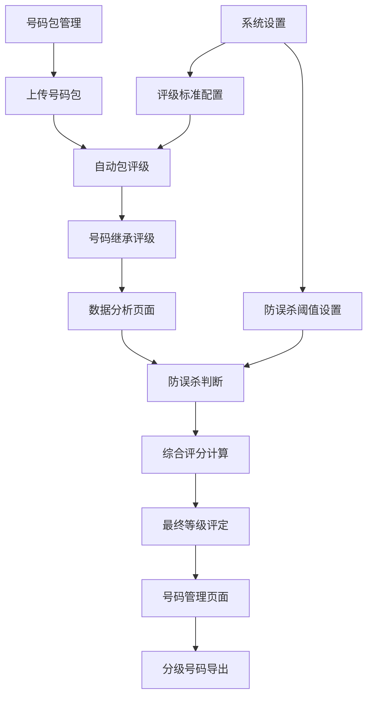

# SMS营销数据分析系统-核心业务逻辑修复-产品需求文档

## 1. 产品概述

本文档旨在修复SMS营销数据分析系统中断裂的核心业务逻辑，实现从号码包上传到分级号码导出的完整自动化流程。
系统将从当前的"静态展示工具"升级为"智能分析系统"，实现号码评级的自动继承、防误杀机制的智能判断、综合评分的准确计算和最终等级的自动评定。

## 2. 核心功能

### 2.1 用户角色
| 角色 | 注册方式 | 核心权限 |
|------|----------|----------|
| 系统管理员 | 系统预设 | 配置评级标准、查看所有数据、导出分级号码 |
| 普通用户 | 管理员创建 | 上传号码包、查看分析结果、导出分级号码 |

### 2.2 功能模块

本次修复涉及的核心业务流程包括以下关键页面：
1. **号码包管理页面**：号码包上传、评级配置、包评级自动生成
2. **数据分析页面**：号码继承评级展示、防误杀机制状态、综合评分计算结果、最终等级分布
3. **系统设置页面**：评级分数映射配置、最终等级标准配置、防误杀阈值设置
4. **号码管理页面**：分级号码查看、按等级导出功能

### 2.3 页面详情

| 页面名称 | 模块名称 | 功能描述 |
|----------|----------|----------|
| 号码包管理 | 包评级自动生成 | 上传号码包后，根据配置的评级分数映射自动为包分配评级（A/B/C/D/E） |
| 号码包管理 | 号码继承包评级 | 号码自动继承其所在包的最高评级，建立号码与包评级的关联关系 |
| 数据分析 | 防误杀机制判断 | 当号码出现在多个包中且达到配置阈值时，自动触发防误杀机制 |
| 数据分析 | 综合评分计算 | 对触发防误杀的号码，计算其在所有包中评级分数的简单平均值 |
| 数据分析 | 最终等级评定 | 基于综合评分和配置的等级标准，自动评定号码的最终等级 |
| 数据分析 | 评级结果展示 | 实时显示号码评级状态、防误杀触发情况、最终等级分布统计 |
| 号码管理 | 分级号码查看 | 按最终等级（A/B/C/D/E）分类展示号码列表，支持筛选和搜索 |
| 号码管理 | 分级号码导出 | 支持按最终等级导出号码列表，生成Excel或CSV格式文件 |
| 系统设置 | 评级标准配置 | 配置包评级分数映射（A=100, B=80等）和最终等级标准 |
| 系统设置 | 防误杀阈值设置 | 配置触发防误杀机制的包出现次数阈值（默认3次） |

## 3. 核心流程

### 3.1 主要业务流程

**完整的号码评级分析流程（含配置应用检查点）：**
1. 用户上传号码包 → **[检查点1：验证号码包评级阈值配置]** → 系统根据配置自动为包分配评级
2. 系统自动为包内号码建立评级继承关系 → **[检查点2：应用评级分数映射配置]** → 号码继承包的评级
3. 系统检测号码在多包中的出现情况 → **[检查点3：应用防误杀阈值配置]** → 达到阈值时触发防误杀机制
4. 系统计算触发防误杀号码的综合评分 → **[检查点4：使用评级分数映射进行分数转换]** → 使用简单平均值算法
5. 系统基于综合评分自动评定最终等级 → **[检查点5：应用最终等级配置标准]** → 应用配置的等级标准
6. 用户查看分析结果并导出分级号码 → **[检查点6：验证配置一致性]** → 按等级分类导出

**配置应用检查点说明：**
- **检查点1-2**：确保包评级和号码继承评级正确应用评级分数映射
- **检查点3**：确保防误杀机制按配置的阈值正确触发
- **检查点4-5**：确保综合评分计算和最终等级评定使用最新配置
- **检查点6**：确保导出结果与当前配置标准一致

### 3.2 页面导航流程图

## 4. 用户界面设计

### 4.1 设计风格
- **主色调**：蓝色系（#3B82F6）和绿色系（#10B981）
- **辅助色**：灰色系（#6B7280）和红色系（#EF4444）
- **按钮样式**：圆角按钮，支持悬停效果
- **字体**：系统默认字体，标题16px，正文14px
- **布局风格**：卡片式布局，顶部导航栏
- **图标风格**：简洁的线性图标，支持状态指示

### 4.2 页面设计概览

| 页面名称 | 模块名称 | UI元素 |
|----------|----------|---------|
| 号码包管理 | 包评级显示 | 评级标签（A/B/C/D/E），使用不同颜色区分，支持自动更新状态 |
| 数据分析 | 防误杀状态 | 状态指示器，显示触发防误杀的号码数量，使用橙色警告色 |
| 数据分析 | 综合评分展示 | 评分进度条，显示0-100分的评分结果，使用渐变色彩 |
| 数据分析 | 等级分布图 | 饼图或柱状图，展示各等级号码的分布情况 |
| 号码管理 | 等级筛选器 | 下拉选择框，支持按A/B/C/D/E等级筛选号码 |
| 号码管理 | 导出按钮 | 主要操作按钮，支持批量导出和按等级导出 |
| 系统设置 | 配置表单 | 数值输入框，支持实时验证和保存确认 |

### 4.3 响应式设计
- 桌面优先设计，支持移动端自适应
- 表格在小屏幕上支持横向滚动
- 关键操作按钮在移动端保持易点击的尺寸

## 5. 技术要求

### 5.1 自动化要求
- 号码包上传后自动触发评级继承流程
- 实时检测防误杀条件并自动计算综合评分
- 配置变更后自动重新计算相关评级结果
- 支持批量处理大量号码数据

### 5.2 数据一致性要求
- 确保号码评级数据与包评级数据的一致性
- 防误杀机制触发状态的实时更新
- 综合评分计算结果的准确性验证
- 最终等级评定的逻辑正确性

### 5.3 性能要求
- 支持单次上传10万条号码的处理
- 评级计算响应时间不超过5秒
- 分级号码导出支持大数据量（50万条以上）
- 页面加载时间不超过3秒

### 5.4 用户体验要求
- 提供清晰的处理进度提示
- 支持操作结果的即时反馈
- 错误信息提示准确且易理解
- 支持操作撤销和数据恢复功能

## 6. 配置项影响分析

### 6.1 四大核心配置项问题诊断

#### 6.1.1 号码包评级阈值配置
**当前问题：**
- 配置存储在 `system_settings` 表中，但前端 `getPackageGrade()` 函数未正确读取
- 硬编码的转换率阈值（如 >80% 为A级）与数据库配置脱节
- 包评级生成逻辑与配置标准不一致

**业务影响：**
- 包评级结果不准确，影响后续所有号码继承评级
- 用户修改评级标准后，历史包评级未同步更新
- 评级标准不透明，用户无法预期评级结果

**修复优先级：** 🔴 **高优先级** - 影响整个评级流程的起点

#### 6.1.2 评级分数映射配置
**当前问题：**
- 前端 `getRatingScore()` 函数使用硬编码映射（A=100, B=80等）
- 数据库中的 `ratingScoreMap` 配置未被应用层读取
- 配置变更后，已计算的综合评分未重新计算

**业务影响：**
- 综合评分计算结果固化，无法响应业务调整
- 不同评级的分数权重无法灵活调整
- 评分标准与实际业务需求脱节

**修复优先级：** 🔴 **高优先级** - 直接影响综合评分准确性

#### 6.1.3 最终等级配置
**当前问题：**
- 前端 `getFinalGrade()` 函数使用固定的分数区间判断
- 数据库中的 `finalGradeStandards` 配置被忽略
- 等级标准调整后，已评定的最终等级未更新

**业务影响：**
- 最终等级评定标准僵化，无法适应市场变化
- 分级导出结果与当前业务标准不符
- 等级分布统计失去参考价值

**修复优先级：** 🟡 **中优先级** - 影响最终输出结果的准确性

#### 6.1.4 防误杀机制配置
**当前问题：**
- 前端 `calculatePhoneScore()` 函数未集成防误杀检查
- 数据库层已实现防误杀逻辑，但应用层未调用
- 阈值配置变更后，防误杀状态未重新评估

**业务影响：**
- 高质量号码可能被误判为低质量
- 防误杀机制形同虚设，无法发挥保护作用
- 号码评级结果可信度降低

**修复优先级：** 🔴 **高优先级** - 关系到评级结果的公正性

### 6.2 配置-业务逻辑断裂分析

#### 6.2.1 断裂点识别
1. **配置读取断裂**：前端函数未从数据库读取配置，使用硬编码值
2. **配置应用断裂**：数据库层和应用层使用不同的配置逻辑
3. **配置更新断裂**：配置变更后，相关业务数据未同步更新
4. **配置验证断裂**：缺乏配置有效性检查和业务规则验证

#### 6.2.2 影响范围评估
- **直接影响**：评级结果不准确，导出数据不可信
- **间接影响**：用户对系统失去信任，业务决策基础薄弱
- **系统影响**：配置管理功能形同虚设，系统灵活性丧失

### 6.3 修复目标与成功标准

#### 6.3.1 修复目标
1. **配置统一化**：实现数据库配置与应用逻辑的完全一致
2. **配置实时化**：配置变更后立即生效，相关数据自动更新
3. **配置可视化**：提供配置影响预览和变更确认机制
4. **配置自动化**：实现配置驱动的业务逻辑自动执行

#### 6.3.2 成功标准
- ✅ 所有业务函数从数据库读取配置，零硬编码
- ✅ 配置变更后，相关评级数据在5分钟内完成重算
- ✅ 防误杀机制100%按配置阈值正确触发
- ✅ 最终等级评定完全基于当前配置标准
- ✅ 提供配置变更影响分析和批量重算功能

### 6.4 修复优先级排序

| 优先级 | 配置项 | 修复时间 | 依赖关系 |
|--------|--------|----------|----------|
| P0 | 评级分数映射配置 | 1天 | 无依赖，独立修复 |
| P0 | 防误杀机制配置 | 1天 | 依赖评级分数映射 |
| P1 | 号码包评级阈值配置 | 1天 | 依赖评级分数映射 |
| P2 | 最终等级配置 | 0.5天 | 依赖前三项完成 |

**修复策略：** 采用"配置优先、逐层修复"的策略，先修复核心配置读取逻辑，再修复业务应用逻辑，最后实现配置热更新和批量重算功能。