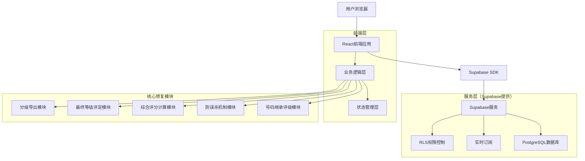
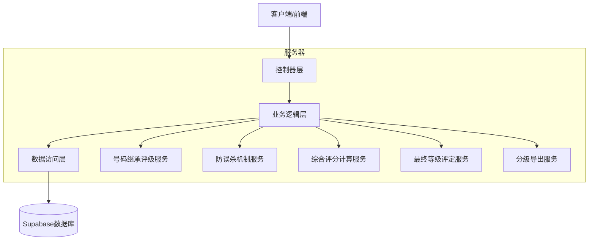
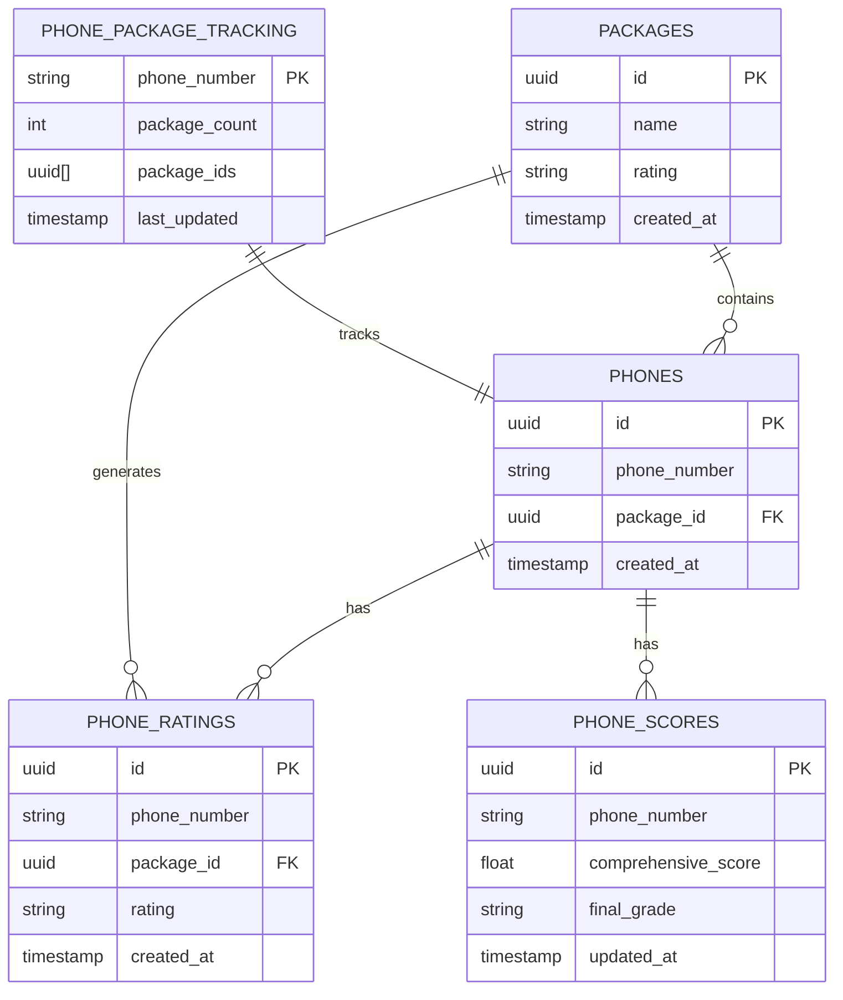
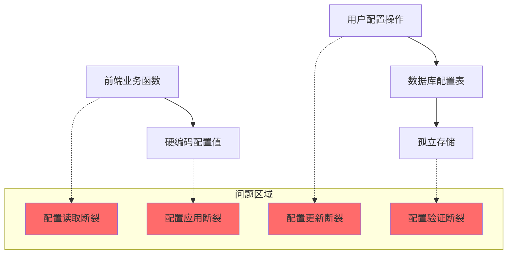
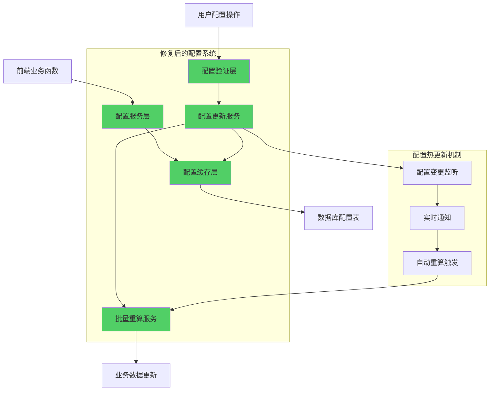

# SMS营销数据分析系统-核心业务逻辑修复-技术架构文档

## 1. 架构设计



## 2. 技术描述

* **前端**: React\@18 + TypeScript + TailwindCSS\@3 + Vite

* **后端**: Supabase（PostgreSQL + 实时API + 认证）

* **状态管理**: Zustand

* **数据库**: Supabase PostgreSQL（利用现有表结构）

* **部署**: Vercel

## 3. 路由定义

| 路由                  | 用途                           |
| ------------------- | ---------------------------- |
| /package-management | 号码包管理页面，包含包评级自动生成和号码继承评级功能   |
| /data-analysis      | 数据分析页面，展示防误杀机制状态、综合评分和最终等级分布 |
| /phone-management   | 号码管理页面，支持分级号码查看和按等级导出功能      |
| /system-settings    | 系统设置页面，配置评级标准和防误杀阈值          |

## 4. API定义

### 4.1 核心业务逻辑API

#### 号码继承包评级

```typescript
// 自动为号码分配包评级
POST /api/phone-ratings/inherit-package-rating
```

请求参数:

| 参数名           | 参数类型   | 是否必需 | 描述             |
| ------------- | ------ | ---- | -------------- |
| packageId     | string | true | 号码包ID          |
| packageRating | string | true | 包评级（A/B/C/D/E） |

响应:

| 参数名            | 参数类型           | 描述        |
| -------------- | -------------- | --------- |
| success        | boolean        | 操作是否成功    |
| affectedPhones | number         | 受影响的号码数量  |
| phoneRatings   | PhoneRating\[] | 创建的号码评级记录 |

#### 防误杀机制检查

```typescript
// 检查并触发防误杀机制
POST /api/anti-false-positive/check-threshold
```

请求参数:

| 参数名         | 参数类型   | 是否必需  | 描述               |
| ----------- | ------ | ----- | ---------------- |
| phoneNumber | string | false | 特定号码（可选，不传则检查所有） |

响应:

| 参数名             | 参数类型      | 描述         |
| --------------- | --------- | ---------- |
| triggeredPhones | string\[] | 触发防误杀的号码列表 |
| threshold       | number    | 当前配置的阈值    |
| totalChecked    | number    | 检查的号码总数    |

#### 综合评分计算

```typescript
// 计算号码综合评分
POST /api/phone-scores/calculate-comprehensive
```

请求参数:

| 参数名              | 参数类型    | 是否必需  | 描述       |
| ---------------- | ------- | ----- | -------- |
| phoneNumber      | string  | true  | 号码       |
| forceRecalculate | boolean | false | 是否强制重新计算 |

响应:

| 参数名                | 参数类型           | 描述          |
| ------------------ | -------------- | ----------- |
| phoneNumber        | string         | 号码          |
| comprehensiveScore | number         | 综合评分（0-100） |
| ratingHistory      | PhoneRating\[] | 评级历史记录      |
| calculationMethod  | string         | 计算方法说明      |

#### 最终等级评定

```typescript
// 评定号码最终等级
POST /api/phone-scores/assign-final-grade
```

请求参数:

| 参数名                | 参数类型   | 是否必需 | 描述   |
| ------------------ | ------ | ---- | ---- |
| phoneNumber        | string | true | 号码   |
| comprehensiveScore | number | true | 综合评分 |

响应:

| 参数名         | 参数类型   | 描述              |
| ----------- | ------ | --------------- |
| phoneNumber | string | 号码              |
| finalGrade  | string | 最终等级（A/B/C/D/E） |
| scoreRange  | object | 等级对应的分数范围       |

#### 分级号码导出

```typescript
// 按等级导出号码
GET /api/phone-export/by-grade
```

请求参数:

| 参数名    | 参数类型   | 是否必需  | 描述                      |
| ------ | ------ | ----- | ----------------------- |
| grade  | string | false | 指定等级（A/B/C/D/E），不传则导出全部 |
| format | string | false | 导出格式（csv/excel），默认csv   |
| limit  | number | false | 限制导出数量，默认无限制            |

响应:

| 参数名               | 参数类型   | 描述      |
| ----------------- | ------ | ------- |
| downloadUrl       | string | 下载链接    |
| fileName          | string | 文件名     |
| totalRecords      | number | 导出记录总数  |
| gradeDistribution | object | 各等级分布统计 |

### 4.2 配置管理API

#### 评级标准配置

```typescript
// 更新评级分数映射
PUT /api/settings/rating-score-map
```

请求参数:

| 参数名            | 参数类型   | 是否必需 | 描述                                          |
| -------------- | ------ | ---- | ------------------------------------------- |
| ratingScoreMap | object | true | 评级分数映射 {A: 100, B: 80, C: 60, D: 40, E: 20} |

#### 最终等级标准配置

```typescript
// 更新最终等级标准
PUT /api/settings/final-grade-standards
```

请求参数:

| 参数名            | 参数类型   | 是否必需 | 描述                                                        |
| -------------- | ------ | ---- | --------------------------------------------------------- |
| gradeStandards | object | true | 等级标准 {A: {min: 90, max: 100}, B: {min: 80, max: 89}, ...} |

## 5. 服务器架构图



## 6. 数据模型

### 6.1 数据模型定义



### 6.2 数据定义语言

#### 利用现有表结构

```sql
-- 现有表结构已存在，无需重新创建
-- packages, phones, phone_ratings, phone_scores, phone_package_tracking

-- 添加必要的索引优化查询性能
CREATE INDEX IF NOT EXISTS idx_phone_ratings_phone_number ON phone_ratings(phone_number);
CREATE INDEX IF NOT EXISTS idx_phone_ratings_package_id ON phone_ratings(package_id);
CREATE INDEX IF NOT EXISTS idx_phone_scores_final_grade ON phone_scores(final_grade);
CREATE INDEX IF NOT EXISTS idx_phone_package_tracking_package_count ON phone_package_tracking(package_count);

-- 创建号码继承包评级的触发器函数
CREATE OR REPLACE FUNCTION inherit_package_rating()
RETURNS TRIGGER AS $$
BEGIN
    -- 当新增号码时，自动继承包评级
    INSERT INTO phone_ratings (phone_number, package_id, rating, created_at)
    SELECT NEW.phone_number, NEW.package_id, p.rating, NOW()
    FROM packages p
    WHERE p.id = NEW.package_id
    ON CONFLICT (phone_number, package_id) DO NOTHING;
    
    RETURN NEW;
END;
$$ LANGUAGE plpgsql;

-- 创建触发器
DROP TRIGGER IF EXISTS trigger_inherit_package_rating ON phones;
CREATE TRIGGER trigger_inherit_package_rating
    AFTER INSERT ON phones
    FOR EACH ROW
    EXECUTE FUNCTION inherit_package_rating();

-- 创建综合评分计算函数
CREATE OR REPLACE FUNCTION calculate_comprehensive_score(target_phone_number TEXT)
RETURNS FLOAT AS $$
DECLARE
    avg_score FLOAT;
    rating_score_map JSONB;
BEGIN
    -- 获取评级分数映射配置
    SELECT value INTO rating_score_map 
    FROM system_settings 
    WHERE key = 'ratingScoreMap';
    
    -- 计算该号码所有评级的平均分数
    SELECT AVG((rating_score_map->>pr.rating)::FLOAT)
    INTO avg_score
    FROM phone_ratings pr
    WHERE pr.phone_number = target_phone_number;
    
    RETURN COALESCE(avg_score, 0);
END;
$$ LANGUAGE plpgsql;

-- 创建最终等级评定函数
CREATE OR REPLACE FUNCTION assign_final_grade(score FLOAT)
RETURNS TEXT AS $$
DECLARE
    grade_standards JSONB;
    final_grade TEXT := 'E';
BEGIN
    -- 获取最终等级标准配置
    SELECT value INTO grade_standards 
    FROM system_settings 
    WHERE key = 'finalGradeStandards';
    
    -- 根据分数确定等级
    IF score >= (grade_standards->'A'->>'min')::FLOAT THEN
        final_grade := 'A';
    ELSIF score >= (grade_standards->'B'->>'min')::FLOAT THEN
        final_grade := 'B';
    ELSIF score >= (grade_standards->'C'->>'min')::FLOAT THEN
        final_grade := 'C';
    ELSIF score >= (grade_standards->'D'->>'min')::FLOAT THEN
        final_grade := 'D';
    END IF;
    
    RETURN final_grade;
END;
$$ LANGUAGE plpgsql;

-- 创建防误杀机制检查和处理的存储过程
CREATE OR REPLACE FUNCTION process_anti_false_positive()
RETURNS TABLE(phone_number TEXT, comprehensive_score FLOAT, final_grade TEXT) AS $$
DECLARE
    threshold_config JSONB;
    threshold_value INT;
    phone_record RECORD;
    calc_score FLOAT;
    calc_grade TEXT;
BEGIN
    -- 获取防误杀阈值配置
    SELECT value INTO threshold_config 
    FROM system_settings 
    WHERE key = 'antiFalsePositiveConfig';
    
    threshold_value := (threshold_config->>'threshold')::INT;
    
    -- 处理达到阈值的号码
    FOR phone_record IN 
        SELECT ppt.phone_number
        FROM phone_package_tracking ppt
        WHERE ppt.package_count >= threshold_value
    LOOP
        -- 计算综合评分
        calc_score := calculate_comprehensive_score(phone_record.phone_number);
        
        -- 评定最终等级
        calc_grade := assign_final_grade(calc_score);
        
        -- 更新或插入phone_scores记录
        INSERT INTO phone_scores (phone_number, comprehensive_score, final_grade, updated_at)
        VALUES (phone_record.phone_number, calc_score, calc_grade, NOW())
        ON CONFLICT (phone_number) 
        DO UPDATE SET 
            comprehensive_score = EXCLUDED.comprehensive_score,
            final_grade = EXCLUDED.final_grade,
            updated_at = EXCLUDED.updated_at;
        
        -- 返回结果
        phone_number := phone_record.phone_number;
        comprehensive_score := calc_score;
        final_grade := calc_grade;
        RETURN NEXT;
    END LOOP;
    
    RETURN;
END;
$$ LANGUAGE plpgsql;

-- 初始化默认配置数据
INSERT INTO system_settings (key, value, created_at) VALUES
('ratingScoreMap', '{"A": 100, "B": 80, "C": 60, "D": 40, "E": 20}', NOW()),
('finalGradeStandards', '{"A": {"min": 90, "max": 100}, "B": {"min": 80, "max": 89}, "C": {"min": 60, "max": 79}, "D": {"min": 40, "max": 59}, "E": {"min": 0, "max": 39}}', NOW()),
('antiFalsePositiveConfig', '{"threshold": 3, "enabled": true}', NOW())
ON CONFLICT (key) DO NOTHING;
```

## 7. 核心算法实现

### 7.1 号码继承包评级算法

```typescript
// 简化的继承逻辑：号码直接继承包评级
async function inheritPackageRating(packageId: string, packageRating: string) {
  const phones = await getPhonesByPackageId(packageId);
  
  const phoneRatings = phones.map(phone => ({
    phone_number: phone.phone_number,
    package_id: packageId,
    rating: packageRating,
    created_at: new Date().toISOString()
  }));
  
  return await batchCreatePhoneRatings(phoneRatings);
}
```

### 7.2 综合评分计算算法

```typescript
// 简化为简单平均值计算
async function calculateComprehensiveScore(phoneNumber: string) {
  const ratings = await getPhoneRatings(phoneNumber);
  const ratingScoreMap = await getRatingScoreMap();
  
  if (ratings.length === 0) return 0;
  
  const totalScore = ratings.reduce((sum, rating) => {
    return sum + ratingScoreMap[rating.rating];
  }, 0);
  
  return totalScore / ratings.length;
}
```

### 7.3 最终等级评定算法

```typescript
// 基于配置的等级标准进行评定
function assignFinalGrade(comprehensiveScore: number, gradeStandards: GradeStandards) {
  for (const [grade, range] of Object.entries(gradeStandards)) {
    if (comprehensiveScore >= range.min && comprehensiveScore <= range.max) {
      return grade;
    }
  }
  return 'E'; // 默认最低等级
}
```

## 8. 性能优化策略

### 8.1 数据库优化

* 为关键查询字段添加索引

* 使用批量操作减少数据库连接次数

* 实现数据分页和懒加载

### 8.2 前端优化

* 使用React.memo优化组件渲染

* 实现虚拟滚动处理大数据量

* 使用防抖处理频繁的用户操作

### 8.3 业务逻辑优化

* 异步处理大批量数据计算

* 缓存配置数据减少重复查询

* 实现增量更新而非全量重算

## 9. 配置系统架构修复

### 9.1 当前问题诊断架构图



### 9.2 修复后架构图



### 9.3 核心修复点

#### 9.3.1 配置服务层重构

```typescript
// 统一配置服务接口
interface ConfigService {
  getRatingScoreMap(): Promise<RatingScoreMap>;
  getFinalGradeStandards(): Promise<FinalGradeStandards>;
  getAntiFalsePositiveConfig(): Promise<AntiFalsePositiveConfig>;
  getPackageGradeThresholds(): Promise<PackageGradeThresholds>;
  
  // 配置更新接口
  updateRatingScoreMap(config: RatingScoreMap): Promise<void>;
  updateFinalGradeStandards(config: FinalGradeStandards): Promise<void>;
  updateAntiFalsePositiveConfig(config: AntiFalsePositiveConfig): Promise<void>;
  
  // 配置验证接口
  validateRatingScoreMap(config: RatingScoreMap): ValidationResult;
  validateFinalGradeStandards(config: FinalGradeStandards): ValidationResult;
}
```

#### 9.3.2 配置热更新机制

```typescript
// 配置变更监听器
class ConfigChangeListener {
  private subscribers: Map<string, Function[]> = new Map();
  
  subscribe(configKey: string, callback: Function) {
    if (!this.subscribers.has(configKey)) {
      this.subscribers.set(configKey, []);
    }
    this.subscribers.get(configKey)!.push(callback);
  }
  
  async notifyChange(configKey: string, newValue: any) {
    const callbacks = this.subscribers.get(configKey) || [];
    for (const callback of callbacks) {
      await callback(newValue);
    }
  }
}
```

### 9.4 数据库层修复

#### 9.4.1 统一防误杀逻辑

````sql
-- 创建统一的防误杀检查函数
CREATE OR REPLACE FUNCTION check_anti_false_positive_unified(target_phone_number TEXT DEFAULT NULL)
RETURNS TABLE(
    phone_number TEXT,
    package_count INT,
    threshold_met BOOLEAN,
    comprehensive_score FLOAT,
    final_grade TEXT
) AS $$
DECLARE
    threshold_config JSONB;
    threshold_value INT;
    phone_record RECORD;
BEGIN
    -- 获取防误杀配置
    SELECT value INTO threshold_config 
    FROM system_settings 
    WHERE key = 'antiFalsePositiveConfig';
    
    threshold_value := (threshold_config->>'threshold')::INT;
    
    -- 查询条件：特定号码或所有号码
    FOR phone_record IN 
        SELECT ppt.phone_number, ppt.package_count
        FROM phone_package_tracking ppt
        WHERE (target_phone_number IS NULL OR ppt.phone_number = target_phone_number)
    LOOP
        phone_number := phone_record.phone_number;
        package_count := phone_record.package_count;
        threshold_met := phone_record.package_count >= threshold_value;
        
        -- 如果达到阈值，计算综合评分和最终等级
        IF threshold_met THEN
            comprehensive_score := calculate_comprehensive_score(phone_record.phone_number);
            final_grade := assign_final_grade(comprehensive_score);
        ELSE
            comprehensive_score := NULL;
            final_grade := NULL;
        END IF;
        
        RETURN NEXT;
    END LOOP;
    
    RETURN;
END;
$$ LANGUAGE plpgsql;

#### 9.3.2 配置变更触发器
```sql
-- 创建配置变更触发器
CREATE OR REPLACE FUNCTION on_config_change()
RETURNS TRIGGER AS $$
BEGIN
    -- 记录配置变更日志
    INSERT INTO config_change_log (config_key, old_value, new_value, changed_at)
    VALUES (NEW.key, OLD.value, NEW.value, NOW());
    
    -- 根据配置类型触发相应的重算
    CASE NEW.key
        WHEN 'ratingScoreMap' THEN
            -- 触发综合评分重算
            PERFORM pg_notify('config_changed', json_build_object(
                'type', 'rating_score_map',
                'action', 'recalculate_scores'
            )::text);
            
        WHEN 'finalGradeStandards' THEN
            -- 触发最终等级重算
            PERFORM pg_notify('config_changed', json_build_object(
                'type', 'final_grade_standards',
                'action', 'recalculate_grades'
            )::text);
            
        WHEN 'antiFalsePositiveConfig' THEN
            -- 触发防误杀重新评估
            PERFORM pg_notify('config_changed', json_build_object(
                'type', 'anti_false_positive',
                'action', 'reevaluate_threshold'
            )::text);
    END CASE;
    
    RETURN NEW;
END;
$$ LANGUAGE plpgsql;

-- 创建触发器
DROP TRIGGER IF EXISTS trigger_config_change ON system_settings;
CREATE TRIGGER trigger_config_change
    AFTER UPDATE ON system_settings
    FOR EACH ROW
    WHEN (OLD.value IS DISTINCT FROM NEW.value)
    EXECUTE FUNCTION on_config_change();
````

## 10. 三阶段修复实施计划

### 10.1 第一阶段：配置逻辑对接修复（1-2天）

#### 10.1.1 修复目标

* 消除所有硬编码配置，实现配置统一读取

* 修复四大核心配置项的应用逻辑

* 实现配置验证和错误处理机制

#### 10.1.2 核心任务

**任务1：重构配置服务层（0.5天）**

```typescript
// 实现统一配置服务
class SupabaseConfigService implements ConfigService {
  private cache = new Map<string, any>();
  private cacheExpiry = new Map<string, number>();
  
  async getRatingScoreMap(): Promise<RatingScoreMap> {
    return this.getConfig('ratingScoreMap', {
      A: 100, B: 80, C: 60, D: 40, E: 20
    });
  }
  
  private async getConfig<T>(key: string, defaultValue: T): Promise<T> {
    // 缓存逻辑
    if (this.cache.has(key) && Date.now() < this.cacheExpiry.get(key)!) {
      return this.cache.get(key);
    }
    
    // 从数据库读取
    const { data } = await supabase
      .from('system_settings')
      .select('value')
      .eq('key', key)
      .single();
    
    const value = data?.value || defaultValue;
    this.cache.set(key, value);
    this.cacheExpiry.set(key, Date.now() + 5 * 60 * 1000); // 5分钟缓存
    
    return value;
  }
}
```

**任务2：修复业务函数配置读取（0.5天）**

```typescript
// 修复 getRatingScore 函数
async function getRatingScore(rating: string): Promise<number> {
  const configService = new SupabaseConfigService();
  const ratingScoreMap = await configService.getRatingScoreMap();
  return ratingScoreMap[rating] || 0;
}

// 修复 getFinalGrade 函数
async function getFinalGrade(score: number): Promise<string> {
  const configService = new SupabaseConfigService();
  const gradeStandards = await configService.getFinalGradeStandards();
  
  for (const [grade, range] of Object.entries(gradeStandards)) {
    if (score >= range.min && score <= range.max) {
      return grade;
    }
  }
  return 'E';
}
```

**任务3：集成防误杀机制（0.5天）**

```typescript
// 修复 calculatePhoneScore 函数
async function calculatePhoneScore(phoneNumber: string): Promise<number> {
  const configService = new SupabaseConfigService();
  const antiFalsePositiveConfig = await configService.getAntiFalsePositiveConfig();
  
  // 检查是否触发防误杀
  const { data: trackingData } = await supabase
    .from('phone_package_tracking')
    .select('package_count')
    .eq('phone_number', phoneNumber)
    .single();
  
  if (trackingData && trackingData.package_count >= antiFalsePositiveConfig.threshold) {
    // 触发防误杀，使用综合评分
    return await calculateComprehensiveScore(phoneNumber);
  } else {
    // 未触发防误杀，使用单一评级
    const { data: ratingData } = await supabase
      .from('phone_ratings')
      .select('rating')
      .eq('phone_number', phoneNumber)
      .order('created_at', { ascending: false })
      .limit(1)
      .single();
    
    return await getRatingScore(ratingData?.rating || 'E');
  }
}
```

#### 10.1.3 技术实现要点

* 使用 TypeScript 接口确保配置类型安全

* 实现配置缓存机制，减少数据库查询

* 添加配置验证逻辑，防止无效配置

* 实现优雅的错误处理和降级机制

### 10.2 第二阶段：自动化增强（2-3天）

#### 10.2.1 修复目标

* 实现配置热更新机制

* 实现批量重算功能

* 实现分级号码导出功能

* 实现配置影响分析功能

#### 10.2.2 核心任务

**任务1：配置热更新机制（1天）**

```typescript
// 实现配置变更监听
class ConfigHotUpdateService {
  private supabase = createClient(supabaseUrl, supabaseKey);
  private listeners = new Map<string, Function[]>();
  
  constructor() {
    this.setupRealtimeSubscription();
  }
  
  private setupRealtimeSubscription() {
    this.supabase
      .channel('config_changes')
      .on('postgres_changes', {
        event: 'UPDATE',
        schema: 'public',
        table: 'system_settings'
      }, (payload) => {
        this.handleConfigChange(payload.new.key, payload.new.value);
      })
      .subscribe();
  }
  
  private async handleConfigChange(key: string, newValue: any) {
    // 清除缓存
    configService.clearCache(key);
    
    // 触发相关业务逻辑重算
    switch (key) {
      case 'ratingScoreMap':
        await this.recalculateComprehensiveScores();
        break;
      case 'finalGradeStandards':
        await this.recalculateFinalGrades();
        break;
      case 'antiFalsePositiveConfig':
        await this.reevaluateAntiFalsePositive();
        break;
    }
    
    // 通知前端更新
    this.notifyListeners(key, newValue);
  }
}
```

**任务2：批量重算服务（1天）**

```typescript
// 实现批量重算服务
class BatchRecalculationService {
  async recalculateAll(): Promise<RecalculationResult> {
    const startTime = Date.now();
    const results = {
      comprehensiveScores: 0,
      finalGrades: 0,
      antiFalsePositiveChecks: 0,
      errors: []
    };
    
    try {
      // 1. 重算综合评分
      results.comprehensiveScores = await this.recalculateComprehensiveScores();
      
      // 2. 重算最终等级
      results.finalGrades = await this.recalculateFinalGrades();
      
      // 3. 重新评估防误杀
      results.antiFalsePositiveChecks = await this.reevaluateAntiFalsePositive();
      
      const duration = Date.now() - startTime;
      console.log(`批量重算完成，耗时: ${duration}ms`);
      
      return results;
    } catch (error) {
      results.errors.push(error.message);
      throw error;
    }
  }
  
  private async recalculateComprehensiveScores(): Promise<number> {
    // 调用数据库存储过程进行批量重算
    const { data } = await supabase.rpc('batch_recalculate_comprehensive_scores');
    return data?.affected_count || 0;
  }
}
```

**任务3：分级导出功能（1天）**

```typescript
// 实现分级导出服务
class GradedExportService {
  async exportByGrade(grade?: string, format: 'csv' | 'excel' = 'csv'): Promise<ExportResult> {
    // 1. 查询分级数据
    let query = supabase
      .from('phone_scores')
      .select(`
        phone_number,
        comprehensive_score,
        final_grade,
        updated_at
      `);
    
    if (grade) {
      query = query.eq('final_grade', grade);
    }
    
    const { data: phoneScores, error } = await query.order('comprehensive_score', { ascending: false });
    
    if (error) throw error;
    
    // 2. 生成导出文件
    const fileName = `graded_phones_${grade || 'all'}_${new Date().toISOString().split('T')[0]}.${format}`;
    const fileContent = format === 'csv' 
      ? this.generateCSV(phoneScores)
      : this.generateExcel(phoneScores);
    
    // 3. 上传到存储并返回下载链接
    const { data: uploadData } = await supabase.storage
      .from('exports')
      .upload(fileName, fileContent);
    
    const { data: urlData } = supabase.storage
      .from('exports')
      .getPublicUrl(fileName);
    
    return {
      downloadUrl: urlData.publicUrl,
      fileName,
      totalRecords: phoneScores.length,
      gradeDistribution: this.calculateGradeDistribution(phoneScores)
    };
  }
}
```

#### 10.2.3 技术实现要点

* 使用 Supabase 实时订阅监听配置变更

* 实现异步批量处理，避免阻塞主线程

* 使用队列机制处理大量数据重算

* 实现进度跟踪和错误恢复机制

### 10.3 第三阶段：系统完善（1-2天）

#### 10.3.1 修复目标

* 实现配置影响分析功能

* 实现监控和告警机制

* 实现数据一致性保障

* 完善错误处理和日志记录

#### 10.3.2 核心任务

**任务1：配置影响分析（0.5天）**

```typescript
// 实现配置影响分析服务
class ConfigImpactAnalysisService {
  async analyzeConfigChange(configKey: string, newValue: any): Promise<ImpactAnalysis> {
    const analysis: ImpactAnalysis = {
      configKey,
      newValue,
      estimatedImpact: {
        affectedPhones: 0,
        affectedPackages: 0,
        recalculationTime: 0
      },
      riskAssessment: 'low',
      recommendations: []
    };
    
    switch (configKey) {
      case 'ratingScoreMap':
        analysis.estimatedImpact = await this.analyzeRatingScoreMapChange(newValue);
        break;
      case 'finalGradeStandards':
        analysis.estimatedImpact = await this.analyzeFinalGradeStandardsChange(newValue);
        break;
      case 'antiFalsePositiveConfig':
        analysis.estimatedImpact = await this.analyzeAntiFalsePositiveChange(newValue);
        break;
    }
    
    // 评估风险等级
    analysis.riskAssessment = this.assessRisk(analysis.estimatedImpact);
    
    // 生成建议
    analysis.recommendations = this.generateRecommendations(analysis);
    
    return analysis;
  }
  
  private async analyzeRatingScoreMapChange(newMap: RatingScoreMap): Promise<EstimatedImpact> {
    // 查询受影响的号码数量
    const { count: affectedPhones } = await supabase
      .from('phone_ratings')
      .select('phone_number', { count: 'exact', head: true });
    
    // 估算重算时间（基于历史数据）
    const recalculationTime = Math.ceil(affectedPhones / 1000) * 2; // 每1000条记录约2秒
    
    return {
      affectedPhones,
      affectedPackages: 0,
      recalculationTime
    };
  }
}
```

**任务2：监控和告警（0.5天）**

```typescript
// 实现系统监控服务
class SystemMonitoringService {
  private metrics = {
    configChanges: 0,
    recalculationErrors: 0,
    performanceIssues: 0
  };
  
  async monitorConfigConsistency(): Promise<ConsistencyReport> {
    const report: ConsistencyReport = {
      timestamp: new Date(),
      issues: [],
      status: 'healthy'
    };
    
    // 检查配置一致性
    const configIssues = await this.checkConfigConsistency();
    report.issues.push(...configIssues);
    
    // 检查数据一致性
    const dataIssues = await this.checkDataConsistency();
    report.issues.push(...dataIssues);
    
    // 检查性能指标
    const performanceIssues = await this.checkPerformanceMetrics();
    report.issues.push(...performanceIssues);
    
    // 确定整体状态
    report.status = report.issues.length === 0 ? 'healthy' : 
                   report.issues.some(i => i.severity === 'critical') ? 'critical' : 'warning';
    
    // 发送告警（如果需要）
    if (report.status !== 'healthy') {
      await this.sendAlert(report);
    }
    
    return report;
  }
  
  private async sendAlert(report: ConsistencyReport) {
    // 实现告警逻辑（邮件、Slack、钉钉等）
    console.warn('系统一致性告警:', report);
  }
}
```

**任务3：数据一致性保障（0.5天）**

```sql
-- 创建数据一致性检查函数
CREATE OR REPLACE FUNCTION check_data_consistency()
RETURNS TABLE(
    check_type TEXT,
    issue_description TEXT,
    affected_count INT,
    severity TEXT
) AS $$
BEGIN
    -- 检查1：号码评级与包评级的一致性
    RETURN QUERY
    SELECT 
        'rating_consistency'::TEXT,
        '号码评级与包评级不一致'::TEXT,
        COUNT(*)::INT,
        CASE WHEN COUNT(*) > 100 THEN 'critical' ELSE 'warning' END::TEXT
    FROM phone_ratings pr
    JOIN packages p ON pr.package_id = p.id
    WHERE pr.rating != p.rating;
    
    -- 检查2：防误杀机制触发状态
    RETURN QUERY
    SELECT 
        'anti_false_positive'::TEXT,
        '防误杀机制未正确触发'::TEXT,
        COUNT(*)::INT,
        'warning'::TEXT
    FROM phone_package_tracking ppt
    LEFT JOIN phone_scores ps ON ppt.phone_number = ps.phone_number
    WHERE ppt.package_count >= 3 AND ps.phone_number IS NULL;
    
    -- 检查3：综合评分计算准确性
    RETURN QUERY
    SELECT 
        'score_accuracy'::TEXT,
        '综合评分计算结果异常'::TEXT,
        COUNT(*)::INT,
        'critical'::TEXT
    FROM phone_scores ps
    WHERE ps.comprehensive_score < 0 OR ps.comprehensive_score > 100;
    
    RETURN;
END;
$$ LANGUAGE plpgsql;
```

#### 10.3.3 技术实现要点

* 实现定时任务进行系统健康检查

* 使用事务确保数据操作的原子性

* 实现详细的操作日志记录

* 建立完善的错误处理和恢复机制

### 10.4 实施时间表

| 阶段   | 任务      | 预计时间 | 依赖关系   | 验收标准            |
| ---- | ------- | ---- | ------ | --------------- |
| 第一阶段 | 配置服务层重构 | 0.5天 | 无      | 所有配置从数据库读取，零硬编码 |
| 第一阶段 | 业务函数修复  | 0.5天 | 配置服务层  | 评级计算使用动态配置      |
| 第一阶段 | 防误杀机制集成 | 0.5天 | 业务函数修复 | 防误杀机制正确触发       |
| 第二阶段 | 配置热更新   | 1天   | 第一阶段完成 | 配置变更5分钟内生效      |
| 第二阶段 | 批量重算服务  | 1天   | 配置热更新  | 支持10万条数据重算      |
| 第二阶段 | 分级导出功能  | 1天   | 批量重算服务 | 支持按等级导出         |
| 第三阶段 | 配置影响分析  | 0.5天 | 第二阶段完成 | 提供变更影响预估        |
| 第三阶段 | 监控告警    | 0.5天 | 配置影响分析 | 自动检测一致性问题       |
| 第三阶段 | 数据一致性保障 | 0.5天 | 监控告警   | 数据一致性100%       |

**总计修复时间：4-5天**

### 10.5 风险控制措施

1. **数据备份**：修复前完整备份所有相关表数据
2. **灰度发布**：先在测试环境验证，再逐步发布到生产环境
3. **回滚方案**：准备快速回滚脚本，出现问题时立即恢复
4. **监控告警**：实时监控系统状态，及时发现和处理异常
5. **性能测试**：确保修复后系统性能不低于修复前水平

