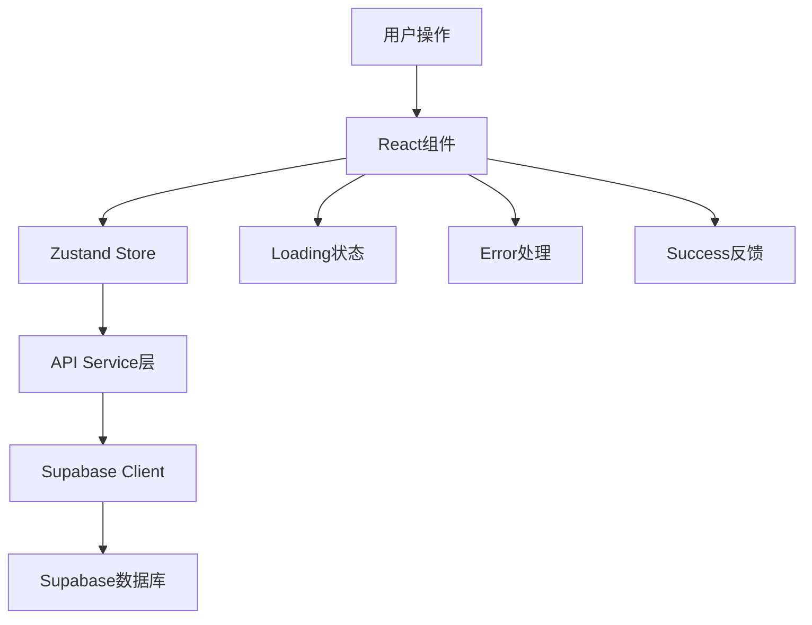

# 前端组件API集成指南

## 概述

本文档提供了SMS营销数据分析系统中各个前端组件与后端API集成的详细指南，包括数据获取、状态管理、错误处理和用户交互优化。

## 核心架构

### 1. 数据流架构



### 2. Store集成模式

```typescript
// 组件中使用API的标准模式
const Component = () => {
  const { 
    data, 
    loading, 
    error,
    loadData,
    createItem,
    updateItem,
    deleteItem 
  } = useAppStore();

  useEffect(() => {
    loadData();
  }, []);

  const handleCreate = async (formData) => {
    try {
      await createItem(formData);
      // 成功处理
    } catch (error) {
      // 错误处理
    }
  };
};
```

## 页面组件集成

### 1. 号码包管理页面 (PackageManagement.tsx)

#### 数据获取集成

```typescript
import { useAppStore } from '../store';

const PackageManagement = () => {
  const {
    packages,
    loading,
    error,
    loadPackages,
    createPackage,
    updatePackageAsync,
    deletePackageAsync,
    uploadPackageFile
  } = useAppStore();

  // 页面加载时获取数据
  useEffect(() => {
    loadPackages();
  }, [loadPackages]);

  // 创建号码包
  const handleCreatePackage = async (packageData) => {
    try {
      setSubmitting(true);
      await createPackage(packageData);
      message.success('号码包创建成功');
      setIsModalVisible(false);
      form.resetFields();
    } catch (error) {
      message.error(`创建失败: ${error.message}`);
    } finally {
      setSubmitting(false);
    }
  };

  // 文件上传
  const handleFileUpload = async (file, packageId) => {
    try {
      setUploading(true);
      const result = await uploadPackageFile(file, packageId);
      message.success('文件上传成功');
      return result;
    } catch (error) {
      message.error(`上传失败: ${error.message}`);
      throw error;
    } finally {
      setUploading(false);
    }
  };

  // 删除号码包
  const handleDelete = async (packageId) => {
    try {
      await deletePackageAsync(packageId);
      message.success('删除成功');
    } catch (error) {
      message.error(`删除失败: ${error.message}`);
    }
  };
};
```

#### 状态管理优化

```typescript
// 使用选择器优化性能
const usePackageData = () => {
  const packages = useAppStore(state => state.packages);
  const loading = useAppStore(state => state.loading.packages);
  const error = useAppStore(state => state.error);
  
  return { packages, loading, error };
};

// 使用操作选择器
const usePackageActions = () => {
  const actions = useAppStore(state => ({
    loadPackages: state.loadPackages,
    createPackage: state.createPackage,
    updatePackageAsync: state.updatePackageAsync,
    deletePackageAsync: state.deletePackageAsync,
    uploadPackageFile: state.uploadPackageFile
  }));
  
  return actions;
};
```

### 2. 号码评级页面 (PhoneRating.tsx)

#### 评级数据集成

```typescript
const PhoneRating = () => {
  const {
    phoneRatings,
    phoneScores,
    loading,
    loadPhoneRatings,
    createPhoneRating,
    loadPhoneScores,
    updatePhoneScoreAsync
  } = useAppStore();

  // 加载评级数据
  useEffect(() => {
    Promise.all([
      loadPhoneRatings(),
      loadPhoneScores()
    ]);
  }, []);

  // 提交评级
  const handleRatingSubmit = async (ratingData) => {
    try {
      setSubmitting(true);
      await createPhoneRating(ratingData);
      message.success('评级提交成功');
      
      // 自动刷新相关数据
      await loadPhoneScores();
    } catch (error) {
      message.error(`评级失败: ${error.message}`);
    } finally {
      setSubmitting(false);
    }
  };

  // 批量评级
  const handleBatchRating = async (phoneNumbers, rating) => {
    try {
      setBatchLoading(true);
      const promises = phoneNumbers.map(phone => 
        createPhoneRating({
          phone_number: phone,
          rating,
          package_id: selectedPackageId,
          notes: batchNotes
        })
      );
      
      await Promise.all(promises);
      message.success(`成功评级 ${phoneNumbers.length} 个号码`);
      
      // 刷新数据
      await Promise.all([
        loadPhoneRatings(),
        loadPhoneScores()
      ]);
    } catch (error) {
      message.error(`批量评级失败: ${error.message}`);
    } finally {
      setBatchLoading(false);
    }
  };
};
```

#### 实时数据更新

```typescript
// 使用轮询更新评分数据
const useRealTimeScores = () => {
  const { loadPhoneScores } = useAppStore();
  
  useEffect(() => {
    const interval = setInterval(() => {
      loadPhoneScores();
    }, 30000); // 30秒更新一次
    
    return () => clearInterval(interval);
  }, [loadPhoneScores]);
};
```

### 3. 数据分析页面 (DataAnalysis.tsx)

#### 分析数据集成

```typescript
const DataAnalysis = () => {
  const {
    packages,
    phoneScores,
    reports,
    loading,
    loadPackages,
    loadPhoneScores,
    getReportStats
  } = useAppStore();

  // 加载分析所需数据
  useEffect(() => {
    const loadAnalysisData = async () => {
      try {
        await Promise.all([
          loadPackages(),
          loadPhoneScores(),
          getReportStats()
        ]);
      } catch (error) {
        message.error('数据加载失败');
      }
    };
    
    loadAnalysisData();
  }, []);

  // 计算分析指标
  const analysisData = useMemo(() => {
    if (!packages.length || !phoneScores.length) return null;
    
    return {
      totalPackages: packages.length,
      totalPhones: packages.reduce((sum, pkg) => sum + pkg.phone_count, 0),
      averageConversion: packages.reduce((sum, pkg) => sum + pkg.conversion_rate, 0) / packages.length,
      gradeDistribution: phoneScores.reduce((acc, score) => {
        acc[score.final_grade] = (acc[score.final_grade] || 0) + 1;
        return acc;
      }, {}),
      topPerformingPackages: packages
        .sort((a, b) => b.conversion_rate - a.conversion_rate)
        .slice(0, 5)
    };
  }, [packages, phoneScores]);

  // 图表数据处理
  const chartData = useMemo(() => {
    if (!analysisData) return [];
    
    return Object.entries(analysisData.gradeDistribution).map(([grade, count]) => ({
      grade,
      count,
      percentage: (count / phoneScores.length * 100).toFixed(1)
    }));
  }, [analysisData, phoneScores]);
};
```

### 4. 报告中心页面 (ReportCenter.tsx)

#### 报告生成集成

```typescript
const ReportCenter = () => {
  const {
    reports,
    loading,
    loadReports,
    generateReport,
    deleteReportAsync,
    downloadReport
  } = useAppStore();

  // 加载报告列表
  useEffect(() => {
    loadReports();
  }, [loadReports]);

  // 生成报告
  const handleGenerateReport = async (reportConfig) => {
    try {
      setGenerating(true);
      await generateReport(reportConfig);
      message.success('报告生成任务已提交');
      
      // 定期检查生成状态
      const checkStatus = setInterval(async () => {
        await loadReports();
        const latestReport = reports.find(r => r.status === 'generating');
        if (!latestReport) {
          clearInterval(checkStatus);
          message.success('报告生成完成');
        }
      }, 5000);
      
      // 5分钟后停止检查
      setTimeout(() => clearInterval(checkStatus), 300000);
    } catch (error) {
      message.error(`报告生成失败: ${error.message}`);
    } finally {
      setGenerating(false);
    }
  };

  // 下载报告
  const handleDownload = async (reportId, fileName) => {
    try {
      setDownloading(reportId);
      const blob = await downloadReport(reportId);
      
      // 创建下载链接
      const url = window.URL.createObjectURL(blob);
      const link = document.createElement('a');
      link.href = url;
      link.download = fileName;
      document.body.appendChild(link);
      link.click();
      document.body.removeChild(link);
      window.URL.revokeObjectURL(url);
      
      message.success('下载完成');
    } catch (error) {
      message.error(`下载失败: ${error.message}`);
    } finally {
      setDownloading(null);
    }
  };
};
```

### 5. 系统设置页面 (SystemSettings.tsx)

#### 设置管理集成

```typescript
const SystemSettings = () => {
  const {
    settings,
    loading,
    loadSystemSettings,
    saveSystemSettings,
    resetSystemSettings,
    updateCategorySettings
  } = useAppStore();

  // 加载系统设置
  useEffect(() => {
    loadSystemSettings();
  }, [loadSystemSettings]);

  // 保存设置
  const handleSaveSettings = async (formData) => {
    try {
      setSaving(true);
      await saveSystemSettings(formData);
      message.success('设置保存成功');
    } catch (error) {
      message.error(`保存失败: ${error.message}`);
    } finally {
      setSaving(false);
    }
  };

  // 重置设置
  const handleResetSettings = async () => {
    try {
      await resetSystemSettings();
      message.success('设置已重置为默认值');
      form.resetFields();
    } catch (error) {
      message.error(`重置失败: ${error.message}`);
    }
  };

  // 分类设置更新
  const handleCategoryUpdate = async (category, categorySettings) => {
    try {
      await updateCategorySettings(category, categorySettings);
      message.success(`${category}设置更新成功`);
    } catch (error) {
      message.error(`更新失败: ${error.message}`);
    }
  };
};
```

## 通用集成模式

### 1. 错误处理模式

```typescript
// 全局错误处理Hook
const useErrorHandler = () => {
  const error = useAppStore(state => state.error);
  
  useEffect(() => {
    if (error) {
      // 根据错误类型显示不同消息
      if (error.code === 'NETWORK_ERROR') {
        message.error('网络连接失败，请检查网络设置');
      } else if (error.code === 'AUTH_ERROR') {
        message.error('认证失败，请重新登录');
        // 跳转到登录页
      } else if (error.code === 'PERMISSION_ERROR') {
        message.error('权限不足，请联系管理员');
      } else {
        message.error(error.message || '操作失败');
      }
    }
  }, [error]);
};

// 组件中使用
const Component = () => {
  useErrorHandler();
  // 组件逻辑
};
```

### 2. 加载状态管理

```typescript
// 加载状态Hook
const useLoadingState = (loadingKey) => {
  const loading = useAppStore(state => state.loading[loadingKey]);
  return loading || false;
};

// 使用示例
const Component = () => {
  const packagesLoading = useLoadingState('packages');
  const ratingsLoading = useLoadingState('ratings');
  
  return (
    <Spin spinning={packagesLoading || ratingsLoading}>
      {/* 组件内容 */}
    </Spin>
  );
};
```

### 3. 数据缓存策略

```typescript
// 数据缓存Hook
const useDataCache = (key, loadFunction, dependencies = []) => {
  const data = useAppStore(state => state[key]);
  const loading = useAppStore(state => state.loading[key]);
  
  useEffect(() => {
    if (!data || data.length === 0) {
      loadFunction();
    }
  }, dependencies);
  
  return { data, loading };
};

// 使用示例
const Component = () => {
  const { data: packages, loading } = useDataCache(
    'packages',
    useAppStore(state => state.loadPackages),
    []
  );
};
```

### 4. 表单集成模式

```typescript
// 表单提交Hook
const useFormSubmit = (submitFunction, onSuccess, onError) => {
  const [submitting, setSubmitting] = useState(false);
  
  const handleSubmit = async (formData) => {
    try {
      setSubmitting(true);
      const result = await submitFunction(formData);
      onSuccess?.(result);
      return result;
    } catch (error) {
      onError?.(error);
      throw error;
    } finally {
      setSubmitting(false);
    }
  };
  
  return { handleSubmit, submitting };
};

// 使用示例
const FormComponent = () => {
  const { createPackage } = useAppStore();
  const [form] = Form.useForm();
  
  const { handleSubmit, submitting } = useFormSubmit(
    createPackage,
    () => {
      message.success('创建成功');
      form.resetFields();
    },
    (error) => {
      message.error(`创建失败: ${error.message}`);
    }
  );
  
  return (
    <Form form={form} onFinish={handleSubmit}>
      {/* 表单字段 */}
      <Button type="primary" htmlType="submit" loading={submitting}>
        提交
      </Button>
    </Form>
  );
};
```

### 5. 分页数据集成

```typescript
// 分页Hook
const usePagination = (loadFunction, pageSize = 10) => {
  const [current, setCurrent] = useState(1);
  const [total, setTotal] = useState(0);
  const [loading, setLoading] = useState(false);
  const [data, setData] = useState([]);
  
  const loadData = async (page = current) => {
    try {
      setLoading(true);
      const result = await loadFunction({
        page,
        pageSize,
        offset: (page - 1) * pageSize
      });
      setData(result.data);
      setTotal(result.total);
      setCurrent(page);
    } catch (error) {
      message.error('数据加载失败');
    } finally {
      setLoading(false);
    }
  };
  
  useEffect(() => {
    loadData(1);
  }, []);
  
  return {
    data,
    loading,
    current,
    total,
    pageSize,
    onChange: loadData,
    refresh: () => loadData(current)
  };
};
```

## 性能优化

### 1. 组件懒加载

```typescript
// 路由懒加载
const PackageManagement = lazy(() => import('../pages/PackageManagement'));
const PhoneRating = lazy(() => import('../pages/PhoneRating'));
const DataAnalysis = lazy(() => import('../pages/DataAnalysis'));

// 使用Suspense包装
<Suspense fallback={<PageLoading />}>
  <Routes>
    <Route path="/packages" element={<PackageManagement />} />
    <Route path="/rating" element={<PhoneRating />} />
    <Route path="/analysis" element={<DataAnalysis />} />
  </Routes>
</Suspense>
```

### 2. 数据预加载

```typescript
// 应用初始化时预加载关键数据
const useAppInitialization = () => {
  const { 
    loadSystemSettings,
    loadPackages,
    loadPhoneScores 
  } = useAppStore();
  
  useEffect(() => {
    const initializeApp = async () => {
      try {
        // 并行加载关键数据
        await Promise.all([
          loadSystemSettings(),
          loadPackages(),
          loadPhoneScores()
        ]);
      } catch (error) {
        console.error('应用初始化失败:', error);
      }
    };
    
    initializeApp();
  }, []);
};
```

### 3. 虚拟滚动

```typescript
// 大数据量列表使用虚拟滚动
import { FixedSizeList as List } from 'react-window';

const VirtualizedTable = ({ data }) => {
  const Row = ({ index, style }) => (
    <div style={style}>
      {/* 行内容 */}
    </div>
  );
  
  return (
    <List
      height={600}
      itemCount={data.length}
      itemSize={50}
      width="100%"
    >
      {Row}
    </List>
  );
};
```

## 测试集成

### 1. API Mock

```typescript
// 开发环境API Mock
const mockApiService = {
  loadPackages: () => Promise.resolve(mockPackages),
  createPackage: (data) => Promise.resolve({ id: Date.now(), ...data }),
  // 其他mock方法
};

// 根据环境选择API服务
const apiService = process.env.NODE_ENV === 'development' 
  ? mockApiService 
  : realApiService;
```

### 2. 组件测试

```typescript
// 组件测试示例
import { render, screen, fireEvent, waitFor } from '@testing-library/react';
import { useAppStore } from '../store';

// Mock store
jest.mock('../store');

test('PackageManagement loads and displays packages', async () => {
  const mockLoadPackages = jest.fn();
  useAppStore.mockReturnValue({
    packages: mockPackages,
    loading: false,
    loadPackages: mockLoadPackages
  });
  
  render(<PackageManagement />);
  
  expect(mockLoadPackages).toHaveBeenCalled();
  await waitFor(() => {
    expect(screen.getByText('号码包列表')).toBeInTheDocument();
  });
});
```

## 部署配置

### 1. 环境变量

```typescript
// 环境配置
const config = {
  supabase: {
    url: process.env.REACT_APP_SUPABASE_URL,
    anonKey: process.env.REACT_APP_SUPABASE_ANON_KEY
  },
  api: {
    baseUrl: process.env.REACT_APP_API_BASE_URL,
    timeout: parseInt(process.env.REACT_APP_API_TIMEOUT) || 10000
  },
  features: {
    enableMockData: process.env.REACT_APP_ENABLE_MOCK_DATA === 'true',
    enableDebugMode: process.env.REACT_APP_DEBUG_MODE === 'true'
  }
};
```

### 2. 构建优化

```typescript
// webpack配置优化
module.exports = {
  optimization: {
    splitChunks: {
      chunks: 'all',
      cacheGroups: {
        vendor: {
          test: /[\\/]node_modules[\\/]/,
          name: 'vendors',
          chunks: 'all'
        },
        common: {
          name: 'common',
          minChunks: 2,
          chunks: 'all'
        }
      }
    }
  }
};
```

## 监控和调试

### 1. 性能监控

```typescript
// 性能监控Hook
const usePerformanceMonitor = (componentName) => {
  useEffect(() => {
    const startTime = performance.now();
    
    return () => {
      const endTime = performance.now();
      const renderTime = endTime - startTime;
      
      if (renderTime > 100) {
        console.warn(`${componentName} 渲染时间过长: ${renderTime}ms`);
      }
    };
  }, [componentName]);
};
```

### 2. API调用监控

```typescript
// API调用监控
const apiMonitor = {
  logApiCall: (method, url, duration, success) => {
    console.log(`API ${method} ${url}: ${duration}ms ${success ? '✓' : '✗'}`);
    
    // 发送到监控服务
    if (process.env.NODE_ENV === 'production') {
      // 发送监控数据
    }
  }
};
```

这个集成指南提供了完整的前端组件与API集成方案，确保系统的稳定性、性能和用户体验。