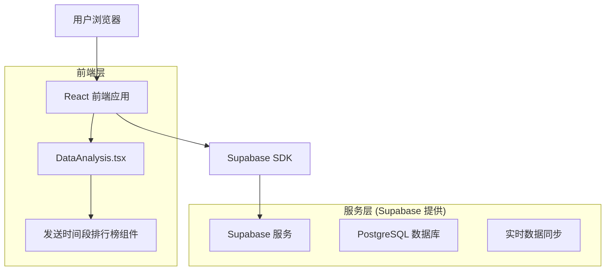
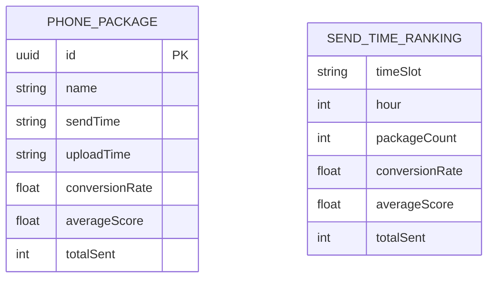

# 发送时间段排行榜技术架构文档

## 1. Architecture design



## 2. Technology Description

* Frontend: React\@18 + TypeScript + Tailwind CSS + Vite

* Backend: Supabase (PostgreSQL + 实时同步)

* 状态管理: Zustand

* 图表库: Recharts

* 图标库: Lucide React

## 3. Route definitions

| Route          | Purpose             |
| -------------- | ------------------- |
| /data-analysis | 数据分析页面，包含发送时间段排行榜功能 |

## 4. API definitions

### 4.1 数据类型定义

发送时间段排行榜数据结构：

```typescript
interface SendTimeRankingData {
  timeSlot: string;        // 时间段，如 "09:00-10:00"
  hour: number;           // 小时数，0-23
  packageCount: number;   // 包数量
  conversionRate: number; // 转化率 (0-100)
  averageScore: number;   // 平均评分 (0-5)
  totalSent: number;      // 总发送量
}

interface SendTimeStats {
  totalPackages: number;     // 总包数
  averageConversion: number; // 平均转化率
  peakHour: string;         // 高峰时段
  bestConversionHour: string; // 最佳转化时段
}
```

### 4.2 数据处理逻辑

从 PhonePackage 数据中提取发送时间信息：

```typescript
// 解析发送时间，按小时分组
const processSendTimeData = (packages: PhonePackage[], timeRange: string) => {
  // 1. 过滤时间范围内的包数据
  // 2. 解析 sendTime 字段，提取小时信息
  // 3. 按小时分组统计
  // 4. 计算各项指标（包数量、转化率、平均评分）
  // 5. 返回排序后的时间段数据
}
```

## 5. Data model

### 5.1 Data model definition



### 5.2 Data Definition Language

基于现有 PhonePackage 表结构，无需新增表。发送时间段排行榜数据通过前端计算生成：

```sql
-- 现有 phone_packages 表已包含所需字段
-- sendTime: 发送时间字段
-- conversionRate: 转化率
-- averageScore: 平均评分
-- totalSent: 总发送量

-- 示例查询：按时间范围获取包数据
SELECT id, name, send_time, conversion_rate, average_score, total_sent
FROM phone_packages 
WHERE send_time >= NOW() - INTERVAL '7 days'
ORDER BY send_time DESC;
```

## 6. 实现要点

### 6.1 状态管理

在 DataAnalysis.tsx 中新增发送时间排行榜状态：

```typescript
sendTimeSlots: {
  collapsed: false,
  showAll: false,
  sortBy: 'conversionRate',
  sortOrder: 'desc' as 'asc' | 'desc'
}
```

### 6.2 数据处理

* 解析 sendTime 字段（格式：YYYY-MM-DD HH:mm:ss）

* 按小时分组（0-23小时）

* 计算每个时间段的统计指标

* 支持时间范围筛选

### 6.3 UI 组件

* 复用现有排行榜组件结构

* 使用 Clock 图标标识时间段排行榜

* 保持与其他排行榜一致的样式和交互

