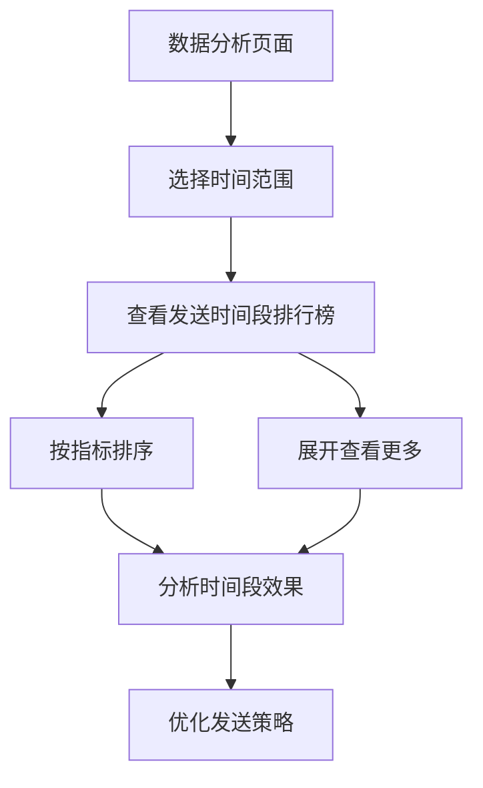

# 发送时间段排行榜功能需求文档

## 1. Product Overview
为数据分析页面新增发送时间段排行榜功能，通过分析号码包的发送时间分布，帮助用户了解不同时间段的发送效果和转化情况，优化发送策略。
- 解决问题：用户无法直观了解不同时间段的发送效果差异，难以制定最优的发送时间策略
- 目标用户：数据分析人员、运营人员、决策者
- 产品价值：通过时间维度的数据分析，提升发送效果和转化率

## 2. Core Features

### 2.1 User Roles
本功能基于现有用户体系，无需新增角色权限。

### 2.2 Feature Module
发送时间段排行榜功能将集成到现有数据分析页面中：
1. **数据分析页面**：新增第5个排行榜模块 - 发送时间段排行榜

### 2.3 Page Details

| Page Name | Module Name | Feature description |
|-----------|-------------|---------------------|
| 数据分析页面 | 发送时间段排行榜 | 显示24小时时间段统计，包含包数量、转化率、平均评分等指标。支持按转化率、包数量、平均评分排序。提供展开/收起功能，显示更多时间段数据 |

## 3. Core Process

用户在数据分析页面可以：
1. 选择时间范围（昨天、3天、7天、15天、30天）
2. 查看发送时间段排行榜，了解各时间段的发送效果
3. 点击排序按钮，按不同指标排序（转化率、包数量、平均评分）
4. 点击"显示更多"查看完整的24小时时间段数据
5. 基于数据分析结果，优化发送时间策略

## 4. User Interface Design

### 4.1 Design Style
- 主色调：蓝色系（#3B82F6）和灰色系（#6B7280）
- 按钮样式：圆角按钮，悬停效果
- 字体：系统默认字体，标题14px，内容12px
- 布局风格：卡片式布局，与现有排行榜保持一致
- 图标风格：使用时钟图标（Clock）表示时间段

### 4.2 Page Design Overview

| Page Name | Module Name | UI Elements |
|-----------|-------------|-------------|
| 数据分析页面 | 发送时间段排行榜 | 标题区域：时钟图标+标题+排序按钮组。数据区域：时间段列表，每行显示时间段、包数量、转化率、平均评分。底部：显示更多按钮。样式与现有排行榜保持一致，使用相同的卡片布局和颜色方案 |

### 4.3 Responsiveness
桌面优先设计，支持移动端自适应显示。