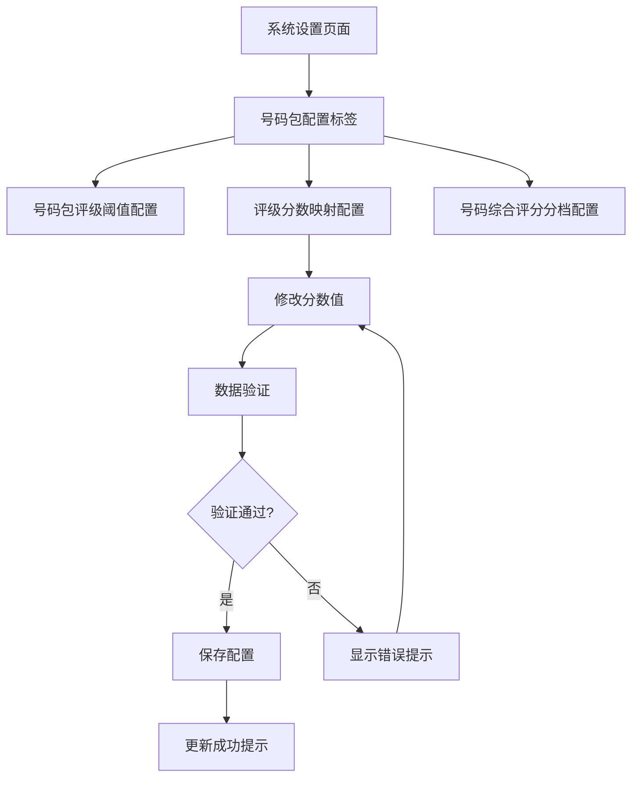

# 号码包评级分数映射配置功能 - 产品需求文档

## 1. 产品概述

本功能为SMS营销数据分析系统新增"号码包评级分数映射配置"模块，允许管理员在系统设置中自定义各评级等级（SS/S/A/B/C/D）对应的数值分数。

- 解决当前评级分数硬编码问题，提供灵活的配置能力
- 确保评级分数与产品需求文档标准保持一致
- 为号码综合评分算法提供可调整的基础数据

## 2. 核心功能

### 2.1 用户角色

| 角色 | 权限说明 | 核心功能 |
|------|----------|----------|
| 系统管理员 | 完全访问权限 | 可查看、编辑、保存评级分数映射配置 |
| 操作员 | 只读权限 | 仅可查看当前配置，无法修改 |

### 2.2 功能模块

本功能在现有系统设置页面中新增一个配置模块：

1. **评级分数映射配置页面**：在系统设置的"号码包配置"标签页中新增配置区域

### 2.3 页面详情

| 页面名称 | 模块名称 | 功能描述 |
|----------|----------|----------|
| 系统设置页面 | 评级分数映射配置 | 显示SS/S/A/B/C/D六个评级的分数输入框，支持实时编辑、数据验证、保存配置、重置默认值 |

## 3. 核心流程

### 3.1 管理员配置流程

1. 管理员登录系统
2. 进入"系统设置"页面
3. 切换到"号码包配置"标签页
4. 在"评级分数映射配置"区域修改各评级分数
5. 系统实时验证输入数据的合法性
6. 点击"保存配置"按钮提交更改
7. 系统更新数据库并刷新全局状态

### 3.2 页面导航流程



## 4. 用户界面设计

### 4.1 设计风格

- **主色调**：沿用系统现有的蓝色主题（#3B82F6）和灰色辅助色
- **布局风格**：卡片式布局，与现有配置模块保持一致
- **字体**：系统默认字体，标题使用16px，正文使用14px，说明文字使用12px
- **交互风格**：简洁的输入框设计，清晰的错误提示，一致的按钮样式

### 4.2 页面设计概览

| 页面名称 | 模块名称 | UI元素 |
|----------|----------|--------|
| 系统设置页面 | 评级分数映射配置 | 白色卡片容器，标题区域，6个数字输入框（网格布局），约束说明文字，保存/重置按钮，错误提示区域 |

### 4.3 响应式设计

- **桌面优先**：主要面向管理员在桌面端使用
- **移动适配**：输入框在小屏幕下调整为单列布局
- **触控优化**：输入框具备足够的点击区域，支持触控操作

## 5. 技术规格

### 5.1 数据验证规则

**基础约束**：
- 所有分数必须为0-100之间的整数
- 分数必须严格递减：SS > S > A > B > C > D
- 相邻评级分数差距不能小于5分
- SS级分数不能低于80分，D级分数不能高于40分

**默认配置**：
```json
{
  "SS": 100,
  "S": 85,
  "A": 70,
  "B": 55,
  "C": 40,
  "D": 25
}
```

**验证逻辑**：
```javascript
// 验证函数示例
function validateRatingScores(scores) {
  const ratings = ['SS', 'S', 'A', 'B', 'C', 'D'];
  const values = ratings.map(r => scores[r]);
  
  // 检查递减顺序
  for (let i = 0; i < values.length - 1; i++) {
    if (values[i] <= values[i + 1]) {
      return { valid: false, error: `${ratings[i]}级分数必须高于${ratings[i + 1]}级` };
    }
  }
  
  // 检查最小差距
  for (let i = 0; i < values.length - 1; i++) {
    if (values[i] - values[i + 1] < 5) {
      return { valid: false, error: `${ratings[i]}级与${ratings[i + 1]}级差距不能小于5分` };
    }
  }
  
  return { valid: true };
}
```

### 5.2 数据存储

**数据库表**：system_settings
**存储格式**：
```sql
INSERT INTO system_settings (setting_key, setting_value, setting_type, description) 
VALUES (
  'rating_score_mapping', 
  '{"SS":100,"S":85,"A":70,"B":55,"C":40,"D":25}', 
  'mapping', 
  '评级分数映射配置'
);
```

### 5.3 状态管理

**前端状态**：
- 使用现有的 Zustand store 管理配置状态
- 支持实时更新和全局状态同步
- 提供加载状态和错误状态管理

## 6. 验收标准

### 6.1 功能验收

- [ ] 管理员可以查看当前评级分数映射配置
- [ ] 管理员可以修改各评级对应的分数值
- [ ] 系统能够实时验证输入数据的合法性
- [ ] 保存功能正常工作，数据能够持久化到数据库
- [ ] 重置功能能够恢复到默认配置
- [ ] 操作员只能查看配置，无法修改

### 6.2 界面验收

- [ ] 配置区域与现有模块风格保持一致
- [ ] 输入框布局合理，标签清晰
- [ ] 错误提示信息准确且用户友好
- [ ] 保存和重置按钮位置合理，交互流畅

### 6.3 数据验证验收

- [ ] 输入非法数值时显示相应错误提示
- [ ] 违反递减规则时阻止保存并提示
- [ ] 相邻差距小于5分时给出明确提示
- [ ] 边界值验证正确（SS≥80，D≤40）

### 6.4 兼容性验收

- [ ] 不影响现有功能的正常使用
- [ ] 与现有评分算法兼容
- [ ] 数据库迁移平滑，无数据丢失
- [ ] 前端状态管理与现有逻辑兼容

## 7. 实施优先级

### 高优先级（必须实现）
1. 基础UI界面和输入功能
2. 数据验证逻辑
3. 保存到数据库功能
4. 重置为默认值功能

### 中优先级（建议实现）
1. 权限控制（管理员/操作员区分）
2. 操作成功/失败的用户反馈
3. 配置变更的实时预览

### 低优先级（可选实现）
1. 配置变更历史记录
2. 批量导入/导出功能
3. 配置变更审计日志

## 8. 风险评估

### 技术风险
- **低风险**：基于现有成熟架构，复用现有组件和逻辑
- **数据一致性**：通过严格的验证规则确保数据质量
- **向下兼容**：不改变现有API接口，保持兼容性

### 业务风险
- **配置错误**：通过UI约束和验证规则最小化错误配置风险
- **权限控制**：确保只有管理员可以修改关键配置
- **回滚机制**：提供重置功能作为快速恢复手段

## 9. 成功指标

### 功能指标
- 配置保存成功率 ≥ 99%
- 数据验证准确率 = 100%
- 界面响应时间 ≤ 200ms

### 用户体验指标
- 管理员配置操作完成时间 ≤ 2分钟
- 错误提示理解度 ≥ 95%
- 界面一致性评分 ≥ 9/10

### 技术指标
- 代码增量 ≤ 100行
- 现有功能回归测试通过率 = 100%
- 数据库查询性能无明显下降