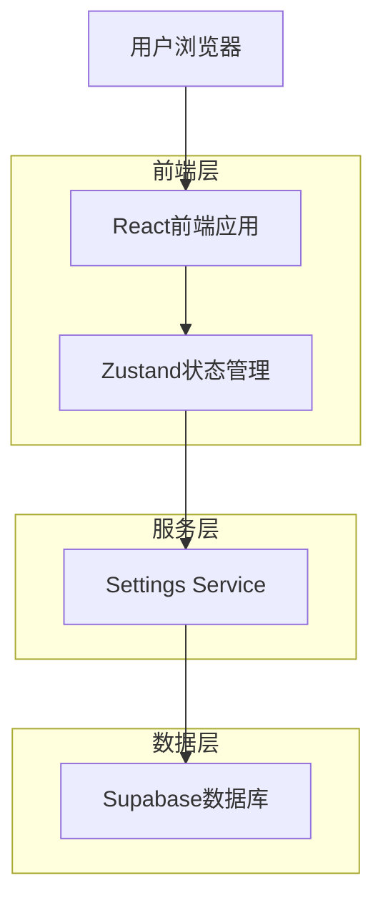
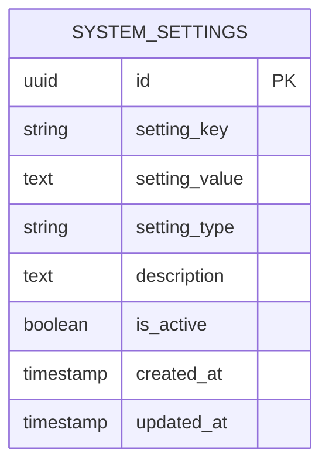

# 号码包评级分数映射配置功能 - 技术架构文档

## 1. 架构设计



## 2. 技术描述

- **前端**: React@18 + TypeScript + Tailwind CSS + Zustand
- **后端**: Supabase (PostgreSQL + 实时API)
- **状态管理**: Zustand (复用现有store架构)
- **UI组件**: 复用现有组件库和样式系统

## 3. 路由定义

| 路由 | 用途 |
|------|------|
| /settings | 系统设置页面，包含评级分数映射配置模块 |

## 4. API定义

### 4.1 核心API

**获取评级分数映射配置**
```
GET /api/settings/rating-score-mapping
```

通过Supabase客户端实现：
```typescript
const { data, error } = await supabase
  .from('system_settings')
  .select('setting_value')
  .eq('setting_key', 'rating_score_mapping')
  .single();
```

**更新评级分数映射配置**
```
PUT /api/settings/rating-score-mapping
```

请求参数：
| 参数名称 | 参数类型 | 是否必需 | 描述 |
|----------|----------|----------|------|
| SS | number | true | SS级评分 (80-100) |
| S | number | true | S级评分 (70-95) |
| A | number | true | A级评分 (60-85) |
| B | number | true | B级评分 (45-70) |
| C | number | true | C级评分 (30-55) |
| D | number | true | D级评分 (10-40) |

响应：
| 参数名称 | 参数类型 | 描述 |
|----------|----------|------|
| success | boolean | 操作是否成功 |
| message | string | 操作结果消息 |

示例：
```json
{
  "SS": 100,
  "S": 85,
  "A": 70,
  "B": 55,
  "C": 40,
  "D": 25
}
```

## 5. 数据模型

### 5.1 数据模型定义



### 5.2 数据定义语言

**系统设置表 (system_settings)**
```sql
-- 表结构已存在，无需创建

-- 初始化评级分数映射配置
INSERT INTO system_settings (setting_key, setting_value, setting_type, description, is_active) 
VALUES (
  'rating_score_mapping', 
  '{"SS":100,"S":85,"A":70,"B":55,"C":40,"D":25}', 
  'mapping', 
  '评级分数映射配置', 
  true
) ON CONFLICT (setting_key) DO UPDATE SET 
  setting_value = EXCLUDED.setting_value,
  updated_at = NOW();

-- 创建索引（如果不存在）
CREATE INDEX IF NOT EXISTS idx_system_settings_key ON system_settings(setting_key);
CREATE INDEX IF NOT EXISTS idx_system_settings_type ON system_settings(setting_type);
```

## 6. 前端组件架构

### 6.1 组件层次结构

```
SystemSettings.tsx
├── RatingScoreMappingConfig (新增组件)
│   ├── RatingScoreInput (评级分数输入框)
│   ├── ValidationMessage (验证错误提示)
│   └── ActionButtons (保存/重置按钮)
└── 其他现有配置组件
```

### 6.2 状态管理

**Zustand Store 扩展**
```typescript
interface SystemStore {
  // 现有状态...
  ratingScoreMap: Record<string, number>;
  ratingScoreMapLoading: boolean;
  ratingScoreMapError: string | null;
  
  // 新增方法
  loadRatingScoreMap: () => Promise<void>;
  updateRatingScoreMap: (scoreMap: Record<string, number>) => Promise<boolean>;
  resetRatingScoreMap: () => Promise<void>;
}
```

### 6.3 数据验证

**前端验证逻辑**
```typescript
interface ValidationResult {
  isValid: boolean;
  errors: Record<string, string>;
}

function validateRatingScoreMap(scoreMap: Record<string, number>): ValidationResult {
  const errors: Record<string, string> = {};
  const ratings = ['SS', 'S', 'A', 'B', 'C', 'D'];
  const scores = ratings.map(r => scoreMap[r]);
  
  // 范围验证
  const ranges = {
    'SS': [80, 100], 'S': [70, 95], 'A': [60, 85],
    'B': [45, 70], 'C': [30, 55], 'D': [10, 40]
  };
  
  ratings.forEach(rating => {
    const score = scoreMap[rating];
    const [min, max] = ranges[rating];
    if (score < min || score > max) {
      errors[rating] = `分数必须在${min}-${max}分之间`;
    }
  });
  
  // 严格递减验证
  for (let i = 0; i < scores.length - 1; i++) {
    if (scores[i] <= scores[i + 1]) {
      errors[ratings[i]] = `分数必须高于${ratings[i + 1]}级`;
    }
  }
  
  // 最小差距验证
  for (let i = 0; i < scores.length - 1; i++) {
    if (scores[i] - scores[i + 1] < 5) {
      errors[ratings[i]] = `与${ratings[i + 1]}级差距不能小于5分`;
    }
  }
  
  return { isValid: Object.keys(errors).length === 0, errors };
}
```

## 7. 服务层设计

### 7.1 Settings Service 扩展

```typescript
// services/settings.ts 新增方法

export const getRatingScoreMapping = async (): Promise<Record<string, number>> => {
  const { data, error } = await supabase
    .from('system_settings')
    .select('setting_value')
    .eq('setting_key', 'rating_score_mapping')
    .single();
    
  if (error) {
    console.error('获取评级分数映射失败:', error);
    // 返回默认值
    return { 'SS': 100, 'S': 85, 'A': 70, 'B': 55, 'C': 40, 'D': 25 };
  }
  
  return JSON.parse(data.setting_value);
};

export const updateRatingScoreMapping = async (scoreMap: Record<string, number>): Promise<void> => {
  const { error } = await supabase
    .from('system_settings')
    .upsert({
      setting_key: 'rating_score_mapping',
      setting_value: JSON.stringify(scoreMap),
      setting_type: 'mapping',
      description: '评级分数映射配置',
      is_active: true,
      updated_at: new Date().toISOString()
    });
    
  if (error) {
    throw new Error(`更新评级分数映射失败: ${error.message}`);
  }
};

export const resetRatingScoreMappingToDefault = async (): Promise<void> => {
  const defaultMap = { 'SS': 100, 'S': 85, 'A': 70, 'B': 55, 'C': 40, 'D': 25 };
  await updateRatingScoreMapping(defaultMap);
};
```

## 8. 安全考虑

### 8.1 权限控制

**Row Level Security (RLS) 策略**
```sql
-- 确保只有管理员可以修改系统设置
CREATE POLICY "管理员可以修改系统设置" ON system_settings
  FOR UPDATE USING (
    EXISTS (
      SELECT 1 FROM app_users 
      WHERE app_users.id = auth.uid() 
      AND app_users.role = 'admin'
    )
  );

-- 所有认证用户可以查看系统设置
CREATE POLICY "认证用户可以查看系统设置" ON system_settings
  FOR SELECT USING (auth.role() = 'authenticated');
```

### 8.2 数据验证

**双重验证机制**
1. **前端验证**：实时用户体验，即时反馈
2. **后端验证**：通过数据库约束和触发器确保数据完整性

```sql
-- 数据库层面的验证触发器
CREATE OR REPLACE FUNCTION validate_rating_score_mapping()
RETURNS TRIGGER AS $$
DECLARE
  score_data jsonb;
  scores integer[];
BEGIN
  IF NEW.setting_key = 'rating_score_mapping' THEN
    score_data := NEW.setting_value::jsonb;
    scores := ARRAY[
      (score_data->>'SS')::integer,
      (score_data->>'S')::integer,
      (score_data->>'A')::integer,
      (score_data->>'B')::integer,
      (score_data->>'C')::integer,
      (score_data->>'D')::integer
    ];
    
    -- 检查递减顺序
    FOR i IN 1..5 LOOP
      IF scores[i] <= scores[i+1] THEN
        RAISE EXCEPTION '评级分数必须严格递减';
      END IF;
    END LOOP;
    
    -- 检查最小差距
    FOR i IN 1..5 LOOP
      IF scores[i] - scores[i+1] < 5 THEN
        RAISE EXCEPTION '相邻评级分数差距不能小于5分';
      END IF;
    END LOOP;
  END IF;
  
  RETURN NEW;
END;
$$ LANGUAGE plpgsql;

CREATE TRIGGER validate_rating_score_mapping_trigger
  BEFORE INSERT OR UPDATE ON system_settings
  FOR EACH ROW EXECUTE FUNCTION validate_rating_score_mapping();
```

## 9. 性能优化

### 9.1 缓存策略

**前端缓存**
- 使用 Zustand 持久化插件缓存配置数据
- 避免重复的数据库查询

**数据库优化**
- 利用现有的 `setting_key` 索引快速查询
- 配置数据较小，无需额外优化

### 9.2 实时更新

**Supabase 实时订阅**
```typescript
// 可选：监听配置变更的实时更新
const subscription = supabase
  .channel('system_settings_changes')
  .on('postgres_changes', 
    { 
      event: 'UPDATE', 
      schema: 'public', 
      table: 'system_settings',
      filter: 'setting_key=eq.rating_score_mapping'
    }, 
    (payload) => {
      // 更新本地状态
      const newScoreMap = JSON.parse(payload.new.setting_value);
      useSystemStore.getState().setRatingScoreMap(newScoreMap);
    }
  )
  .subscribe();
```

## 10. 测试策略

### 10.1 单元测试

**验证逻辑测试**
```typescript
describe('validateRatingScoreMap', () => {
  test('应该接受有效的评级分数映射', () => {
    const validMap = { SS: 100, S: 85, A: 70, B: 55, C: 40, D: 25 };
    const result = validateRatingScoreMap(validMap);
    expect(result.isValid).toBe(true);
  });
  
  test('应该拒绝非递减的分数', () => {
    const invalidMap = { SS: 100, S: 100, A: 70, B: 55, C: 40, D: 25 };
    const result = validateRatingScoreMap(invalidMap);
    expect(result.isValid).toBe(false);
  });
});
```

### 10.2 集成测试

**API测试**
```typescript
describe('Rating Score Mapping API', () => {
  test('应该能够保存和获取评级分数映射', async () => {
    const testMap = { SS: 95, S: 80, A: 65, B: 50, C: 35, D: 20 };
    await updateRatingScoreMapping(testMap);
    const retrieved = await getRatingScoreMapping();
    expect(retrieved).toEqual(testMap);
  });
});
```

### 10.3 端到端测试

**用户流程测试**
1. 管理员登录
2. 导航到系统设置页面
3. 修改评级分数
4. 保存配置
5. 验证配置已生效

## 11. 部署考虑

### 11.1 数据库迁移

**迁移脚本**
```sql
-- 008_rating_score_mapping_config.sql
-- 确保评级分数映射配置存在
INSERT INTO system_settings (setting_key, setting_value, setting_type, description, is_active) 
VALUES (
  'rating_score_mapping', 
  '{"SS":100,"S":85,"A":70,"B":55,"C":40,"D":25}', 
  'mapping', 
  '评级分数映射配置', 
  true
) ON CONFLICT (setting_key) DO NOTHING;
```

### 11.2 环境配置

**无需额外环境变量**
- 复用现有的 Supabase 配置
- 无需新增外部依赖

### 11.3 回滚计划

**回滚策略**
1. 前端代码回滚：移除新增的UI组件
2. 数据库回滚：保留配置数据，不影响现有功能
3. 状态管理回滚：移除新增的状态字段

**风险评估**：低风险，新功能独立，不影响现有核心功能