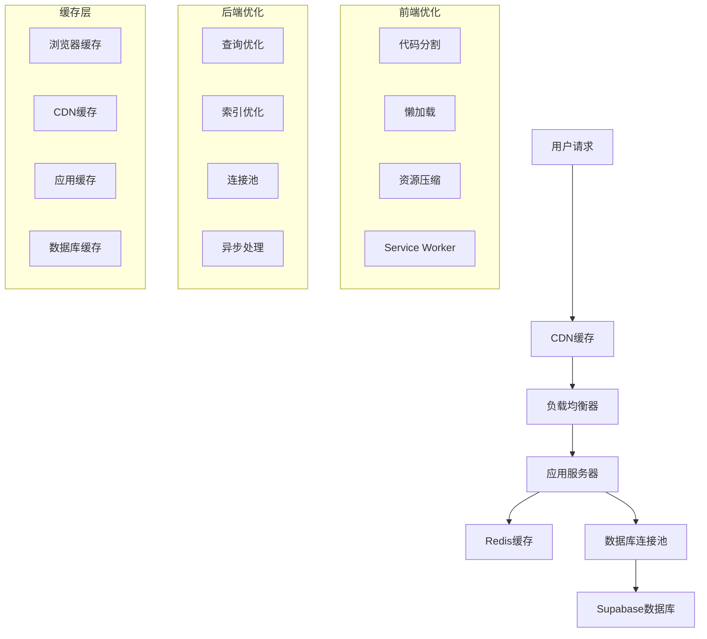

# 性能优化与监控

## 概述

本文档详细说明了SMS营销数据分析系统的性能优化策略、监控方案、缓存机制和性能调优最佳实践。

## 性能优化架构

### 1. 整体性能架构



### 2. 性能指标体系

```typescript
// 性能指标定义
export interface PerformanceMetrics {
  // 响应时间指标
  responseTime: {
    p50: number;    // 50%分位数
    p90: number;    // 90%分位数
    p95: number;    // 95%分位数
    p99: number;    // 99%分位数
    avg: number;    // 平均响应时间
    max: number;    // 最大响应时间
  };

  // 吞吐量指标
  throughput: {
    rps: number;           // 每秒请求数
    rpm: number;           // 每分钟请求数
    concurrent: number;    // 并发用户数
  };

  // 错误率指标
  errorRate: {
    total: number;         // 总错误率
    http4xx: number;       // 4xx错误率
    http5xx: number;       // 5xx错误率
    timeout: number;       // 超时错误率
  };

  // 资源使用指标
  resources: {
    cpu: number;           // CPU使用率
    memory: number;        // 内存使用率
    disk: number;          // 磁盘使用率
    network: number;       // 网络使用率
  };

  // 数据库指标
  database: {
    connectionPool: number;    // 连接池使用率
    queryTime: number;         // 平均查询时间
    slowQueries: number;       // 慢查询数量
    deadlocks: number;         // 死锁数量
  };
}
```

## 前端性能优化

### 1. 代码分割与懒加载

```typescript
// 路由级代码分割
import { lazy, Suspense } from 'react';
import { Routes, Route } from 'react-router-dom';

// 懒加载页面组件
const PackageManagement = lazy(() => 
  import('../pages/PackageManagement').then(module => ({
    default: module.PackageManagement
  }))
);

const PhoneRating = lazy(() => 
  import('../pages/PhoneRating').then(module => ({
    default: module.PhoneRating
  }))
);

const DataAnalysis = lazy(() => 
  import('../pages/DataAnalysis').then(module => ({
    default: module.DataAnalysis
  }))
);

// 路由配置
const AppRoutes = () => (
  <Suspense fallback={<PageLoading />}>
    <Routes>
      <Route path="/packages" element={<PackageManagement />} />
      <Route path="/rating" element={<PhoneRating />} />
      <Route path="/analysis" element={<DataAnalysis />} />
    </Routes>
  </Suspense>
);

// 组件级懒加载
const LazyChart = lazy(() => import('../components/Chart'));

const Dashboard = () => {
  const [showChart, setShowChart] = useState(false);

  return (
    <div>
      <button onClick={() => setShowChart(true)}>
        显示图表
      </button>
      
      {showChart && (
        <Suspense fallback={<ChartSkeleton />}>
          <LazyChart />
        </Suspense>
      )}
    </div>
  );
};
```

### 2. 虚拟滚动优化

```typescript
// 虚拟滚动表格组件
import { FixedSizeList as List } from 'react-window';
import { useMemo } from 'react';

interface VirtualTableProps {
  data: any[];
  columns: TableColumn[];
  height: number;
  itemHeight: number;
}

const VirtualTable: React.FC<VirtualTableProps> = ({
  data,
  columns,
  height,
  itemHeight
}) => {
  // 行渲染器
  const Row = useMemo(() => 
    ({ index, style }: { index: number; style: React.CSSProperties }) => {
      const item = data[index];
      
      return (
        <div style={style} className="table-row">
          {columns.map(column => (
            <div key={column.key} className="table-cell">
              {column.render ? column.render(item[column.key], item) : item[column.key]}
            </div>
          ))}
        </div>
      );
    }, [data, columns]
  );

  return (
    <div className="virtual-table">
      <div className="table-header">
        {columns.map(column => (
          <div key={column.key} className="table-header-cell">
            {column.title}
          </div>
        ))}
      </div>
      
      <List
        height={height}
        itemCount={data.length}
        itemSize={itemHeight}
        width="100%"
      >
        {Row}
      </List>
    </div>
  );
};

// 使用示例
const PackageList = () => {
  const { packages } = useAppStore();
  
  const columns = [
    { key: 'name', title: '包名称' },
    { key: 'phone_count', title: '号码数量' },
    { key: 'conversion_rate', title: '转化率' },
    { 
      key: 'actions', 
      title: '操作',
      render: (_, record) => (
        <Button onClick={() => handleEdit(record.id)}>
          编辑
        </Button>
      )
    }
  ];

  return (
    <VirtualTable
      data={packages}
      columns={columns}
      height={600}
      itemHeight={50}
    />
  );
};
```

### 3. 数据预取与缓存

```typescript
// 数据预取Hook
const useDataPrefetch = () => {
  const { loadPackages, loadPhoneScores, loadSystemSettings } = useAppStore();

  useEffect(() => {
    // 应用启动时预取关键数据
    const prefetchData = async () => {
      try {
        await Promise.all([
          loadSystemSettings(),
          loadPackages(),
          loadPhoneScores()
        ]);
      } catch (error) {
        console.error('数据预取失败:', error);
      }
    };

    prefetchData();
  }, []);
};

// 智能预取Hook
const useSmartPrefetch = (route: string) => {
  const navigate = useNavigate();
  const { loadPackages, loadPhoneRatings, loadReports } = useAppStore();

  const prefetchRouteData = useMemo(() => ({
    '/packages': () => loadPackages(),
    '/rating': () => Promise.all([loadPackages(), loadPhoneRatings()]),
    '/reports': () => loadReports(),
    '/analysis': () => Promise.all([loadPackages(), loadPhoneScores()])
  }), [loadPackages, loadPhoneRatings, loadReports, loadPhoneScores]);

  // 鼠标悬停时预取数据
  const handleMouseEnter = useCallback((targetRoute: string) => {
    const prefetchFn = prefetchRouteData[targetRoute];
    if (prefetchFn) {
      prefetchFn().catch(console.error);
    }
  }, [prefetchRouteData]);

  return { handleMouseEnter };
};

// 使用示例
const Navigation = () => {
  const { handleMouseEnter } = useSmartPrefetch();

  return (
    <nav>
      <Link 
        to="/packages" 
        onMouseEnter={() => handleMouseEnter('/packages')}
      >
        号码包管理
      </Link>
      <Link 
        to="/rating" 
        onMouseEnter={() => handleMouseEnter('/rating')}
      >
        号码评级
      </Link>
    </nav>
  );
};
```

### 4. 图片和资源优化

```typescript
// 图片懒加载组件
const LazyImage: React.FC<{
  src: string;
  alt: string;
  placeholder?: string;
  className?: string;
}> = ({ src, alt, placeholder, className }) => {
  const [isLoaded, setIsLoaded] = useState(false);
  const [isInView, setIsInView] = useState(false);
  const imgRef = useRef<HTMLImageElement>(null);

  useEffect(() => {
    const observer = new IntersectionObserver(
      ([entry]) => {
        if (entry.isIntersecting) {
          setIsInView(true);
          observer.disconnect();
        }
      },
      { threshold: 0.1 }
    );

    if (imgRef.current) {
      observer.observe(imgRef.current);
    }

    return () => observer.disconnect();
  }, []);

  return (
    <div ref={imgRef} className={className}>
      {isInView && (
        <>
          {!isLoaded && placeholder && (
            
          )}
           setIsLoaded(true)}
            style={{ display: isLoaded ? 'block' : 'none' }}
          />
        </>
      )}
    </div>
  );
};

// 资源预加载
const preloadResources = () => {
  const criticalResources = [
    '/images/logo.png',
    '/fonts/main.woff2',
    '/api/system/settings'
  ];

  criticalResources.forEach(resource => {
    if (resource.startsWith('/api/')) {
      // 预取API数据
      fetch(resource).catch(console.error);
    } else {
      // 预加载静态资源
      const link = document.createElement('link');
      link.rel = 'preload';
      link.href = resource;
      link.as = resource.includes('.woff') ? 'font' : 'image';
      if (link.as === 'font') {
        link.crossOrigin = 'anonymous';
      }
      document.head.appendChild(link);
    }
  });
};
```

## 后端性能优化

### 1. 数据库查询优化

```typescript
// 查询优化服务
export class QueryOptimizationService {
  // 分页查询优化
  async getPaginatedData<T>(
    table: string,
    options: PaginationOptions
  ): Promise<PaginatedResult<T>> {
    const { page = 1, pageSize = 20, sortBy, sortOrder = 'desc', filters } = options;
    const offset = (page - 1) * pageSize;

    // 构建查询
    let query = supabase
      .from(table)
      .select('*', { count: 'exact' });

    // 应用过滤器
    if (filters) {
      Object.entries(filters).forEach(([key, value]) => {
        if (value !== undefined && value !== null) {
          query = query.eq(key, value);
        }
      });
    }

    // 应用排序
    if (sortBy) {
      query = query.order(sortBy, { ascending: sortOrder === 'asc' });
    }

    // 应用分页
    query = query.range(offset, offset + pageSize - 1);

    const { data, error, count } = await query;

    if (error) {
      throw new Error(`查询失败: ${error.message}`);
    }

    return {
      data: data || [],
      total: count || 0,
      page,
      pageSize,
      totalPages: Math.ceil((count || 0) / pageSize)
    };
  }

  // 批量查询优化
  async getBatchData<T>(
    table: string,
    ids: string[],
    batchSize: number = 100
  ): Promise<T[]> {
    const results: T[] = [];
    
    // 分批查询避免单次查询过大
    for (let i = 0; i < ids.length; i += batchSize) {
      const batch = ids.slice(i, i + batchSize);
      
      const { data, error } = await supabase
        .from(table)
        .select('*')
        .in('id', batch);

      if (error) {
        throw new Error(`批量查询失败: ${error.message}`);
      }

      results.push(...(data || []));
    }

    return results;
  }

  // 聚合查询优化
  async getAggregatedData(
    table: string,
    aggregations: AggregationConfig[]
  ): Promise<AggregationResult> {
    const queries = aggregations.map(agg => {
      let query = supabase.from(table);

      switch (agg.type) {
        case 'count':
          return query.select('*', { count: 'exact', head: true });
        case 'sum':
          return query.select(`${agg.field}.sum()`);
        case 'avg':
          return query.select(`${agg.field}.avg()`);
        case 'max':
          return query.select(`${agg.field}.max()`);
        case 'min':
          return query.select(`${agg.field}.min()`);
        default:
          throw new Error(`不支持的聚合类型: ${agg.type}`);
      }
    });

    const results = await Promise.all(queries);
    
    return aggregations.reduce((acc, agg, index) => {
      acc[agg.name] = results[index].data;
      return acc;
    }, {} as AggregationResult);
  }
}
```

### 2. 缓存策略

```typescript
// Redis缓存服务
export class CacheService {
  private redis: Redis;
  private defaultTTL = 3600; // 1小时

  constructor() {
    this.redis = new Redis({
      host: process.env.REDIS_HOST || 'localhost',
      port: parseInt(process.env.REDIS_PORT || '6379'),
      password: process.env.REDIS_PASSWORD,
      retryDelayOnFailover: 100,
      maxRetriesPerRequest: 3
    });
  }

  // 获取缓存
  async get<T>(key: string): Promise<T | null> {
    try {
      const value = await this.redis.get(key);
      return value ? JSON.parse(value) : null;
    } catch (error) {
      console.error('缓存获取失败:', error);
      return null;
    }
  }

  // 设置缓存
  async set(key: string, value: any, ttl?: number): Promise<void> {
    try {
      const serialized = JSON.stringify(value);
      await this.redis.setex(key, ttl || this.defaultTTL, serialized);
    } catch (error) {
      console.error('缓存设置失败:', error);
    }
  }

  // 删除缓存
  async del(key: string): Promise<void> {
    try {
      await this.redis.del(key);
    } catch (error) {
      console.error('缓存删除失败:', error);
    }
  }

  // 批量删除缓存
  async delPattern(pattern: string): Promise<void> {
    try {
      const keys = await this.redis.keys(pattern);
      if (keys.length > 0) {
        await this.redis.del(...keys);
      }
    } catch (error) {
      console.error('批量缓存删除失败:', error);
    }
  }

  // 缓存装饰器
  cache(key: string, ttl?: number) {
    return (target: any, propertyKey: string, descriptor: PropertyDescriptor) => {
      const originalMethod = descriptor.value;

      descriptor.value = async function (...args: any[]) {
        const cacheKey = `${key}:${JSON.stringify(args)}`;
        
        // 尝试从缓存获取
        const cached = await this.cacheService.get(cacheKey);
        if (cached !== null) {
          return cached;
        }

        // 执行原方法
        const result = await originalMethod.apply(this, args);
        
        // 设置缓存
        await this.cacheService.set(cacheKey, result, ttl);
        
        return result;
      };

      return descriptor;
    };
  }
}

// 使用示例
export class PackageService {
  constructor(private cacheService: CacheService) {}

  @cache('packages:list', 300) // 5分钟缓存
  async getPackages(filters?: PackageFilters): Promise<Package[]> {
    // 查询逻辑
  }

  @cache('packages:stats', 600) // 10分钟缓存
  async getPackageStats(): Promise<PackageStats> {
    // 统计逻辑
  }

  // 更新时清除相关缓存
  async updatePackage(id: string, data: UpdatePackageData): Promise<Package> {
    const result = await this.performUpdate(id, data);
    
    // 清除相关缓存
    await this.cacheService.delPattern('packages:*');
    
    return result;
  }
}
```

### 3. 异步处理优化

```typescript
// 任务队列服务
export class TaskQueueService {
  private queue: Queue;

  constructor() {
    this.queue = new Queue('task-queue', {
      redis: {
        host: process.env.REDIS_HOST,
        port: parseInt(process.env.REDIS_PORT || '6379'),
        password: process.env.REDIS_PASSWORD
      }
    });

    this.setupProcessors();
  }

  // 设置任务处理器
  private setupProcessors(): void {
    // 报告生成任务
    this.queue.process('generate-report', 5, async (job) => {
      const { reportConfig } = job.data;
      return this.processReportGeneration(reportConfig, job);
    });

    // 文件上传处理任务
    this.queue.process('process-upload', 3, async (job) => {
      const { fileUrl, packageId } = job.data;
      return this.processFileUpload(fileUrl, packageId, job);
    });

    // 数据分析任务
    this.queue.process('analyze-data', 2, async (job) => {
      const { analysisConfig } = job.data;
      return this.processDataAnalysis(analysisConfig, job);
    });
  }

  // 添加任务
  async addTask(
    taskType: string,
    data: any,
    options?: JobOptions
  ): Promise<Job> {
    return this.queue.add(taskType, data, {
      attempts: 3,
      backoff: {
        type: 'exponential',
        delay: 2000
      },
      removeOnComplete: 10,
      removeOnFail: 5,
      ...options
    });
  }

  // 报告生成处理
  private async processReportGeneration(
    config: ReportConfig,
    job: Job
  ): Promise<ReportResult> {
    try {
      // 更新进度
      await job.progress(10);

      // 获取数据
      const data = await this.fetchReportData(config);
      await job.progress(50);

      // 生成报告
      const reportBuffer = await this.generateReportFile(data, config);
      await job.progress(80);

      // 上传文件
      const fileUrl = await this.uploadReportFile(reportBuffer, config);
      await job.progress(100);

      return {
        success: true,
        fileUrl,
        fileSize: reportBuffer.length
      };
    } catch (error) {
      throw new Error(`报告生成失败: ${error.message}`);
    }
  }

  // 文件上传处理
  private async processFileUpload(
    fileUrl: string,
    packageId: string,
    job: Job
  ): Promise<UploadResult> {
    try {
      await job.progress(10);

      // 下载文件
      const fileBuffer = await this.downloadFile(fileUrl);
      await job.progress(30);

      // 解析文件
      const phoneNumbers = await this.parsePhoneFile(fileBuffer);
      await job.progress(60);

      // 保存到数据库
      await this.savePhoneNumbers(packageId, phoneNumbers);
      await job.progress(90);

      // 更新包信息
      await this.updatePackageInfo(packageId, phoneNumbers.length);
      await job.progress(100);

      return {
        success: true,
        phoneCount: phoneNumbers.length
      };
    } catch (error) {
      throw new Error(`文件处理失败: ${error.message}`);
    }
  }
}

// 使用示例
export class ReportService {
  constructor(private taskQueue: TaskQueueService) {}

  async generateReportAsync(config: ReportConfig): Promise<{ jobId: string }> {
    const job = await this.taskQueue.addTask('generate-report', {
      reportConfig: config
    });

    return { jobId: job.id };
  }

  async getJobStatus(jobId: string): Promise<JobStatus> {
    const job = await this.taskQueue.getJob(jobId);
    
    if (!job) {
      throw new Error('任务不存在');
    }

    return {
      id: job.id,
      status: await job.getState(),
      progress: job.progress(),
      result: job.returnvalue,
      error: job.failedReason
    };
  }
}
```

## 性能监控

### 1. 应用性能监控 (APM)

```typescript
// 性能监控服务
export class PerformanceMonitoringService {
  private metrics: Map<string, PerformanceMetric[]> = new Map();
  private alertThresholds: AlertThresholds;

  constructor() {
    this.alertThresholds = {
      responseTime: {
        warning: 1000,  // 1秒
        critical: 3000  // 3秒
      },
      errorRate: {
        warning: 0.05,  // 5%
        critical: 0.1   // 10%
      },
      throughput: {
        warning: 100,   // 100 RPS
        critical: 50    // 50 RPS
      }
    };

    this.startMonitoring();
  }

  // 记录性能指标
  recordMetric(
    name: string,
    value: number,
    tags?: Record<string, string>
  ): void {
    const metric: PerformanceMetric = {
      name,
      value,
      timestamp: Date.now(),
      tags: tags || {}
    };

    if (!this.metrics.has(name)) {
      this.metrics.set(name, []);
    }

    const metrics = this.metrics.get(name)!;
    metrics.push(metric);

    // 保持最近1小时的数据
    const oneHourAgo = Date.now() - 3600000;
    this.metrics.set(name, metrics.filter(m => m.timestamp > oneHourAgo));

    // 检查告警
    this.checkAlerts(name, value);
  }

  // 性能监控中间件
  createPerformanceMiddleware() {
    return (req: Request, res: Response, next: NextFunction) => {
      const startTime = Date.now();
      const originalSend = res.send;

      res.send = function(data) {
        const endTime = Date.now();
        const responseTime = endTime - startTime;

        // 记录响应时间
        this.recordMetric('http.response_time', responseTime, {
          method: req.method,
          route: req.route?.path || req.path,
          status: res.statusCode.toString()
        });

        // 记录请求计数
        this.recordMetric('http.requests', 1, {
          method: req.method,
          route: req.route?.path || req.path,
          status: res.statusCode.toString()
        });

        return originalSend.call(this, data);
      }.bind(this);

      next();
    };
  }

  // 数据库查询监控
  monitorDatabaseQuery<T>(
    queryName: string,
    queryFn: () => Promise<T>
  ): Promise<T> {
    const startTime = Date.now();

    return queryFn()
      .then(result => {
        const endTime = Date.now();
        const queryTime = endTime - startTime;

        this.recordMetric('db.query_time', queryTime, {
          query: queryName,
          status: 'success'
        });

        return result;
      })
      .catch(error => {
        const endTime = Date.now();
        const queryTime = endTime - startTime;

        this.recordMetric('db.query_time', queryTime, {
          query: queryName,
          status: 'error'
        });

        this.recordMetric('db.errors', 1, {
          query: queryName,
          error: error.message
        });

        throw error;
      });
  }

  // 获取性能统计
  getPerformanceStats(
    metricName: string,
    timeRange: number = 3600000 // 1小时
  ): PerformanceStats {
    const metrics = this.metrics.get(metricName) || [];
    const cutoff = Date.now() - timeRange;
    const recentMetrics = metrics.filter(m => m.timestamp > cutoff);

    if (recentMetrics.length === 0) {
      return {
        count: 0,
        avg: 0,
        min: 0,
        max: 0,
        p50: 0,
        p90: 0,
        p95: 0,
        p99: 0
      };
    }

    const values = recentMetrics.map(m => m.value).sort((a, b) => a - b);
    const count = values.length;

    return {
      count,
      avg: values.reduce((sum, val) => sum + val, 0) / count,
      min: values[0],
      max: values[count - 1],
      p50: this.percentile(values, 0.5),
      p90: this.percentile(values, 0.9),
      p95: this.percentile(values, 0.95),
      p99: this.percentile(values, 0.99)
    };
  }

  private percentile(values: number[], p: number): number {
    const index = Math.ceil(values.length * p) - 1;
    return values[Math.max(0, index)];
  }

  private checkAlerts(metricName: string, value: number): void {
    const threshold = this.alertThresholds[metricName];
    if (!threshold) return;

    if (value >= threshold.critical) {
      this.sendAlert('critical', metricName, value);
    } else if (value >= threshold.warning) {
      this.sendAlert('warning', metricName, value);
    }
  }

  private async sendAlert(
    level: 'warning' | 'critical',
    metricName: string,
    value: number
  ): Promise<void> {
    const alert: PerformanceAlert = {
      level,
      metric: metricName,
      value,
      threshold: this.alertThresholds[metricName],
      timestamp: new Date(),
      message: `${metricName} 指标异常: ${value}`
    };

    // 发送告警通知
    await this.notificationService.sendAlert(alert);
  }

  private startMonitoring(): void {
    // 定期收集系统指标
    setInterval(() => {
      this.collectSystemMetrics();
    }, 60000); // 每分钟收集一次

    // 定期清理过期数据
    setInterval(() => {
      this.cleanupOldMetrics();
    }, 300000); // 每5分钟清理一次
  }

  private collectSystemMetrics(): void {
    // 收集内存使用情况
    const memUsage = process.memoryUsage();
    this.recordMetric('system.memory.used', memUsage.heapUsed);
    this.recordMetric('system.memory.total', memUsage.heapTotal);

    // 收集CPU使用情况
    const cpuUsage = process.cpuUsage();
    this.recordMetric('system.cpu.user', cpuUsage.user);
    this.recordMetric('system.cpu.system', cpuUsage.system);

    // 收集事件循环延迟
    const start = process.hrtime.bigint();
    setImmediate(() => {
      const delay = Number(process.hrtime.bigint() - start) / 1000000;
      this.recordMetric('system.event_loop_delay', delay);
    });
  }

  private cleanupOldMetrics(): void {
    const cutoff = Date.now() - 3600000; // 1小时前

    for (const [name, metrics] of this.metrics.entries()) {
      const filtered = metrics.filter(m => m.timestamp > cutoff);
      this.metrics.set(name, filtered);
    }
  }
}
```

### 2. 实时监控仪表板

```typescript
// 监控仪表板组件
const PerformanceDashboard: React.FC = () => {
  const [metrics, setMetrics] = useState<DashboardMetrics>({});
  const [alerts, setAlerts] = useState<PerformanceAlert[]>([]);

  useEffect(() => {
    // 定期获取性能指标
    const interval = setInterval(async () => {
      try {
        const response = await fetch('/api/monitoring/metrics');
        const data = await response.json();
        setMetrics(data);
      } catch (error) {
        console.error('获取监控数据失败:', error);
      }
    }, 5000); // 每5秒更新

    return () => clearInterval(interval);
  }, []);

  useEffect(() => {
    // 获取告警信息
    const fetchAlerts = async () => {
      try {
        const response = await fetch('/api/monitoring/alerts');
        const data = await response.json();
        setAlerts(data);
      } catch (error) {
        console.error('获取告警信息失败:', error);
      }
    };

    fetchAlerts();
    const interval = setInterval(fetchAlerts, 30000); // 每30秒更新

    return () => clearInterval(interval);
  }, []);

  return (
    <div className="performance-dashboard">
      <h2>性能监控仪表板</h2>
      
      {/* 告警面板 */}
      <AlertPanel alerts={alerts} />
      
      {/* 关键指标 */}
      <div className="metrics-grid">
        <MetricCard
          title="平均响应时间"
          value={metrics.responseTime?.avg || 0}
          unit="ms"
          threshold={1000}
          trend={metrics.responseTime?.trend}
        />
        
        <MetricCard
          title="错误率"
          value={metrics.errorRate?.current || 0}
          unit="%"
          threshold={5}
          trend={metrics.errorRate?.trend}
        />
        
        <MetricCard
          title="吞吐量"
          value={metrics.throughput?.current || 0}
          unit="RPS"
          threshold={100}
          trend={metrics.throughput?.trend}
        />
        
        <MetricCard
          title="活跃用户"
          value={metrics.activeUsers?.current || 0}
          unit="人"
          trend={metrics.activeUsers?.trend}
        />
      </div>
      
      {/* 性能图表 */}
      <div className="charts-grid">
        <PerformanceChart
          title="响应时间趋势"
          data={metrics.responseTime?.history || []}
          type="line"
        />
        
        <PerformanceChart
          title="请求量分布"
          data={metrics.requestDistribution || []}
          type="bar"
        />
        
        <PerformanceChart
          title="错误率趋势"
          data={metrics.errorRate?.history || []}
          type="area"
        />
        
        <PerformanceChart
          title="系统资源使用"
          data={metrics.systemResources || []}
          type="gauge"
        />
      </div>
    </div>
  );
};

// 指标卡片组件
const MetricCard: React.FC<{
  title: string;
  value: number;
  unit: string;
  threshold: number;
  trend?: 'up' | 'down' | 'stable';
}> = ({ title, value, unit, threshold, trend }) => {
  const status = value > threshold ? 'warning' : 'normal';
  
  return (
    <div className={`metric-card ${status}`}>
      <h3>{title}</h3>
      <div className="metric-value">
        {value.toFixed(2)} {unit}
      </div>
      {trend && (
        <div className={`metric-trend ${trend}`}>
          {trend === 'up' && '↗'}
          {trend === 'down' && '↘'}
          {trend === 'stable' && '→'}
        </div>
      )}
    </div>
  );
};
```

### 3. 错误监控与告警

```typescript
// 错误监控服务
export class ErrorMonitoringService {
  private errorCounts: Map<string, number> = new Map();
  private errorThresholds = {
    perMinute: 10,
    perHour: 100
  };

  // 记录错误
  recordError(error: Error, context?: ErrorContext): void {
    const errorInfo: ErrorInfo = {
      message: error.message,
      stack: error.stack,
      timestamp: new Date(),
      context: context || {},
      fingerprint: this.generateFingerprint(error)
    };

    // 保存错误信息
    this.saveError(errorInfo);

    // 更新错误计数
    this.updateErrorCount(errorInfo.fingerprint);

    // 检查是否需要告警
    this.checkErrorThreshold(errorInfo.fingerprint);
  }

  // 全局错误处理器
  setupGlobalErrorHandlers(): void {
    // 未捕获的异常
    process.on('uncaughtException', (error) => {
      this.recordError(error, {
        type: 'uncaughtException',
        severity: 'critical'
      });
      
      // 优雅关闭
      this.gracefulShutdown();
    });

    // 未处理的Promise拒绝
    process.on('unhandledRejection', (reason, promise) => {
      const error = reason instanceof Error ? reason : new Error(String(reason));
      this.recordError(error, {
        type: 'unhandledRejection',
        severity: 'high',
        promise: promise.toString()
      });
    });

    // Express错误处理中间件
    this.createErrorMiddleware();
  }

  // 创建错误处理中间件
  createErrorMiddleware() {
    return (error: Error, req: Request, res: Response, next: NextFunction) => {
      this.recordError(error, {
        type: 'httpError',
        method: req.method,
        url: req.url,
        userAgent: req.get('User-Agent'),
        ip: req.ip,
        userId: req.user?.id
      });

      // 返回错误响应
      const statusCode = error.statusCode || 500;
      res.status(statusCode).json({
        error: {
          message: statusCode === 500 ? '服务器内部错误' : error.message,
          code: error.code || 'INTERNAL_ERROR',
          timestamp: new Date().toISOString()
        }
      });
    };
  }

  private generateFingerprint(error: Error): string {
    // 基于错误消息和堆栈生成指纹
    const content = `${error.name}:${error.message}:${error.stack?.split('\n')[1]}`;
    return crypto.createHash('md5').update(content).digest('hex');
  }

  private updateErrorCount(fingerprint: string): void {
    const current = this.errorCounts.get(fingerprint) || 0;
    this.errorCounts.set(fingerprint, current + 1);
  }

  private checkErrorThreshold(fingerprint: string): void {
    const count = this.errorCounts.get(fingerprint) || 0;
    
    if (count >= this.errorThresholds.perMinute) {
      this.sendErrorAlert(fingerprint, count, 'high_frequency');
    }
  }

  private async sendErrorAlert(
    fingerprint: string,
    count: number,
    type: string
  ): Promise<void> {
    const alert: ErrorAlert = {
      type,
      fingerprint,
      count,
      timestamp: new Date(),
      message: `错误频率过高: ${count} 次/分钟`
    };

    await this.notificationService.sendErrorAlert(alert);
  }

  private gracefulShutdown(): void {
    console.log('开始优雅关闭...');
    
    // 停止接受新请求
    server.close(() => {
      console.log('HTTP服务器已关闭');
      
      // 关闭数据库连接
      this.closeConnections().then(() => {
        console.log('所有连接已关闭');
        process.exit(1);
      });
    });

    // 强制退出超时
    setTimeout(() => {
      console.log('强制退出');
      process.exit(1);
    }, 10000);
  }
}
```

## 性能调优

### 1. 数据库性能调优

```sql
-- 创建性能优化索引
-- 号码包查询优化
CREATE INDEX CONCURRENTLY idx_phone_packages_country_status 
ON phone_packages(country, status) 
WHERE status = 'active';

CREATE INDEX CONCURRENTLY idx_phone_packages_upload_time_desc 
ON phone_packages(upload_time DESC);

-- 号码评级查询优化
CREATE INDEX CONCURRENTLY idx_phone_ratings_package_rating 
ON phone_ratings(package_id, rating);

CREATE INDEX CONCURRENTLY idx_phone_ratings_phone_country 
ON phone_ratings(phone_number, country);

-- 复合索引优化
CREATE INDEX CONCURRENTLY idx_phone_scores_grade_status 
ON phone_scores(final_grade, status) 
WHERE status = 'active';

-- 部分索引优化
CREATE INDEX CONCURRENTLY idx_reports_recent_completed 
ON reports(generated_at DESC) 
WHERE status = 'completed' 
AND generated_at > NOW() - INTERVAL '30 days';

-- 查询性能分析函数
CREATE OR REPLACE FUNCTION analyze_query_performance(
    query_text TEXT
) RETURNS TABLE(
    plan_text TEXT,
    execution_time NUMERIC,
    planning_time NUMERIC
) AS $$
BEGIN
    RETURN QUERY
    EXECUTE 'EXPLAIN (ANALYZE, BUFFERS, FORMAT TEXT) ' || query_text;
END;
$$ LANGUAGE plpgsql;

-- 慢查询监控
CREATE OR REPLACE VIEW slow_queries AS
SELECT 
    query,
    calls,
    total_time,
    mean_time,
    rows,
    100.0 * shared_blks_hit / nullif(shared_blks_hit + shared_blks_read, 0) AS hit_percent
FROM pg_stat_statements
WHERE mean_time > 1000 -- 超过1秒的查询
ORDER BY mean_time DESC;
```

### 2. 应用层性能调优

```typescript
// 连接池优化
export class DatabasePool {
  private pool: Pool;

  constructor() {
    this.pool = new Pool({
      host: process.env.DB_HOST,
      port: parseInt(process.env.DB_PORT || '5432'),
      database: process.env.DB_NAME,
      user: process.env.DB_USER,
      password: process.env.DB_PASSWORD,
      
      // 连接池配置
      min: 5,                    // 最小连接数
      max: 20,                   // 最大连接数
      idleTimeoutMillis: 30000,  // 空闲超时
      connectionTimeoutMillis: 2000, // 连接超时
      
      // 性能优化
      statement_timeout: 30000,   // 语句超时
      query_timeout: 30000,       // 查询超时
      application_name: 'sms-analytics',
      
      // 连接验证
      allowExitOnIdle: true
    });

    this.setupPoolEvents();
  }

  private setupPoolEvents(): void {
    this.pool.on('connect', (client) => {
      console.log('数据库连接已建立');
    });

    this.pool.on('error', (err, client) => {
      console.error('数据库连接错误:', err);
    });

    this.pool.on('acquire', (client) => {
      console.log('获取数据库连接');
    });

    this.pool.on('release', (client) => {
      console.log('释放数据库连接');
    });
  }

  async query<T>(text: string, params?: any[]): Promise<QueryResult<T>> {
    const start = Date.now();
    
    try {
      const result = await this.pool.query(text, params);
      const duration = Date.now() - start;
      
      // 记录慢查询
      if (duration > 1000) {
        console.warn(`慢查询检测: ${duration}ms`, { text, params });
      }
      
      return result;
    } catch (error) {
      console.error('查询执行失败:', error);
      throw error;
    }
  }

  async getPoolStatus(): Promise<PoolStatus> {
    return {
      totalCount: this.pool.totalCount,
      idleCount: this.pool.idleCount,
      waitingCount: this.pool.waitingCount
    };
  }
}

// 批处理优化
export class BatchProcessor<T> {
  private batch: T[] = [];
  private batchSize: number;
  private flushInterval: number;
  private processor: (items: T[]) => Promise<void>;
  private timer?: NodeJS.Timeout;

  constructor(
    batchSize: number,
    flushInterval: number,
    processor: (items: T[]) => Promise<void>
  ) {
    this.batchSize = batchSize;
    this.flushInterval = flushInterval;
    this.processor = processor;
    this.startTimer();
  }

  add(item: T): void {
    this.batch.push(item);
    
    if (this.batch.length >= this.batchSize) {
      this.flush();
    }
  }

  async flush(): Promise<void> {
    if (this.batch.length === 0) return;

    const items = this.batch.splice(0);
    
    try {
      await this.processor(items);
    } catch (error) {
      console.error('批处理失败:', error);
      // 可以选择重试或记录失败的项目
    }
  }

  private startTimer(): void {
    this.timer = setInterval(() => {
      this.flush();
    }, this.flushInterval);
  }

  stop(): void {
    if (this.timer) {
      clearInterval(this.timer);
    }
    this.flush(); // 处理剩余项目
  }
}

// 使用示例
const auditLogProcessor = new BatchProcessor<AuditLog>(
  100,    // 批大小
  5000,   // 5秒刷新间隔
  async (logs) => {
    await supabase.from('audit_logs').insert(logs);
  }
);

// 内存优化
export class MemoryOptimizer {
  private memoryThreshold = 0.8; // 80%内存使用率阈值

  startMemoryMonitoring(): void {
    setInterval(() => {
      this.checkMemoryUsage();
    }, 30000); // 每30秒检查一次
  }

  private checkMemoryUsage(): void {
    const usage = process.memoryUsage();
    const usagePercent = usage.heapUsed / usage.heapTotal;

    if (usagePercent > this.memoryThreshold) {
      console.warn('内存使用率过高:', {
        used: Math.round(usage.heapUsed / 1024 / 1024),
        total: Math.round(usage.heapTotal / 1024 / 1024),
        percent: Math.round(usagePercent * 100)
      });

      // 触发垃圾回收
      if (global.gc) {
        global.gc();
      }

      // 清理缓存
      this.clearCaches();
    }
  }

  private clearCaches(): void {
    // 清理应用缓存
    if (this.cacheService) {
      this.cacheService.clearExpired();
    }

    // 清理其他内存占用
    this.clearTempData();
  }

  private clearTempData(): void {
    // 清理临时数据
    // 实现具体的清理逻辑
  }
}
```

这个性能优化与监控文档提供了全面的性能优化策略和监控方案，确保系统在高负载下仍能保持良好的性能表现。