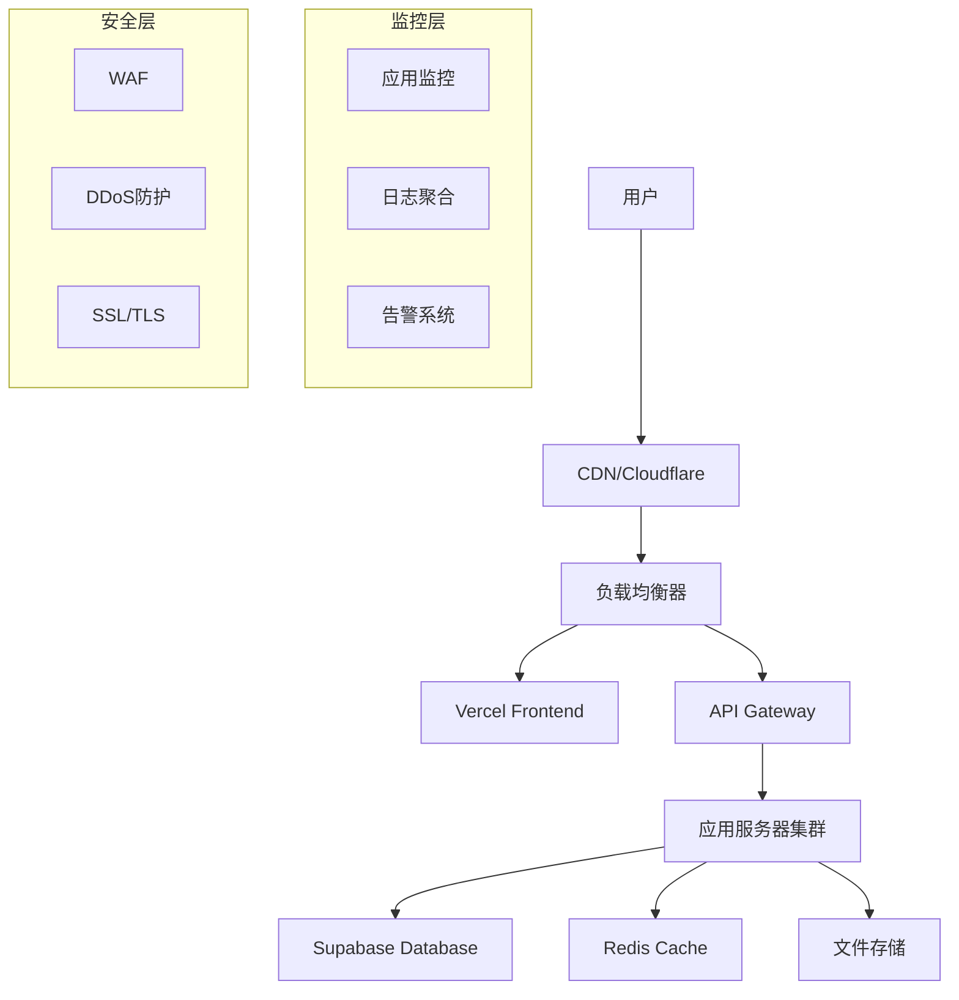

# 部署与运维指南

## 概述

本文档详细说明了SMS营销数据分析系统的部署流程、运维策略、监控配置和故障处理方案。

## 部署架构

### 1. 整体部署架构



### 2. 环境配置

```typescript
// 环境配置管理
export interface EnvironmentConfig {
  // 应用配置
  app: {
    name: string;
    version: string;
    environment: 'development' | 'staging' | 'production';
    port: number;
    host: string;
  };

  // 数据库配置
  database: {
    url: string;
    poolSize: number;
    timeout: number;
    ssl: boolean;
  };

  // 缓存配置
  redis: {
    host: string;
    port: number;
    password?: string;
    db: number;
    ttl: number;
  };

  // 存储配置
  storage: {
    provider: 'supabase' | 'aws' | 'gcp';
    bucket: string;
    region: string;
    accessKey?: string;
    secretKey?: string;
  };

  // 监控配置
  monitoring: {
    enabled: boolean;
    endpoint: string;
    apiKey: string;
    sampleRate: number;
  };

  // 安全配置
  security: {
    jwtSecret: string;
    encryptionKey: string;
    corsOrigins: string[];
    rateLimitWindow: number;
    rateLimitMax: number;
  };
}

// 配置加载器
export class ConfigLoader {
  private config: EnvironmentConfig;

  constructor() {
    this.config = this.loadConfig();
    this.validateConfig();
  }

  private loadConfig(): EnvironmentConfig {
    return {
      app: {
        name: process.env.APP_NAME || 'sms-analytics',
        version: process.env.APP_VERSION || '1.0.0',
        environment: (process.env.NODE_ENV as any) || 'development',
        port: parseInt(process.env.PORT || '3000'),
        host: process.env.HOST || '0.0.0.0'
      },

      database: {
        url: process.env.DATABASE_URL || '',
        poolSize: parseInt(process.env.DB_POOL_SIZE || '10'),
        timeout: parseInt(process.env.DB_TIMEOUT || '30000'),
        ssl: process.env.DB_SSL === 'true'
      },

      redis: {
        host: process.env.REDIS_HOST || 'localhost',
        port: parseInt(process.env.REDIS_PORT || '6379'),
        password: process.env.REDIS_PASSWORD,
        db: parseInt(process.env.REDIS_DB || '0'),
        ttl: parseInt(process.env.REDIS_TTL || '3600')
      },

      storage: {
        provider: (process.env.STORAGE_PROVIDER as any) || 'supabase',
        bucket: process.env.STORAGE_BUCKET || '',
        region: process.env.STORAGE_REGION || '',
        accessKey: process.env.STORAGE_ACCESS_KEY,
        secretKey: process.env.STORAGE_SECRET_KEY
      },

      monitoring: {
        enabled: process.env.MONITORING_ENABLED === 'true',
        endpoint: process.env.MONITORING_ENDPOINT || '',
        apiKey: process.env.MONITORING_API_KEY || '',
        sampleRate: parseFloat(process.env.MONITORING_SAMPLE_RATE || '0.1')
      },

      security: {
        jwtSecret: process.env.JWT_SECRET || '',
        encryptionKey: process.env.ENCRYPTION_KEY || '',
        corsOrigins: (process.env.CORS_ORIGINS || '').split(','),
        rateLimitWindow: parseInt(process.env.RATE_LIMIT_WINDOW || '900000'),
        rateLimitMax: parseInt(process.env.RATE_LIMIT_MAX || '100')
      }
    };
  }

  private validateConfig(): void {
    const required = [
      'DATABASE_URL',
      'JWT_SECRET',
      'ENCRYPTION_KEY'
    ];

    const missing = required.filter(key => !process.env[key]);
    
    if (missing.length > 0) {
      throw new Error(`缺少必需的环境变量: ${missing.join(', ')}`);
    }

    // 验证数据库连接
    if (!this.config.database.url.startsWith('postgresql://')) {
      throw new Error('数据库URL格式不正确');
    }

    // 验证JWT密钥长度
    if (this.config.security.jwtSecret.length < 32) {
      throw new Error('JWT密钥长度不足32位');
    }
  }

  getConfig(): EnvironmentConfig {
    return this.config;
  }
}
```

## Vercel部署配置

### 1. Vercel配置文件

```json
// vercel.json
{
  "version": 2,
  "name": "sms-analytics-frontend",
  "builds": [
    {
      "src": "package.json",
      "use": "@vercel/static-build",
      "config": {
        "distDir": "dist"
      }
    }
  ],
  "routes": [
    {
      "src": "/api/(.*)",
      "dest": "/api/$1"
    },
    {
      "src": "/(.*)",
      "dest": "/index.html"
    }
  ],
  "env": {
    "VITE_SUPABASE_URL": "@supabase-url",
    "VITE_SUPABASE_ANON_KEY": "@supabase-anon-key",
    "VITE_APP_ENV": "production"
  },
  "build": {
    "env": {
      "VITE_SUPABASE_URL": "@supabase-url",
      "VITE_SUPABASE_ANON_KEY": "@supabase-anon-key"
    }
  },
  "functions": {
    "app/api/**/*.ts": {
      "runtime": "nodejs18.x",
      "maxDuration": 30
    }
  },
  "headers": [
    {
      "source": "/(.*)",
      "headers": [
        {
          "key": "X-Content-Type-Options",
          "value": "nosniff"
        },
        {
          "key": "X-Frame-Options",
          "value": "DENY"
        },
        {
          "key": "X-XSS-Protection",
          "value": "1; mode=block"
        },
        {
          "key": "Strict-Transport-Security",
          "value": "max-age=31536000; includeSubDomains"
        }
      ]
    },
    {
      "source": "/static/(.*)",
      "headers": [
        {
          "key": "Cache-Control",
          "value": "public, max-age=31536000, immutable"
        }
      ]
    }
  ],
  "rewrites": [
    {
      "source": "/api/:path*",
      "destination": "https://your-api-domain.com/api/:path*"
    }
  ]
}
```

### 2. 构建脚本

```json
// package.json
{
  "scripts": {
    "build": "npm run type-check && vite build",
    "build:staging": "npm run type-check && vite build --mode staging",
    "build:production": "npm run type-check && vite build --mode production",
    "type-check": "tsc --noEmit",
    "preview": "vite preview",
    "deploy": "npm run build && vercel --prod",
    "deploy:staging": "npm run build:staging && vercel",
    "analyze": "npm run build && npx vite-bundle-analyzer dist/stats.html"
  },
  "devDependencies": {
    "vite-bundle-analyzer": "^0.7.0"
  }
}
```

### 3. 环境变量配置

```bash
# .env.production
VITE_APP_ENV=production
VITE_SUPABASE_URL=https://your-project.supabase.co
VITE_SUPABASE_ANON_KEY=your-anon-key
VITE_API_BASE_URL=https://api.yourdomain.com
VITE_CDN_URL=https://cdn.yourdomain.com
VITE_SENTRY_DSN=https://your-sentry-dsn
VITE_ANALYTICS_ID=your-analytics-id

# .env.staging
VITE_APP_ENV=staging
VITE_SUPABASE_URL=https://your-staging-project.supabase.co
VITE_SUPABASE_ANON_KEY=your-staging-anon-key
VITE_API_BASE_URL=https://staging-api.yourdomain.com
```

## Supabase配置

### 1. 数据库配置

```sql
-- 数据库性能优化配置
ALTER SYSTEM SET shared_preload_libraries = 'pg_stat_statements';
ALTER SYSTEM SET pg_stat_statements.track = 'all';
ALTER SYSTEM SET log_statement = 'all';
ALTER SYSTEM SET log_min_duration_statement = 1000;

-- 连接池配置
ALTER SYSTEM SET max_connections = 200;
ALTER SYSTEM SET shared_buffers = '256MB';
ALTER SYSTEM SET effective_cache_size = '1GB';
ALTER SYSTEM SET work_mem = '4MB';
ALTER SYSTEM SET maintenance_work_mem = '64MB';

-- 重启配置生效
SELECT pg_reload_conf();

-- 创建监控用户
CREATE USER monitoring_user WITH PASSWORD 'secure_password';
GRANT pg_monitor TO monitoring_user;
```

### 2. RLS策略配置

```sql
-- 启用RLS
ALTER TABLE phone_packages ENABLE ROW LEVEL SECURITY;
ALTER TABLE phone_ratings ENABLE ROW LEVEL SECURITY;
ALTER TABLE phone_scores ENABLE ROW LEVEL SECURITY;
ALTER TABLE reports ENABLE ROW LEVEL SECURITY;
ALTER TABLE audit_logs ENABLE ROW LEVEL SECURITY;

-- 用户数据访问策略
CREATE POLICY "用户只能访问自己的数据" ON phone_packages
    FOR ALL USING (auth.uid() = user_id);

CREATE POLICY "用户只能访问自己的评级" ON phone_ratings
    FOR ALL USING (
        EXISTS (
            SELECT 1 FROM phone_packages 
            WHERE id = phone_ratings.package_id 
            AND user_id = auth.uid()
        )
    );

-- 管理员访问策略
CREATE POLICY "管理员可以访问所有数据" ON phone_packages
    FOR ALL USING (
        EXISTS (
            SELECT 1 FROM user_profiles 
            WHERE id = auth.uid() 
            AND role = 'admin'
        )
    );

-- 审计日志策略
CREATE POLICY "用户只能查看自己的审计日志" ON audit_logs
    FOR SELECT USING (user_id = auth.uid());

CREATE POLICY "系统可以插入审计日志" ON audit_logs
    FOR INSERT WITH CHECK (true);
```

### 3. 存储桶配置

```sql
-- 创建存储桶
INSERT INTO storage.buckets (id, name, public) 
VALUES ('packages', 'packages', false);

INSERT INTO storage.buckets (id, name, public) 
VALUES ('reports', 'reports', false);

-- 存储策略
CREATE POLICY "用户可以上传自己的文件" ON storage.objects
    FOR INSERT WITH CHECK (
        bucket_id = 'packages' AND 
        auth.uid()::text = (storage.foldername(name))[1]
    );

CREATE POLICY "用户可以查看自己的文件" ON storage.objects
    FOR SELECT USING (
        bucket_id = 'packages' AND 
        auth.uid()::text = (storage.foldername(name))[1]
    );

CREATE POLICY "用户可以删除自己的文件" ON storage.objects
    FOR DELETE USING (
        bucket_id = 'packages' AND 
        auth.uid()::text = (storage.foldername(name))[1]
    );
```

## 监控与日志

### 1. 应用监控配置

```typescript
// 监控服务配置
export class MonitoringService {
  private sentry: any;
  private analytics: any;

  constructor(config: EnvironmentConfig) {
    this.initializeSentry(config);
    this.initializeAnalytics(config);
  }

  private initializeSentry(config: EnvironmentConfig): void {
    if (!config.monitoring.enabled) return;

    this.sentry = require('@sentry/node');
    this.sentry.init({
      dsn: config.monitoring.endpoint,
      environment: config.app.environment,
      sampleRate: config.monitoring.sampleRate,
      tracesSampleRate: 0.1,
      
      beforeSend(event: any) {
        // 过滤敏感信息
        if (event.request) {
          delete event.request.headers?.authorization;
          delete event.request.headers?.cookie;
        }
        return event;
      },

      integrations: [
        new this.sentry.Integrations.Http({ tracing: true }),
        new this.sentry.Integrations.Express({ app }),
        new this.sentry.Integrations.Postgres()
      ]
    });
  }

  private initializeAnalytics(config: EnvironmentConfig): void {
    // 初始化分析服务
    this.analytics = {
      track: (event: string, properties: any) => {
        if (config.app.environment === 'production') {
          // 发送到分析服务
          console.log('Analytics:', event, properties);
        }
      }
    };
  }

  // 错误报告
  reportError(error: Error, context?: any): void {
    if (this.sentry) {
      this.sentry.captureException(error, { extra: context });
    }
  }

  // 性能监控
  startTransaction(name: string): any {
    if (this.sentry) {
      return this.sentry.startTransaction({ name });
    }
    return null;
  }

  // 用户行为追踪
  trackUserAction(action: string, userId: string, properties?: any): void {
    this.analytics.track(action, {
      userId,
      timestamp: new Date().toISOString(),
      ...properties
    });
  }
}

// 健康检查端点
export class HealthCheckService {
  async checkHealth(): Promise<HealthStatus> {
    const checks = await Promise.allSettled([
      this.checkDatabase(),
      this.checkRedis(),
      this.checkStorage(),
      this.checkExternalServices()
    ]);

    const results = checks.map((check, index) => ({
      service: ['database', 'redis', 'storage', 'external'][index],
      status: check.status === 'fulfilled' ? 'healthy' : 'unhealthy',
      details: check.status === 'fulfilled' ? check.value : check.reason
    }));

    const overallStatus = results.every(r => r.status === 'healthy') 
      ? 'healthy' 
      : 'unhealthy';

    return {
      status: overallStatus,
      timestamp: new Date().toISOString(),
      version: process.env.APP_VERSION || '1.0.0',
      uptime: process.uptime(),
      checks: results
    };
  }

  private async checkDatabase(): Promise<any> {
    const { data, error } = await supabase
      .from('system_settings')
      .select('id')
      .limit(1);

    if (error) throw error;
    return { latency: Date.now(), connected: true };
  }

  private async checkRedis(): Promise<any> {
    const start = Date.now();
    await redis.ping();
    return { latency: Date.now() - start, connected: true };
  }

  private async checkStorage(): Promise<any> {
    const { data, error } = await supabase.storage
      .from('packages')
      .list('', { limit: 1 });

    if (error) throw error;
    return { accessible: true };
  }

  private async checkExternalServices(): Promise<any> {
    // 检查外部API服务
    return { status: 'ok' };
  }
}
```

### 2. 日志配置

```typescript
// 日志服务
export class LoggingService {
  private logger: any;

  constructor(config: EnvironmentConfig) {
    this.logger = this.createLogger(config);
  }

  private createLogger(config: EnvironmentConfig): any {
    const winston = require('winston');
    
    const logFormat = winston.format.combine(
      winston.format.timestamp(),
      winston.format.errors({ stack: true }),
      winston.format.json(),
      winston.format.printf((info: any) => {
        return JSON.stringify({
          timestamp: info.timestamp,
          level: info.level,
          message: info.message,
          service: config.app.name,
          environment: config.app.environment,
          ...info
        });
      })
    );

    return winston.createLogger({
      level: config.app.environment === 'production' ? 'info' : 'debug',
      format: logFormat,
      defaultMeta: {
        service: config.app.name,
        version: config.app.version
      },
      transports: [
        new winston.transports.Console({
          format: winston.format.combine(
            winston.format.colorize(),
            winston.format.simple()
          )
        }),
        new winston.transports.File({
          filename: 'logs/error.log',
          level: 'error',
          maxsize: 5242880, // 5MB
          maxFiles: 5
        }),
        new winston.transports.File({
          filename: 'logs/combined.log',
          maxsize: 5242880,
          maxFiles: 5
        })
      ]
    });
  }

  info(message: string, meta?: any): void {
    this.logger.info(message, meta);
  }

  error(message: string, error?: Error, meta?: any): void {
    this.logger.error(message, { error: error?.stack, ...meta });
  }

  warn(message: string, meta?: any): void {
    this.logger.warn(message, meta);
  }

  debug(message: string, meta?: any): void {
    this.logger.debug(message, meta);
  }

  // 请求日志中间件
  createRequestLogger() {
    return (req: Request, res: Response, next: NextFunction) => {
      const start = Date.now();
      
      res.on('finish', () => {
        const duration = Date.now() - start;
        
        this.info('HTTP Request', {
          method: req.method,
          url: req.url,
          status: res.statusCode,
          duration,
          userAgent: req.get('User-Agent'),
          ip: req.ip,
          userId: req.user?.id
        });
      });

      next();
    };
  }
}
```

## 备份与恢复

### 1. 数据库备份策略

```bash
#!/bin/bash
# backup.sh - 数据库备份脚本

set -e

# 配置
DB_HOST="${DB_HOST:-localhost}"
DB_PORT="${DB_PORT:-5432}"
DB_NAME="${DB_NAME:-sms_analytics}"
DB_USER="${DB_USER:-postgres}"
BACKUP_DIR="${BACKUP_DIR:-/backups}"
RETENTION_DAYS="${RETENTION_DAYS:-30}"

# 创建备份目录
mkdir -p "$BACKUP_DIR"

# 生成备份文件名
TIMESTAMP=$(date +"%Y%m%d_%H%M%S")
BACKUP_FILE="$BACKUP_DIR/${DB_NAME}_${TIMESTAMP}.sql.gz"

echo "开始备份数据库: $DB_NAME"
echo "备份文件: $BACKUP_FILE"

# 执行备份
pg_dump \
  --host="$DB_HOST" \
  --port="$DB_PORT" \
  --username="$DB_USER" \
  --dbname="$DB_NAME" \
  --verbose \
  --clean \
  --no-owner \
  --no-privileges \
  --format=custom \
  | gzip > "$BACKUP_FILE"

# 验证备份文件
if [ -f "$BACKUP_FILE" ] && [ -s "$BACKUP_FILE" ]; then
  echo "备份成功: $BACKUP_FILE"
  echo "文件大小: $(du -h "$BACKUP_FILE" | cut -f1)"
else
  echo "备份失败: 文件不存在或为空"
  exit 1
fi

# 清理旧备份
echo "清理 $RETENTION_DAYS 天前的备份文件"
find "$BACKUP_DIR" -name "${DB_NAME}_*.sql.gz" -mtime +$RETENTION_DAYS -delete

# 上传到云存储（可选）
if [ -n "$CLOUD_STORAGE_BUCKET" ]; then
  echo "上传备份到云存储"
  aws s3 cp "$BACKUP_FILE" "s3://$CLOUD_STORAGE_BUCKET/backups/"
fi

echo "备份完成"
```

### 2. 恢复脚本

```bash
#!/bin/bash
# restore.sh - 数据库恢复脚本

set -e

# 检查参数
if [ $# -ne 1 ]; then
  echo "用法: $0 <backup_file>"
  echo "示例: $0 /backups/sms_analytics_20231201_120000.sql.gz"
  exit 1
fi

BACKUP_FILE="$1"

# 验证备份文件
if [ ! -f "$BACKUP_FILE" ]; then
  echo "错误: 备份文件不存在: $BACKUP_FILE"
  exit 1
fi

# 配置
DB_HOST="${DB_HOST:-localhost}"
DB_PORT="${DB_PORT:-5432}"
DB_NAME="${DB_NAME:-sms_analytics}"
DB_USER="${DB_USER:-postgres}"

echo "警告: 此操作将覆盖现有数据库!"
echo "数据库: $DB_NAME"
echo "备份文件: $BACKUP_FILE"
read -p "确认继续? (yes/no): " CONFIRM

if [ "$CONFIRM" != "yes" ]; then
  echo "操作已取消"
  exit 0
fi

# 创建数据库备份（安全措施）
SAFETY_BACKUP="/tmp/${DB_NAME}_before_restore_$(date +%Y%m%d_%H%M%S).sql.gz"
echo "创建安全备份: $SAFETY_BACKUP"
pg_dump \
  --host="$DB_HOST" \
  --port="$DB_PORT" \
  --username="$DB_USER" \
  --dbname="$DB_NAME" \
  --format=custom \
  | gzip > "$SAFETY_BACKUP"

# 恢复数据库
echo "开始恢复数据库"
gunzip -c "$BACKUP_FILE" | pg_restore \
  --host="$DB_HOST" \
  --port="$DB_PORT" \
  --username="$DB_USER" \
  --dbname="$DB_NAME" \
  --verbose \
  --clean \
  --if-exists

echo "数据库恢复完成"
echo "安全备份保存在: $SAFETY_BACKUP"
```

### 3. 自动化备份配置

```yaml
# docker-compose.backup.yml
version: '3.8'

services:
  backup:
    image: postgres:15
    environment:
      - PGPASSWORD=${DB_PASSWORD}
    volumes:
      - ./backups:/backups
      - ./scripts:/scripts
    command: >
      sh -c "
        while true; do
          /scripts/backup.sh
          sleep 86400  # 每24小时执行一次
        done
      "
    depends_on:
      - postgres

  backup-monitor:
    image: alpine:latest
    volumes:
      - ./backups:/backups
    command: >
      sh -c "
        while true; do
          # 检查备份文件
          LATEST_BACKUP=$(ls -t /backups/*.sql.gz | head -1)
          if [ -z \"$LATEST_BACKUP\" ]; then
            echo \"警告: 没有找到备份文件\"
          else
            AGE=$(( $(date +%s) - $(stat -c %Y \"$LATEST_BACKUP\") ))
            if [ $AGE -gt 172800 ]; then  # 48小时
              echo \"警告: 备份文件过旧\"
            fi
          fi
          sleep 3600  # 每小时检查一次
        done
      "
```

## 安全配置

### 1. SSL/TLS配置

```nginx
# nginx.conf
server {
    listen 80;
    server_name yourdomain.com www.yourdomain.com;
    return 301 https://$server_name$request_uri;
}

server {
    listen 443 ssl http2;
    server_name yourdomain.com www.yourdomain.com;

    # SSL配置
    ssl_certificate /etc/ssl/certs/yourdomain.com.crt;
    ssl_certificate_key /etc/ssl/private/yourdomain.com.key;
    ssl_protocols TLSv1.2 TLSv1.3;
    ssl_ciphers ECDHE-RSA-AES256-GCM-SHA512:DHE-RSA-AES256-GCM-SHA512:ECDHE-RSA-AES256-GCM-SHA384:DHE-RSA-AES256-GCM-SHA384;
    ssl_prefer_server_ciphers off;
    ssl_session_cache shared:SSL:10m;
    ssl_session_timeout 10m;

    # 安全头
    add_header Strict-Transport-Security "max-age=31536000; includeSubDomains" always;
    add_header X-Content-Type-Options nosniff;
    add_header X-Frame-Options DENY;
    add_header X-XSS-Protection "1; mode=block";
    add_header Referrer-Policy "strict-origin-when-cross-origin";

    # 代理配置
    location /api/ {
        proxy_pass http://backend;
        proxy_set_header Host $host;
        proxy_set_header X-Real-IP $remote_addr;
        proxy_set_header X-Forwarded-For $proxy_add_x_forwarded_for;
        proxy_set_header X-Forwarded-Proto $scheme;
        
        # 超时配置
        proxy_connect_timeout 30s;
        proxy_send_timeout 30s;
        proxy_read_timeout 30s;
    }

    location / {
        proxy_pass http://frontend;
        proxy_set_header Host $host;
        proxy_set_header X-Real-IP $remote_addr;
        proxy_set_header X-Forwarded-For $proxy_add_x_forwarded_for;
        proxy_set_header X-Forwarded-Proto $scheme;
    }
}
```

### 2. 防火墙配置

```bash
#!/bin/bash
# firewall.sh - 防火墙配置脚本

# 清空现有规则
iptables -F
iptables -X
iptables -t nat -F
iptables -t nat -X

# 设置默认策略
iptables -P INPUT DROP
iptables -P FORWARD DROP
iptables -P OUTPUT ACCEPT

# 允许本地回环
iptables -A INPUT -i lo -j ACCEPT
iptables -A OUTPUT -o lo -j ACCEPT

# 允许已建立的连接
iptables -A INPUT -m state --state ESTABLISHED,RELATED -j ACCEPT

# 允许SSH (限制IP)
iptables -A INPUT -p tcp --dport 22 -s YOUR_ADMIN_IP -j ACCEPT

# 允许HTTP/HTTPS
iptables -A INPUT -p tcp --dport 80 -j ACCEPT
iptables -A INPUT -p tcp --dport 443 -j ACCEPT

# 允许数据库连接（仅内网）
iptables -A INPUT -p tcp --dport 5432 -s 10.0.0.0/8 -j ACCEPT
iptables -A INPUT -p tcp --dport 5432 -s 172.16.0.0/12 -j ACCEPT
iptables -A INPUT -p tcp --dport 5432 -s 192.168.0.0/16 -j ACCEPT

# 允许Redis连接（仅内网）
iptables -A INPUT -p tcp --dport 6379 -s 10.0.0.0/8 -j ACCEPT
iptables -A INPUT -p tcp --dport 6379 -s 172.16.0.0/12 -j ACCEPT
iptables -A INPUT -p tcp --dport 6379 -s 192.168.0.0/16 -j ACCEPT

# DDoS防护
iptables -A INPUT -p tcp --dport 80 -m limit --limit 25/minute --limit-burst 100 -j ACCEPT
iptables -A INPUT -p tcp --dport 443 -m limit --limit 25/minute --limit-burst 100 -j ACCEPT

# 保存规则
iptables-save > /etc/iptables/rules.v4
```

## 故障处理

### 1. 故障诊断流程

```typescript
// 故障诊断服务
export class TroubleshootingService {
  async diagnoseSystem(): Promise<DiagnosisReport> {
    const checks = await Promise.allSettled([
      this.checkSystemResources(),
      this.checkDatabaseHealth(),
      this.checkCacheHealth(),
      this.checkNetworkConnectivity(),
      this.checkApplicationHealth()
    ]);

    const issues: Issue[] = [];
    const recommendations: string[] = [];

    checks.forEach((check, index) => {
      if (check.status === 'rejected') {
        issues.push({
          category: ['system', 'database', 'cache', 'network', 'application'][index],
          severity: 'high',
          description: check.reason.message,
          timestamp: new Date()
        });
      }
    });

    // 生成建议
    if (issues.length > 0) {
      recommendations.push(...this.generateRecommendations(issues));
    }

    return {
      timestamp: new Date(),
      overallHealth: issues.length === 0 ? 'healthy' : 'unhealthy',
      issues,
      recommendations
    };
  }

  private async checkSystemResources(): Promise<SystemResources> {
    const usage = process.memoryUsage();
    const cpuUsage = process.cpuUsage();

    const memoryUsagePercent = usage.heapUsed / usage.heapTotal;
    
    if (memoryUsagePercent > 0.9) {
      throw new Error('内存使用率过高: ' + Math.round(memoryUsagePercent * 100) + '%');
    }

    return {
      memory: {
        used: usage.heapUsed,
        total: usage.heapTotal,
        percentage: memoryUsagePercent
      },
      cpu: {
        user: cpuUsage.user,
        system: cpuUsage.system
      }
    };
  }

  private async checkDatabaseHealth(): Promise<DatabaseHealth> {
    try {
      const start = Date.now();
      const { data, error } = await supabase
        .from('system_settings')
        .select('id')
        .limit(1);

      if (error) throw error;

      const latency = Date.now() - start;
      
      if (latency > 5000) {
        throw new Error('数据库响应时间过长: ' + latency + 'ms');
      }

      return {
        connected: true,
        latency,
        status: 'healthy'
      };
    } catch (error) {
      throw new Error('数据库连接失败: ' + error.message);
    }
  }

  private generateRecommendations(issues: Issue[]): string[] {
    const recommendations: string[] = [];

    issues.forEach(issue => {
      switch (issue.category) {
        case 'system':
          if (issue.description.includes('内存')) {
            recommendations.push('重启应用服务释放内存');
            recommendations.push('检查内存泄漏');
          }
          break;
        case 'database':
          recommendations.push('检查数据库连接配置');
          recommendations.push('验证数据库服务状态');
          break;
        case 'cache':
          recommendations.push('重启Redis服务');
          recommendations.push('清理过期缓存');
          break;
        case 'network':
          recommendations.push('检查网络连接');
          recommendations.push('验证防火墙配置');
          break;
        case 'application':
          recommendations.push('检查应用日志');
          recommendations.push('重启应用服务');
          break;
      }
    });

    return [...new Set(recommendations)]; // 去重
  }
}
```

### 2. 自动恢复机制

```typescript
// 自动恢复服务
export class AutoRecoveryService {
  private recoveryAttempts: Map<string, number> = new Map();
  private maxAttempts = 3;
  private recoveryInterval = 60000; // 1分钟

  async startAutoRecovery(): Promise<void> {
    setInterval(async () => {
      try {
        await this.performHealthCheck();
      } catch (error) {
        console.error('健康检查失败:', error);
        await this.attemptRecovery(error);
      }
    }, this.recoveryInterval);
  }

  private async performHealthCheck(): Promise<void> {
    const healthCheck = new HealthCheckService();
    const status = await healthCheck.checkHealth();

    if (status.status === 'unhealthy') {
      throw new Error('系统健康检查失败');
    }
  }

  private async attemptRecovery(error: Error): Promise<void> {
    const errorKey = this.getErrorKey(error);
    const attempts = this.recoveryAttempts.get(errorKey) || 0;

    if (attempts >= this.maxAttempts) {
      console.error('自动恢复失败，已达到最大尝试次数');
      await this.escalateToManual(error);
      return;
    }

    this.recoveryAttempts.set(errorKey, attempts + 1);

    try {
      await this.executeRecoveryAction(error);
      console.log('自动恢复成功');
      this.recoveryAttempts.delete(errorKey);
    } catch (recoveryError) {
      console.error('恢复操作失败:', recoveryError);
    }
  }

  private async executeRecoveryAction(error: Error): Promise<void> {
    if (error.message.includes('数据库')) {
      await this.recoverDatabase();
    } else if (error.message.includes('缓存')) {
      await this.recoverCache();
    } else if (error.message.includes('内存')) {
      await this.recoverMemory();
    } else {
      await this.genericRecovery();
    }
  }

  private async recoverDatabase(): Promise<void> {
    // 重新初始化数据库连接
    console.log('尝试恢复数据库连接');
    // 实现数据库恢复逻辑
  }

  private async recoverCache(): Promise<void> {
    // 重新连接Redis
    console.log('尝试恢复缓存连接');
    // 实现缓存恢复逻辑
  }

  private async recoverMemory(): Promise<void> {
    // 触发垃圾回收
    console.log('尝试释放内存');
    if (global.gc) {
      global.gc();
    }
  }

  private async genericRecovery(): Promise<void> {
    // 通用恢复操作
    console.log('执行通用恢复操作');
  }

  private getErrorKey(error: Error): string {
    return crypto.createHash('md5').update(error.message).digest('hex');
  }

  private async escalateToManual(error: Error): Promise<void> {
    // 发送告警通知
    const alert = {
      level: 'critical',
      message: '自动恢复失败，需要人工干预',
      error: error.message,
      timestamp: new Date()
    };

    await this.notificationService.sendCriticalAlert(alert);
  }
}
```

这个部署与运维指南提供了完整的系统部署、监控、备份和故障处理方案，确保系统能够稳定可靠地运行。