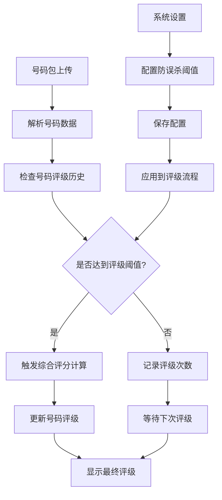

# 防误杀机制功能-产品需求文档

## 1. Product Overview

防误杀机制是SMS营销数据分析系统的核心安全功能，通过要求号码在多个不同号码包中出现并被评级后才触发综合评分计算，有效防止单个号码包的错误评级影响号码的最终评分结果。

- 解决问题：防止因单一号码包数据异常或评级错误导致的号码误判，提高评分系统的准确性和可靠性
- 目标用户：系统管理员、数据分析师、营销人员
- 产品价值：提升号码评级的准确性，降低误杀风险，保护优质号码资源

## 2. Core Features

### 2.1 User Roles

| Role | Registration Method | Core Permissions |
|------|---------------------|------------------|
| 系统管理员 | 管理员创建 | 可配置防误杀阈值、查看所有统计数据、管理系统设置 |
| 数据分析师 | 邀请码注册 | 可查看号码评级统计、分析防误杀效果 |
| 普通用户 | 邮箱注册 | 可查看号码基本评级信息 |

### 2.2 Feature Module

防误杀机制功能包含以下主要页面：
1. **系统设置页面**：防误杀阈值配置、规则管理
2. **号码管理页面**：号码评级次数统计、防误杀状态显示
3. **数据分析页面**：防误杀机制效果分析、统计报表

### 2.3 Page Details

| Page Name | Module Name | Feature description |
|-----------|-------------|---------------------|
| 系统设置页面 | 防误杀配置 | 设置号码评级阈值（1-10次），默认值3次；配置防误杀规则开关；保存和重置配置 |
| 系统设置页面 | 配置验证 | 验证阈值范围有效性；提供配置预览和确认机制 |
| 号码管理页面 | 评级统计显示 | 显示号码在不同号码包中的出现次数；显示是否达到评级阈值；展示防误杀状态标识 |
| 号码管理页面 | 评级状态筛选 | 按防误杀状态筛选号码（已达阈值/未达阈值）；按评级次数范围筛选 |
| 数据分析页面 | 防误杀统计 | 统计达到/未达到阈值的号码数量；分析防误杀机制拦截效果；生成趋势图表 |
| 数据分析页面 | 效果分析 | 对比开启/关闭防误杀机制的评分差异；分析误杀率降低效果 |

## 3. Core Process

### 管理员配置流程
1. 管理员登录系统 → 进入系统设置页面 → 选择防误杀配置模块
2. 设置评级阈值（1-10次） → 配置规则开关 → 保存配置
3. 系统验证配置有效性 → 应用新配置 → 显示配置成功提示

### 号码评级处理流程
1. 号码包上传 → 系统解析号码 → 检查号码评级历史
2. 统计号码在不同号码包中出现次数 → 判断是否达到阈值
3. 达到阈值：触发综合评分计算 → 更新号码评级
4. 未达阈值：记录评级次数 → 暂不计算综合评分

### 用户查询流程
1. 用户登录 → 进入号码管理页面 → 查看号码列表
2. 查看号码评级次数和防误杀状态 → 筛选和分析数据
3. 进入数据分析页面 → 查看防误杀统计报表

## 4. User Interface Design

### 4.1 Design Style

- **主色调**：蓝色系（#3B82F6）作为主色，绿色（#10B981）表示安全状态，橙色（#F59E0B）表示警告状态
- **按钮样式**：圆角按钮，3D阴影效果，hover状态变化
- **字体**：主要使用14px，标题使用16-18px，说明文字使用12px
- **布局风格**：卡片式布局，清晰的模块分割，响应式设计
- **图标样式**：使用线性图标，统一的视觉风格，配合状态颜色

### 4.2 Page Design Overview

| Page Name | Module Name | UI Elements |
|-----------|-------------|-------------|
| 系统设置页面 | 防误杀配置 | 数字输入框（1-10范围），滑块控件，开关按钮，保存/重置按钮，配置说明文字 |
| 号码管理页面 | 评级统计显示 | 评级次数徽章，状态指示器（绿色/橙色），进度条显示，筛选下拉框 |
| 数据分析页面 | 防误杀统计 | 统计卡片，柱状图，饼图，趋势线图，数据表格 |

### 4.3 Responsiveness

产品采用桌面优先设计，同时支持移动端适配。在移动设备上，配置界面采用垂直布局，统计图表支持横向滚动，确保在小屏幕上的可用性。支持触摸操作优化，包括滑块拖拽和按钮点击反馈。