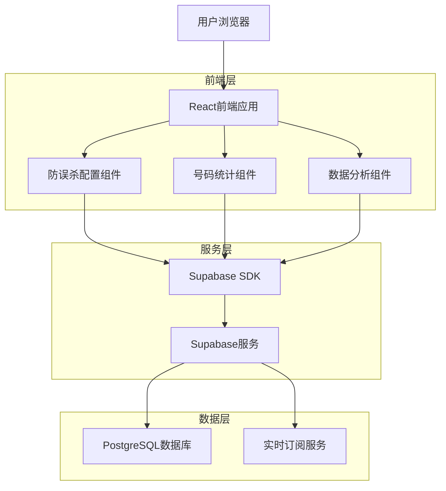
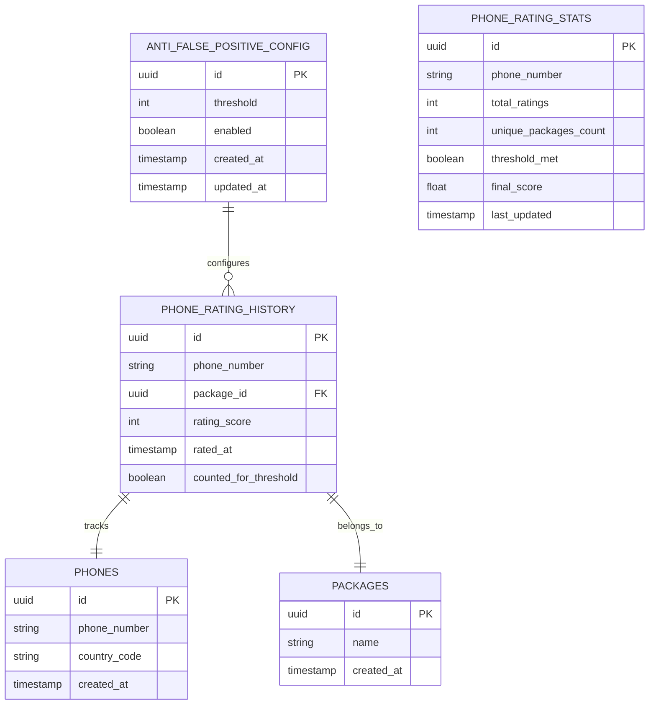

# 防误杀机制功能-技术架构文档

## 1. Architecture design



## 2. Technology Description

- Frontend: React@18 + TypeScript + TailwindCSS@3 + Vite
- Backend: Supabase (PostgreSQL + 实时订阅)
- 状态管理: Zustand
- 图表库: Chart.js 或 Recharts
- UI组件: 自定义组件 + Headless UI

## 3. Route definitions

| Route | Purpose |
|-------|---------|
| /settings | 系统设置页面，包含防误杀机制配置 |
| /phone-management | 号码管理页面，显示号码评级统计和防误杀状态 |
| /data-analysis | 数据分析页面，展示防误杀机制效果统计 |

## 4. API definitions

### 4.1 Core API

防误杀配置相关
```
GET /api/settings/anti-false-positive
```
获取防误杀配置

Response:
| Param Name | Param Type | Description |
|------------|------------|-------------|
| threshold | number | 评级阈值（1-10） |
| enabled | boolean | 是否启用防误杀机制 |
| created_at | string | 配置创建时间 |
| updated_at | string | 配置更新时间 |

```
PUT /api/settings/anti-false-positive
```
更新防误杀配置

Request:
| Param Name | Param Type | isRequired | Description |
|------------|------------|------------|-------------|
| threshold | number | true | 评级阈值（1-10） |
| enabled | boolean | true | 是否启用防误杀机制 |

号码评级统计相关
```
GET /api/phone/rating-stats
```
获取号码评级统计信息

Query Parameters:
| Param Name | Param Type | isRequired | Description |
|------------|------------|------------|-------------|
| phone | string | false | 号码筛选 |
| status | string | false | 状态筛选（qualified/unqualified） |
| page | number | false | 页码 |
| limit | number | false | 每页数量 |

Response:
| Param Name | Param Type | Description |
|------------|------------|-------------|
| data | array | 号码统计数据列表 |
| total | number | 总数量 |
| page | number | 当前页码 |

```
GET /api/phone/anti-false-positive-stats
```
获取防误杀机制统计数据

Response:
| Param Name | Param Type | Description |
|------------|------------|-------------|
| qualified_count | number | 达到阈值的号码数量 |
| unqualified_count | number | 未达到阈值的号码数量 |
| total_phones | number | 总号码数量 |
| effectiveness_rate | number | 防误杀有效率 |

## 5. Data model

### 5.1 Data model definition



### 5.2 Data Definition Language

防误杀配置表 (anti_false_positive_config)
```sql
-- 创建防误杀配置表
CREATE TABLE anti_false_positive_config (
    id UUID PRIMARY KEY DEFAULT gen_random_uuid(),
    threshold INTEGER NOT NULL DEFAULT 3 CHECK (threshold >= 1 AND threshold <= 10),
    enabled BOOLEAN NOT NULL DEFAULT true,
    created_at TIMESTAMP WITH TIME ZONE DEFAULT NOW(),
    updated_at TIMESTAMP WITH TIME ZONE DEFAULT NOW()
);

-- 创建更新时间触发器
CREATE OR REPLACE FUNCTION update_updated_at_column()
RETURNS TRIGGER AS $$
BEGIN
    NEW.updated_at = NOW();
    RETURN NEW;
END;
$$ language 'plpgsql';

CREATE TRIGGER update_anti_false_positive_config_updated_at 
    BEFORE UPDATE ON anti_false_positive_config 
    FOR EACH ROW EXECUTE FUNCTION update_updated_at_column();

-- 插入默认配置
INSERT INTO anti_false_positive_config (threshold, enabled) 
VALUES (3, true);
```

号码评级历史表 (phone_rating_history)
```sql
-- 创建号码评级历史表
CREATE TABLE phone_rating_history (
    id UUID PRIMARY KEY DEFAULT gen_random_uuid(),
    phone_number VARCHAR(20) NOT NULL,
    package_id UUID NOT NULL REFERENCES packages(id),
    rating_score INTEGER NOT NULL,
    rated_at TIMESTAMP WITH TIME ZONE DEFAULT NOW(),
    counted_for_threshold BOOLEAN DEFAULT true,
    created_at TIMESTAMP WITH TIME ZONE DEFAULT NOW()
);

-- 创建索引
CREATE INDEX idx_phone_rating_history_phone ON phone_rating_history(phone_number);
CREATE INDEX idx_phone_rating_history_package ON phone_rating_history(package_id);
CREATE INDEX idx_phone_rating_history_rated_at ON phone_rating_history(rated_at DESC);
```

号码评级统计表 (phone_rating_stats)
```sql
-- 创建号码评级统计表
CREATE TABLE phone_rating_stats (
    id UUID PRIMARY KEY DEFAULT gen_random_uuid(),
    phone_number VARCHAR(20) UNIQUE NOT NULL,
    total_ratings INTEGER DEFAULT 0,
    unique_packages_count INTEGER DEFAULT 0,
    threshold_met BOOLEAN DEFAULT false,
    final_score FLOAT DEFAULT NULL,
    last_updated TIMESTAMP WITH TIME ZONE DEFAULT NOW()
);

-- 创建索引
CREATE INDEX idx_phone_rating_stats_phone ON phone_rating_stats(phone_number);
CREATE INDEX idx_phone_rating_stats_threshold_met ON phone_rating_stats(threshold_met);
CREATE INDEX idx_phone_rating_stats_last_updated ON phone_rating_stats(last_updated DESC);
```

防误杀统计更新函数
```sql
-- 创建更新号码统计的函数
CREATE OR REPLACE FUNCTION update_phone_rating_stats()
RETURNS TRIGGER AS $$
DECLARE
    config_threshold INTEGER;
    unique_packages INTEGER;
    total_count INTEGER;
    should_calculate BOOLEAN;
BEGIN
    -- 获取当前防误杀阈值配置
    SELECT threshold INTO config_threshold 
    FROM anti_false_positive_config 
    WHERE enabled = true 
    ORDER BY created_at DESC 
    LIMIT 1;
    
    -- 如果没有配置，使用默认值3
    IF config_threshold IS NULL THEN
        config_threshold := 3;
    END IF;
    
    -- 统计该号码在不同包中的评级次数
    SELECT 
        COUNT(DISTINCT package_id),
        COUNT(*)
    INTO unique_packages, total_count
    FROM phone_rating_history 
    WHERE phone_number = NEW.phone_number 
    AND counted_for_threshold = true;
    
    -- 判断是否达到阈值
    should_calculate := unique_packages >= config_threshold;
    
    -- 更新或插入统计记录
    INSERT INTO phone_rating_stats (
        phone_number, 
        total_ratings, 
        unique_packages_count, 
        threshold_met,
        last_updated
    ) VALUES (
        NEW.phone_number, 
        total_count, 
        unique_packages, 
        should_calculate,
        NOW()
    )
    ON CONFLICT (phone_number) 
    DO UPDATE SET
        total_ratings = EXCLUDED.total_ratings,
        unique_packages_count = EXCLUDED.unique_packages_count,
        threshold_met = EXCLUDED.threshold_met,
        last_updated = EXCLUDED.last_updated;
    
    -- 如果达到阈值，计算最终评分
    IF should_calculate THEN
        UPDATE phone_rating_stats 
        SET final_score = (
            SELECT AVG(rating_score::FLOAT) 
            FROM phone_rating_history 
            WHERE phone_number = NEW.phone_number
        )
        WHERE phone_number = NEW.phone_number;
    END IF;
    
    RETURN NEW;
END;
$$ LANGUAGE plpgsql;

-- 创建触发器
CREATE TRIGGER trigger_update_phone_rating_stats
    AFTER INSERT ON phone_rating_history
    FOR EACH ROW EXECUTE FUNCTION update_phone_rating_stats();
```

RLS策略
```sql
-- 启用RLS
ALTER TABLE anti_false_positive_config ENABLE ROW LEVEL SECURITY;
ALTER TABLE phone_rating_history ENABLE ROW LEVEL SECURITY;
ALTER TABLE phone_rating_stats ENABLE ROW LEVEL SECURITY;

-- 防误杀配置表策略
CREATE POLICY "Allow authenticated users to read config" ON anti_false_positive_config
    FOR SELECT TO authenticated USING (true);

CREATE POLICY "Allow admin to manage config" ON anti_false_positive_config
    FOR ALL TO authenticated USING (
        EXISTS (
            SELECT 1 FROM system_users 
            WHERE id = auth.uid() AND role = 'admin'
        )
    );

-- 号码评级历史表策略
CREATE POLICY "Allow authenticated users to read rating history" ON phone_rating_history
    FOR SELECT TO authenticated USING (true);

CREATE POLICY "Allow authenticated users to insert rating history" ON phone_rating_history
    FOR INSERT TO authenticated WITH CHECK (true);

-- 号码评级统计表策略
CREATE POLICY "Allow authenticated users to read rating stats" ON phone_rating_stats
    FOR SELECT TO authenticated USING (true);

CREATE POLICY "Allow system to manage rating stats" ON phone_rating_stats
    FOR ALL TO authenticated USING (true);
```